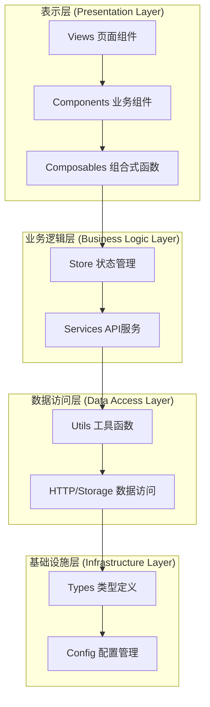
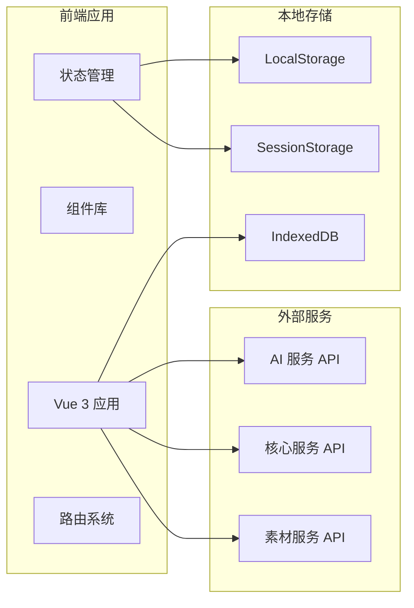

## 核心开发命令

**开发与构建：**

- `pnpm dev` - 启动开发服务器，支持热重载和自动打开浏览器
- `pnpm build` - 构建生产版本，包含 TypeScript 编译
- `pnpm serve` - 本地预览生产版本

**代码质量：**

- `pnpm lint` - 运行 ESLint 进行代码质量检查
- `pnpm fix` - 自动修复 ESLint 问题
- `pnpm lint:prettier` - 使用 Prettier 格式化所有文件类型
- `pnpm lint:stylelint` - 修复 SCSS/CSS 样式问题
- `pnpm lint:lint-staged` - 运行 lint-staged 进行预提交检查

**开发工具：**

- `pnpm commit` - 使用 git-cz (Commitizen) 进行交互式提交
- `pnpm clean:dev` - 清理开发缓存和临时文件
- `pnpm prepare` - 设置 Husky git 钩子

### 技术栈

#### 前端框架

- **Vue 3.5.12**：采用 Composition API 和 `<script setup>` 语法
- **TypeScript 5.6.3**：提供类型安全和更好的开发体验
- **Vite 6.1.0**：现代化的构建工具，提供快速的开发体验

#### 状态管理

- **Pinia 3.0.2**：Vue 3 官方推荐的状态管理库
- **pinia-plugin-persistedstate 4.3.0**：状态持久化插件

#### UI组件库

- **Element Plus 2.10.2**：基于 Vue 3 的企业级UI组件库
- **@element-plus/icons-vue 2.3.1**：Element Plus 图标库

#### 路由和导航

- **Vue Router 4.4.2**：Vue 3 官方路由管理器

#### HTTP客户端

- **Axios 1.7.5**：基于 Promise 的 HTTP 客户端

#### 工具库

- **@vueuse/core 11.0.0**：Vue 组合式函数工具集
- **lodash-es 4.17.21**：实用的 JavaScript 工具库
- **crypto-js 4.2.0**：加密算法库
- **mitt 3.0.1**：小型事件发射器

#### 图表和可视化

- **ECharts 5.6.0**：强大的数据可视化库

#### 编辑器和富文本

- **@wangeditor/editor 5.1.23**：富文本编辑器
- **@wangeditor/editor-for-vue**：WangEditor 的 Vue 3 组件

#### 其他功能

- **vue-i18n 9.14.0**：国际化支持
- **nprogress 0.2.0**：页面加载进度条
- **xlsx 0.18.5**：Excel 文件处理
- **file-saver 2.0.5**：文件保存工具
- **qrcode.vue 3.6.0**：二维码生成
- **vue-draggable-plus 0.6.0**：拖拽功能

#### 开发工具

- **ESLint 9.9.1**：代码质量检查
- **Prettier 3.5.3**：代码格式化
- **Stylelint 16.20.0**：样式代码检查
- **Husky 9.1.5**：Git 钩子管理
- **lint-staged 15.5.2**：暂存文件检查
- **commitizen 4.3.0**：规范化提交信息

---

## 系统整体架构设计

### 架构概览

Art Design Pro 采用分层架构设计，从上到下分为表示层、业务逻辑层、数据访问层和基础设施层。系统遵循单向数据流原则，确保数据流向清晰可预测。

### 核心架构原则

1. **分层架构**：清晰的职责分离，每层只关注自己的核心功能
2. **单向数据流**：数据从上到下流动，事件从下到上传递
3. **模块化设计**：高内聚、低耦合的模块结构
4. **类型安全**：使用 TypeScript 确保类型安全
5. **组件化开发**：可复用的组件设计，提高开发效率
6. **响应式设计**：基于 Vue 3 的响应式系统

### 系统边界与接口

- 基于@devolepement-docs/项目结构速查.md 以及@devolepement-docs/项目开发指南.md 开发，如果开发的功能需要更新文档，则对应更新
