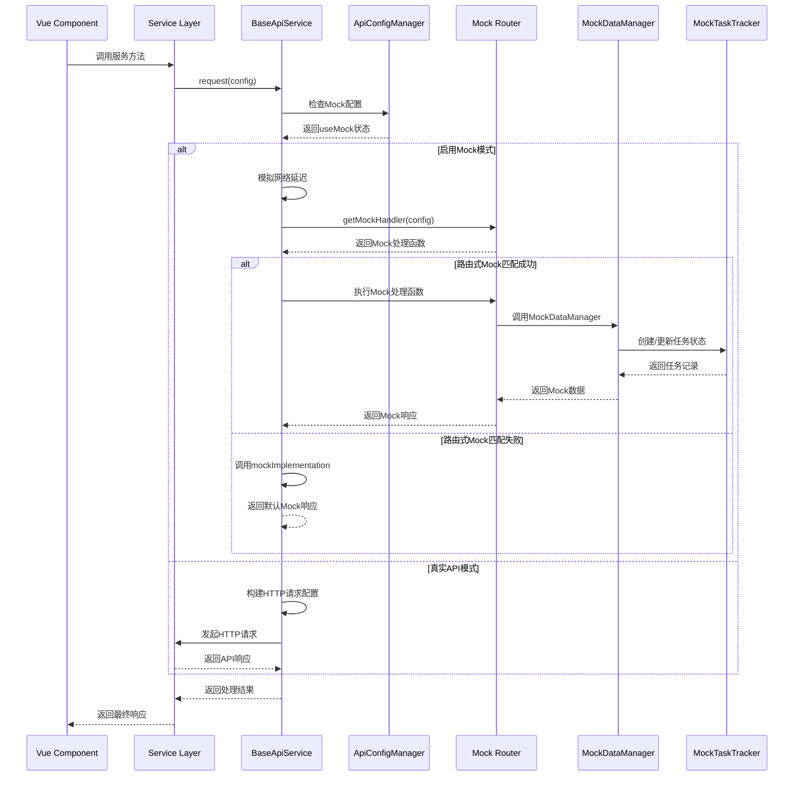

# ReNews Mock模式架构技术文档

## 目录

1. [架构概述](#架构概述)
2. [设计原理](#设计原理)
3. [目录结构组织](#目录结构组织)
4. [数据流动机制](#数据流动机制)
5. [配置管理](#配置管理)
6. [路由分发逻辑](#路由分发逻辑)
7. [核心特性](#核心特性)
8. [使用示例](#使用示例)
9. [最佳实践](#最佳实践)
10. [性能优化](#性能优化)
11. [扩展指南](#扩展指南)
12. [故障排除](#故障排除)

---

## 架构概述

ReNews Mock模式采用**分层式、模块化**的设计架构，为前端开发阶段提供完整的API模拟解决方案。该架构通过统一的配置管理、智能的路由分发和灵活的数据生成机制，实现了Mock模式与真实API模式的无缝切换。

### 架构层次图

```
┌─────────────────────────────────────────────────────────────┐
│                    表示层 (Presentation Layer)               │
│  Vue Components  ←  Composables  ←  Store状态管理          │
└─────────────────────────────────────────────────────────────┘
                              ↓
┌─────────────────────────────────────────────────────────────┐
│                    服务层 (Service Layer)                    │
│  BaseApiService  ←  DocumentGenerateService  ←  Other Services │
└─────────────────────────────────────────────────────────────┘
                              ↓
┌─────────────────────────────────────────────────────────────┐
│                 Mock分发层 (Mock Dispatch Layer)             │
│  ApiConfigManager  ←  Mock路由映射  ←  Route-based Mock     │
└─────────────────────────────────────────────────────────────┘
                              ↓
┌─────────────────────────────────────────────────────────────┐
│                 Mock数据层 (Mock Data Layer)                 │
│  MockDataManager  ←  MockTaskTracker  ←  数据生成器        │
└─────────────────────────────────────────────────────────────┘
                              ↓
┌─────────────────────────────────────────────────────────────┐
│               配置管理层 (Configuration Layer)               │
│  环境变量配置  ←  本地存储配置  ←  动态配置更新             │
└─────────────────────────────────────────────────────────────┘
```

---

## 设计原理

### 核心设计原则

1. **分层架构**：清晰的职责分离，每层只关注自己的核心功能
2. **模块化设计**：按业务领域组织，高内聚、低耦合
3. **配置驱动**：通过配置控制Mock/真实API切换
4. **渐进增强**：新式路由Mock与传统Mock实现共存
5. **类型安全**：完整的TypeScript类型定义

### 架构优势

- ✅ **开发独立性**：前端开发不依赖后端API完成
- ✅ **测试完整性**：覆盖各种业务场景的Mock数据
- ✅ **配置灵活性**：支持多种配置方式和动态切换
- ✅ **性能优化**：智能缓存和按需加载机制
- ✅ **扩展性强**：易于添加新的Mock路由和处理器

---

## 目录结构组织

### Mock目录结构

```
src/mock/
├── data/                          # Mock数据生成器目录
│   ├── document-generate/         # 文档生成相关Mock数据
│   │   ├── agents/               # AI代理Mock数据
│   │   │   ├── scope-agent.ts    # 范围代理Mock
│   │   │   ├── title-agent.ts    # 标题代理Mock
│   │   │   ├── outline-agent.ts  # 大纲代理Mock
│   │   │   └── search2title-agent.ts # 搜索转标题代理Mock
│   │   ├── core/                 # 核心API Mock数据
│   │   │   ├── research-brief.ts # 研究简报Mock
│   │   │   ├── title-candidate.ts # 标题候选Mock
│   │   │   └── title-version.ts  # 标题版本Mock
│   │   ├── index.ts              # 文档生成Mock数据统一导出
│   │   └── mock-routes.ts        # Mock路由映射表
│   ├── auth/                     # 认证Mock数据
│   │   └── index.ts              # 认证相关Mock生成器
│   ├── material/                 # 素材Mock数据
│   │   └── list.ts               # 素材列表Mock生成器
│   ├── search/                   # 搜索Mock数据
│   │   └── results.ts            # 搜索结果Mock生成器
│   ├── project/                  # 项目Mock数据
│   │   └── index.ts              # 项目相关Mock生成器
│   ├── outline/                  # 大纲Mock数据
│   │   └── index.ts              # 大纲相关Mock生成器
│   └── outline-section/          # 大纲章节Mock数据
│       └── index.ts              # 大纲章节Mock生成器
├── json/                         # 静态Mock数据文件
│   ├── chinaMap.json             # 中国地图数据
│   ├── document-generate-title.json # 文档标题数据
│   └── search.json               # 搜索相关静态数据
├── temp/                         # 临时Mock数据（开发调试用）
│   ├── articleList.ts            # 文章列表临时Mock
│   ├── commentDetail.ts          # 评论详情临时Mock
│   ├── commentList.ts            # 评论列表临时Mock
│   └── formData.ts               # 表单数据临时Mock
├── upgrade/                      # 升级相关Mock数据
│   └── changeLog.ts              # 变更日志Mock
└── index.ts                      # Mock数据统一导出入口
```

### Services目录结构

```
src/services/
├── base/                         # 基础服务层
│   └── apiService.ts             # 基础API服务类
├── auth/                         # 认证服务
│   ├── AuthManager.ts            # 认证管理器
│   └── initAuth.ts               # 认证初始化
├── modules/                      # 按业务域组织的服务模块
│   ├── document/                 # 文档服务模块
│   ├── material/                 # 素材服务模块
│   ├── project/                  # 项目服务模块
│   └── search/                   # 搜索服务模块
├── authService.ts                # 认证服务实现
├── documentGenerateService.ts    # 文档生成服务实现
├── materialService.ts            # 素材服务实现
├── projectService.ts             # 项目服务实现
├── searchService.ts              # 搜索服务实现
└── index.ts                      # 服务统一导出
```

---

## 数据流动机制

### 完整数据流动路径



### 核心数据流动步骤

#### 1. 请求发起阶段

- **Vue组件**调用服务层方法
- **服务层**继承BaseApiService，调用统一的request方法
- 传入ApiRequestConfig配置对象

#### 2. 模式判断阶段

- **ApiConfigManager**检查当前Mock配置
- 支持全局配置和服务级别配置
- 用户登录状态智能判断

#### 3. Mock处理阶段

- **路由式Mock优先**：基于HTTP方法和路径匹配
- **传统Mock回退**：作为备用方案
- **智能缓存机制**：状态查询不缓存，其他数据可缓存

#### 4. 数据生成阶段

- **MockDataManager**统一管理Mock数据生成
- **MockTaskTracker**处理异步任务状态
- 支持时间驱动的状态演进

---

## 配置管理

### 配置层次结构

```typescript
interface ApiConfig {
  useMock: boolean // 是否启用Mock模式
  mockDelay: number // Mock延迟时间（毫秒）
  showDebugInfo: boolean // 是否显示调试信息
}

interface MockDataConfig {
  version: string // Mock配置版本
  defaultDelay: number // 默认延迟时间
  randomDelay: boolean // 是否启用随机延迟
  delayRange: [number, number] // 延迟时间范围
}
```

### 配置来源

#### 1. 环境变量配置

```bash
# .env文件
VITE_USE_MOCK=true
VITE_MOCK_DELAY=1000
VITE_API_DEBUG=true
VITE_API_URL=http://localhost:3000
```

#### 2. 本地存储配置

- 自动保存用户配置偏好
- 页面刷新后配置保持
- 支持配置导入/导出

#### 3. 动态配置更新

- 运行时动态切换Mock/真实API
- 配置变更监听和通知
- 用户状态智能感知

### 用户状态感知机制

```typescript
setUseMock(useMock: boolean): void {
  const currentConfig = this.getConfig()
  const userStore = useUserStore()

  if (userStore.isLogin) {
    const userType = userStore.getUserType

    // Mock用户 → 真实API：需要重新登录
    if (!useMock && userType === 'mock') {
      userStore.logOut()
      alert('Mock用户无法使用真实API，请使用真实账户重新登录')
      return
    }

    // 真实用户 → Mock模式：保持登录状态
    if (useMock && userType === 'real') {
      this.updateConfig({ useMock })
      console.log('已切换到Mock模式，当前用户数据保持不变')
      return
    }
  }

  // 无用户登录状态，直接更新配置
  this.updateConfig({ useMock })
}
```

---

## 路由分发逻辑

### 双回退机制

```typescript
// 1. 新式路由Mock（优先级高）
private async handleRouteMock(config: ApiRequestConfig): Promise<any> {
  try {
    const { getMockHandler } = await loadMockRoutes()
    const mockHandler = getMockHandler({
      method: config.method,
      url: config.url
    })

    if (mockHandler) {
      return mockHandler(config)
    }
  } catch (error) {
    console.warn('Mock路由加载失败，回退到传统Mock实现:', error)
  }

  return null
}

// 2. 传统Mock实现（回退方案）
protected async mockImplementation?(_config: ApiRequestConfig): Promise<any> {
  return {
    success: true,
    message: `默认Mock响应 - ${_config.method} ${_config.url}`,
    data: {
      mock: true,
      timestamp: Date.now(),
      service: this.serviceName,
      note: '使用默认Mock实现，建议配置具体Mock路由'
    }
  }
}
```

### 路由映射表

```typescript
// mock-routes.ts
export const mockRoutes = new Map([
  // Scope Agent 路由
  ['POST:/scope-agent/execute', executeScopeAgentMock],
  ['GET:/scope-agent/status/:taskId', getScopeAgentStatusMock],
  ['GET:/scope-agent/tasks', getScopeAgentTasksMock],

  // Title Agent 路由
  ['POST:/title-agent/generate', generateTitlesMock],
  ['GET:/title-agent/status', getTitleToolsStatusMock],

  // Material Bind 路由
  ['POST:/ai/bind-materials', bindMaterialsWithAIMock],
  ['GET:/material-bind/status/:taskId', getMaterialBindStatusMock],

  // Core API 路由
  ['POST:/api/v1/core/projects/:projectId/briefs', createResearchBriefMock],
  ['GET:/api/v1/core/projects/:projectId/briefs', getProjectBriefsMock]
  // ... 更多路由映射
])
```

### 路由键值构建

```typescript
export function buildRouteKey(config: { method: string; url: string }): string {
  let routeKey = `${config.method.toUpperCase()}:${config.url}`

  // 参数化路径匹配，将动态参数替换为通用标识符
  routeKey = routeKey.replace(/\/\d+/g, '/:id') // 数字ID替换
  routeKey = routeKey.replace(/\/tasks\/[^/]+/g, '/tasks/:taskId') // 任务ID替换
  routeKey = routeKey.replace(/\/projects\/[^/]+/g, '/projects/:projectId') // 项目ID替换
  routeKey = routeKey.replace(/\/briefs\/[^/]+/g, '/briefs/:briefId') // 简报ID替换

  return routeKey
}
```

---

## 核心特性

### 1. 异步任务模拟

#### MockTaskTracker

```typescript
export class MockTaskTracker {
  private tasks = new Map<string, TaskRecord>()

  // 创建任务
  createTask(taskId: string, initialResult?: any): TaskRecord

  // 更新任务状态
  updateTask(taskId: string, updates: Partial<TaskRecord>): TaskRecord

  // 基于时间的状态演进
  updateTaskByTime(taskId: string, customLogic?: Function): TaskRecord
}
```

#### 任务状态演进

```typescript
// 默认时间演进逻辑
if (elapsed < 2000) {
  updates = { status: 'pending', progress: Math.min(30, Math.floor(elapsed / 100)) }
} else if (elapsed < 5000) {
  updates = { status: 'running', progress: Math.min(90, 30 + Math.floor((elapsed - 2000) / 50)) }
} else {
  updates = { status: 'completed', progress: 100, result: task.result }
}
```

### 2. 智能缓存机制

#### 缓存策略

```typescript
getMockData(key: string, ...args: any[]): any {
  const cacheKey = `${key}-${JSON.stringify(args)}`
  const isStatusQuery = key.includes('-status')

  // 状态查询接口不使用缓存，确保返回最新的任务状态
  if (!isStatusQuery && this.dataCache.has(cacheKey)) {
    return this.dataCache.get(cacheKey)
  }

  // 生成新数据...
  // 只有非状态查询的数据才缓存
  if (!isStatusQuery) {
    this.dataCache.set(cacheKey, data)
  }
  return data
}
```

#### 缓存管理

```typescript
// 清除特定key的缓存
clearCache(key?: string): void

// 获取缓存统计
getCacheStats(): { total: number; keys: string[] }
```

### 3. 配置驱动的延迟模拟

```typescript
private async simulateDelay(baseDelay: number): Promise<void> {
  const mockConfig = apiConfigManager.getMockConfig()

  if (mockConfig.randomDelay) {
    const [minDelay, maxDelay] = mockConfig.delayRange
    const randomDelay = Math.random() * (maxDelay - minDelay) + minDelay
    return new Promise((resolve) => setTimeout(resolve, randomDelay))
  }

  return new Promise((resolve) => setTimeout(resolve, baseDelay))
}
```

### 4. 轮询机制支持

```typescript
// AsyncTaskPoller集成
async executeScopeAgentWithPolling(
  userId: string,
  projectId: string,
  request: ScopeAgentRequest,
  pollingConfig?: PollingConfig
): Promise<PollingTask> {
  const response = await this.executeScopeAgent(userId, projectId, request)
  const taskId = response.task_id

  const poller = new AsyncTaskPoller(
    () => this.getScopeAgentStatus(taskId),
    {
      interval: 2000,
      timeout: 120000,
      maxAttempts: 60,
      ...pollingConfig
    }
  )

  return poller.start(`scope-agent-${taskId}`)
}
```

---

## 使用示例

### 1. 基础Mock使用

#### 配置Mock模式

```typescript
// 环境变量配置
VITE_USE_MOCK = true
VITE_MOCK_DELAY = 1000

// 或运行时动态配置
import { apiConfigManager } from '@/config/api'

// 启用Mock模式
apiConfigManager.setUseMock(true)

// 设置Mock延迟
apiConfigManager.setMockDelay(1500)

// 启用调试信息
apiConfigManager.setShowDebugInfo(true)
```

#### 服务层调用

```typescript
import { documentGenerateService } from '@/services'

// 调用服务方法（自动根据配置选择Mock或真实API）
async function generateDocument() {
  try {
    // 执行Scope Agent
    const scopeResult = await documentGenerateService.executeScopeAgent('user123', 'project456', {
      query: '人工智能在医疗领域的应用研究'
    })

    // 生成标题
    const titleResult = await documentGenerateService.generateTitles({
      research_brief: 'AI医疗技术研究',
      web_search_data: scopeResult.search_results
    })

    return { scopeResult, titleResult }
  } catch (error) {
    console.error('文档生成失败:', error)
  }
}
```

### 2. 异步任务轮询

```typescript
// 带轮询的异步任务
async function generateDocumentWithPolling() {
  const poller = await documentGenerateService.executeScopeAgentWithPolling(
    'user123',
    'project456',
    { query: '人工智能新闻调研' },
    {
      interval: 2000, // 轮询间隔
      timeout: 120000, // 超时时间
      maxAttempts: 60, // 最大尝试次数
      onProgress: (task) => {
        console.log(`任务进度: ${task.progress}%`)
      },
      onComplete: (task) => {
        console.log('任务完成:', task.data)
      },
      onError: (error) => {
        console.error('任务失败:', error)
      }
    }
  )

  return poller
}
```

### 3. 添加新的Mock路由

#### 1. 创建Mock处理器

```typescript
// src/mock/data/document-generate/agents/new-agent.ts
export async function executeNewAgentMock(config: ApiRequestConfig): Promise<any> {
  const { data } = config

  // 模拟处理逻辑
  return {
    success: true,
    task_id: `new-agent-${Date.now()}`,
    status: 'started',
    message: '新代理任务已启动',
    data: {
      query: data.query,
      processed_at: new Date().toISOString()
    }
  }
}

export async function getNewAgentStatusMock(config: ApiRequestConfig): Promise<any> {
  const { params } = config
  const taskId = params.taskId

  // 基于任务ID生成状态
  const timestamp = parseInt(taskId.split('-')[2])
  const elapsed = Date.now() - timestamp

  let status = 'pending'
  let progress = 0

  if (elapsed > 5000) {
    status = 'completed'
    progress = 100
  } else if (elapsed > 2000) {
    status = 'running'
    progress = Math.min(90, Math.floor((elapsed - 2000) / 30))
  }

  return {
    success: true,
    task_id: taskId,
    status,
    progress,
    result:
      status === 'completed'
        ? {
            analysis: 'AI分析结果',
            recommendations: ['建议1', '建议2', '建议3']
          }
        : null
  }
}
```

#### 2. 注册Mock路由

```typescript
// src/mock/data/document-generate/mock-routes.ts
import { executeNewAgentMock, getNewAgentStatusMock } from './agents/new-agent'

export const mockRoutes = new Map([
  // 现有路由...

  // 新路由
  ['POST:/new-agent/execute', executeNewAgentMock],
  ['GET:/new-agent/status/:taskId', getNewAgentStatusMock]
])
```

#### 3. 服务层方法

```typescript
// src/services/documentGenerateService.ts
class DocumentGenerateService extends BaseApiService {
  /**
   * 执行新代理
   */
  async executeNewAgent(
    userId: string,
    projectId: string,
    request: NewAgentRequest,
    options?: ApiRequestConfig
  ): Promise<NewAgentResponse> {
    return this.post<NewAgentResponse>('/new-agent/execute', request, {
      params: { user_id: userId, project_id: projectId },
      ...options
    })
  }

  /**
   * 获取新代理状态
   */
  async getNewAgentStatus(
    taskId: string,
    options?: ApiRequestConfig
  ): Promise<NewAgentStatusResponse> {
    return this.get<NewAgentStatusResponse>(`/new-agent/status/${taskId}`, undefined, options)
  }
}
```

### 4. 复杂数据生成

```typescript
// src/mock/data/document-generate/complex-example.ts
export function generateComplexDocumentData(config: {
  documentType: string
  complexity: 'simple' | 'medium' | 'complex'
  includeMultimedia: boolean
}) {
  const { documentType, complexity, includeMultimedia } = config

  // 基础结构
  const baseStructure = {
    id: `doc-${Date.now()}`,
    type: documentType,
    created_at: new Date().toISOString(),
    metadata: {
      version: '1.0.0',
      author: 'Mock User',
      tags: ['AI', 'Technology', documentType]
    }
  }

  // 复杂度相关内容
  let content = {}
  switch (complexity) {
    case 'simple':
      content = {
        sections: 3,
        word_count: 1500,
        reading_time: '5分钟'
      }
      break
    case 'medium':
      content = {
        sections: 8,
        word_count: 5000,
        reading_time: '15分钟',
        references: generateMockReferences(10)
      }
      break
    case 'complex':
      content = {
        sections: 15,
        word_count: 12000,
        reading_time: '45分钟',
        references: generateMockReferences(25),
        appendices: generateMockAppendices(),
        interactive_elements: generateMockInteractiveElements()
      }
      break
  }

  // 多媒体元素
  if (includeMultimedia) {
    content.multimedia = generateMockMultimedia()
  }

  return {
    ...baseStructure,
    content,
    analysis: {
      complexity_score: complexity === 'simple' ? 0.3 : complexity === 'medium' ? 0.7 : 0.9,
      quality_score: Math.random() * 0.3 + 0.7,
      engagement_prediction: Math.random() * 0.4 + 0.6
    }
  }
}

function generateMockReferences(count: number) {
  return Array.from({ length: count }, (_, i) => ({
    id: i + 1,
    title: `参考文献标题 ${i + 1}`,
    authors: [`作者${i + 1}A`, `作者${i + 1}B`],
    publication: `期刊名称 ${i + 1}`,
    year: 2020 + Math.floor(Math.random() * 5),
    doi: `10.1000/mock.${i + 1}`,
    credibility_score: Math.random() * 0.3 + 0.7
  }))
}
```

---

## 最佳实践

### 1. Mock数据设计原则

#### 真实性原则

```typescript
// ✅ 好的做法：真实的数据结构
export function generateMockUser() {
  return {
    id: `user_${Date.now()}_${Math.random().toString(36).substr(2, 9)}`,
    username: `user_${Math.floor(Math.random() * 10000)}`,
    email: `user${Math.floor(Math.random() * 1000)}@example.com`,
    profile: {
      avatar: `https://api.dicebear.com/7.x/avataaars/svg?seed=${Date.now()}`,
      bio: '这是用户个人简介',
      location: '北京, 中国',
      join_date: new Date(Date.now() - Math.random() * 365 * 24 * 60 * 60 * 1000).toISOString()
    }
  }
}

// ❌ 避免：过度简化的数据
export function generateBadMockUser() {
  return {
    id: 1,
    name: 'test',
    email: 'test@test.com'
  }
}
```

#### 多样性原则

```typescript
// ✅ 好的做法：提供多样化的数据
const userProfiles = [
  { level: 'beginner', experience: 0, badges: [] },
  { level: 'intermediate', experience: 500, badges: ['快速学习者'] },
  { level: 'advanced', experience: 2000, badges: ['专家', '贡献者'] },
  { level: 'expert', experience: 10000, badges: ['大师', '导师', '创新者'] }
]

export function generateMockUserWithProfile() {
  const profile = userProfiles[Math.floor(Math.random() * userProfiles.length)]
  return {
    ...generateMockUser(),
    ...profile
  }
}
```

#### 边界情况考虑

```typescript
// ✅ 好的做法：考虑边界情况
export function generateMockDocumentList(count: number, options: { includeEmpty?: boolean } = {}) {
  const documents = Array.from({ length: count }, (_, i) => generateMockDocument())

  if (options.includeEmpty) {
    // 添加空文档
    documents.push({
      id: 'empty-doc',
      title: '',
      content: '',
      status: 'draft',
      created_at: new Date().toISOString()
    })
  }

  // 添加特殊情况文档
  documents.push(
    {
      id: 'long-title-doc',
      title: '这是一个非常非常非常长的文档标题，用来测试UI在处理长标题时的表现',
      ...generateMockDocument()
    },
    {
      id: 'special-chars-doc',
      title: '包含特殊字符的文档标题 & <script>alert("test")</script>',
      ...generateMockDocument()
    }
  )

  return documents
}
```

### 2. 性能优化

#### 延迟加载

```typescript
// ✅ 好的做法：延迟加载Mock路由
async function loadMockRoutes() {
  if (!mockRoutes) {
    mockRoutes = await import('@/mock/data/document-generate/mock-routes')
  }
  return mockRoutes
}

// ❌ 避免：同步加载所有Mock数据
import allMockRoutes from '@/mock/data/document-generate/mock-routes' // 不要这样做
```

#### 智能缓存

```typescript
// ✅ 好的做法：智能缓存策略
class OptimizedMockDataManager {
  private cache = new Map<string, { data: any; timestamp: number; ttl: number }>()

  get(key: string, factory: () => any, ttl = 300000) {
    // 5分钟TTL
    const cached = this.cache.get(key)
    const now = Date.now()

    if (cached && now - cached.timestamp < cached.ttl) {
      return cached.data
    }

    const data = factory()
    this.cache.set(key, { data, timestamp: now, ttl })
    return data
  }

  // 定期清理过期缓存
  cleanupExpiredCache() {
    const now = Date.now()
    for (const [key, value] of this.cache.entries()) {
      if (now - value.timestamp >= value.ttl) {
        this.cache.delete(key)
      }
    }
  }
}
```

#### 数据预生成

```typescript
// ✅ 好的做法：预生成常用数据
const PREGENERATED_DATA = {
  commonTags: ['技术', '商业', '科学', '艺术', '教育', '健康', '体育', '娱乐'],
  userNames: ['张三', '李四', '王五', '赵六', '钱七', '孙八', '周九', '吴十'],
  locations: ['北京', '上海', '广州', '深圳', '杭州', '南京', '成都', '武汉']
}

export function generateQuickMockProfile() {
  return {
    name: PREGENERATED_DATA.userNames[
      Math.floor(Math.random() * PREGENERATED_DATA.userNames.length)
    ],
    tags: PREGENERATED_DATA.commonTags.slice(0, Math.floor(Math.random() * 3) + 1),
    location:
      PREGENERATED_DATA.locations[Math.floor(Math.random() * PREGENERATED_DATA.locations.length)]
  }
}
```

### 3. 错误处理

#### 模拟错误场景

```typescript
// ✅ 好的做法：模拟各种错误场景
export function generateMockError(errorType: 'network' | 'timeout' | 'server' | 'validation') {
  const errors = {
    network: {
      code: 'NETWORK_ERROR',
      message: '网络连接失败，请检查网络设置',
      status: 0
    },
    timeout: {
      code: 'TIMEOUT_ERROR',
      message: '请求超时，请稍后重试',
      status: 408
    },
    server: {
      code: 'INTERNAL_ERROR',
      message: '服务器内部错误',
      status: 500
    },
    validation: {
      code: 'VALIDATION_ERROR',
      message: '输入数据验证失败',
      status: 400,
      details: {
        fields: ['email', 'password'],
        reasons: ['邮箱格式不正确', '密码长度不足']
      }
    }
  }

  return Promise.reject(errors[errorType])
}

// 使用示例
export async function mockApiCallWithError(shouldFail = false, errorType = 'network') {
  if (shouldFail) {
    return generateMockError(errorType as any)
  }

  return generateMockSuccessResponse()
}
```

#### 优雅降级

```typescript
// ✅ 好的做法：优雅降级处理
export class RobustMockDataService {
  async getDataWithFallback(key: string) {
    try {
      // 尝试从主数据源获取
      return await this.getPrimaryData(key)
    } catch (primaryError) {
      console.warn('主数据源失败，尝试备用数据源:', primaryError)

      try {
        // 尝试从备用数据源获取
        return await this.getBackupData(key)
      } catch (backupError) {
        console.warn('备用数据源也失败，使用默认数据:', backupError)

        // 返回默认数据
        return this.getDefaultData(key)
      }
    }
  }
}
```

### 4. 测试集成

#### Mock数据测试

```typescript
// ✅ 好的做法：为Mock数据编写测试
describe('Mock Data Generation', () => {
  it('should generate valid user data', () => {
    const user = generateMockUser()

    expect(user).toHaveProperty('id')
    expect(user).toHaveProperty('username')
    expect(user).toHaveProperty('email')
    expect(user.email).toMatch(/@[^@]+\.[^@]+/)
  })

  it('should generate consistent data for same seed', () => {
    const seed = 'test-seed-123'
    const user1 = generateMockUserWithSeed(seed)
    const user2 = generateMockUserWithSeed(seed)

    expect(user1.id).toBe(user2.id)
    expect(user1.username).toBe(user2.username)
  })

  it('should handle edge cases', () => {
    const emptyList = generateMockDocumentList(0)
    expect(emptyList).toHaveLength(0)

    const largeList = generateMockDocumentList(1000)
    expect(largeList).toHaveLength(1000)
  })
})
```

#### Mock服务测试

```typescript
describe('Mock Service Integration', () => {
  beforeEach(() => {
    // 启用Mock模式
    apiConfigManager.setUseMock(true)
  })

  it('should return mock data for service calls', async () => {
    const service = new DocumentGenerateService()
    const result = await service.executeScopeAgent('user123', 'project456', {
      query: 'test query'
    })

    expect(result).toHaveProperty('success')
    expect(result).toHaveProperty('task_id')
  })

  it('should handle async task polling', async () => {
    const service = new DocumentGenerateService()
    const poller = await service.executeScopeAgentWithPolling('user123', 'project456', {
      query: 'test query'
    })

    expect(poller).toHaveProperty('status', 'pending')

    // 等待任务完成
    await new Promise((resolve) => setTimeout(resolve, 6000))

    const finalStatus = poller.getStatus()
    expect(finalStatus).toBe('completed')
  })
})
```

---

## 性能优化

### 1. 内存管理

#### 定期清理任务

```typescript
export class MemoryEfficientMockTaskTracker extends MockTaskTracker {
  private cleanupInterval: NodeJS.Timeout
  private readonly maxAge = 10 * 60 * 1000 // 10分钟
  private readonly maxTasks = 1000 // 最大任务数

  constructor() {
    super()
    this.startCleanup()
  }

  private startCleanup() {
    this.cleanupInterval = setInterval(() => {
      this.cleanup()
    }, 60000) // 每分钟清理一次
  }

  private cleanup() {
    const now = Date.now()
    const tasks = Array.from(this.tasks.entries())

    // 清理过期任务
    tasks.forEach(([taskId, task]) => {
      if (now - task.createdAt > this.maxAge) {
        this.tasks.delete(taskId)
      }
    })

    // 如果任务数过多，删除最旧的任务
    if (tasks.length > this.maxTasks) {
      const sortedTasks = tasks.sort((a, b) => a[1].createdAt - b[1].createdAt)
      const tasksToDelete = sortedTasks.slice(0, tasks.length - this.maxTasks)
      tasksToDelete.forEach(([taskId]) => this.tasks.delete(taskId))
    }
  }

  destroy() {
    if (this.cleanupInterval) {
      clearInterval(this.cleanupInterval)
    }
  }
}
```

#### 对象池模式

```typescript
export class MockDataPool {
  private pools = new Map<string, any[]>()

  get<T>(type: string, factory: () => T): T {
    const pool = this.pools.get(type)
    if (pool && pool.length > 0) {
      return pool.pop()
    }
    return factory()
  }

  release<T>(type: string, obj: T): void {
    // 重置对象状态
    if (typeof obj === 'object' && obj !== null) {
      Object.keys(obj).forEach((key) => {
        delete obj[key]
      })
    }

    const pool = this.pools.get(type) || []
    pool.push(obj)
    this.pools.set(type, pool)
  }

  clear(): void {
    this.pools.clear()
  }
}

// 使用示例
const dataPool = new MockDataPool()

export function getPooledMockUser() {
  return dataPool.get('user', () => ({
    id: '',
    name: '',
    email: ''
    // ... 其他属性
  }))
}

export function releaseMockUser(user: any) {
  dataPool.release('user', user)
}
```

### 2. 延迟加载优化

#### 动态导入优化

```typescript
export class OptimizedMockLoader {
  private static loadedModules = new Map<string, any>()
  private static loadingPromises = new Map<string, Promise<any>>()

  static async loadMockModule(modulePath: string) {
    // 如果已经加载，直接返回
    if (this.loadedModules.has(modulePath)) {
      return this.loadedModules.get(modulePath)
    }

    // 如果正在加载，返回加载Promise
    if (this.loadingPromises.has(modulePath)) {
      return this.loadingPromises.get(modulePath)
    }

    // 开始加载模块
    const loadPromise = import(modulePath).then((module) => {
      this.loadedModules.set(modulePath, module)
      this.loadingPromises.delete(modulePath)
      return module
    })

    this.loadingPromises.set(modulePath, loadPromise)
    return loadPromise
  }

  static async getMockHandler(routeKey: string) {
    // 根据路由Key确定模块路径
    const modulePath = this.getModulePathForRoute(routeKey)
    const module = await this.loadMockModule(modulePath)

    return module[getHandlerNameForRoute(routeKey)]
  }

  private static getModulePathForRoute(routeKey: string): string {
    // 路由到模块的映射逻辑
    if (routeKey.includes('scope-agent')) {
      return '@/mock/data/document-generate/agents/scope-agent'
    }
    // ... 其他映射
    return ''
  }
}
```

### 3. 数据预生成优化

#### 批量数据生成

```typescript
export class BatchMockDataGenerator {
  private batches = new Map<string, any[]>()

  async pregenerateBatch(type: string, count: number, generator: () => any) {
    const batch = Array.from({ length: count }, () => generator())
    this.batches.set(type, batch)
    return batch
  }

  getFromBatch(type: string, count = 1): any[] {
    const batch = this.batches.get(type)
    if (!batch || batch.length === 0) {
      return []
    }

    if (count >= batch.length) {
      this.batches.delete(type)
      return batch
    }

    const items = batch.splice(0, count)
    this.batches.set(type, batch)
    return items
  }

  // 后台预生成
  startBackgroundPregeneration() {
    setInterval(() => {
      this.pregenerateIfNeeded()
    }, 30000) // 每30秒检查一次
  }

  private async pregenerateIfNeeded() {
    const threshold = 10 // 阈值

    for (const [type, batch] of this.batches.entries()) {
      if (batch.length < threshold) {
        const generator = this.getGeneratorForType(type)
        await this.pregenerateBatch(type, 50, generator)
      }
    }
  }
}
```

---

## 扩展指南

### 1. 添加新的Mock数据类型

#### 步骤1：创建数据生成器

```typescript
// src/mock/data/custom/new-feature.ts
export interface NewFeatureRequest {
  name: string
  type: string
  config: Record<string, any>
}

export interface NewFeatureResponse {
  success: boolean
  id: string
  status: 'pending' | 'processing' | 'completed' | 'failed'
  result?: any
  error?: string
  created_at: string
  updated_at: string
}

export function generateNewFeatureResponse(request: NewFeatureRequest): NewFeatureResponse {
  return {
    success: true,
    id: `new-feature-${Date.now()}-${Math.random().toString(36).substr(2, 9)}`,
    status: 'pending',
    created_at: new Date().toISOString(),
    updated_at: new Date().toISOString()
  }
}

export function generateNewFeatureStatus(
  featureId: string,
  request?: NewFeatureRequest
): NewFeatureResponse {
  const timestamp = parseInt(featureId.split('-')[2])
  const elapsed = Date.now() - timestamp

  let status: NewFeatureResponse['status'] = 'pending'
  let result: any = null

  if (elapsed > 8000) {
    status = 'completed'
    result = {
      analysis: `分析结果: ${request?.name || '未知功能'}`,
      recommendations: ['建议1：优化配置', '建议2：增加验证', '建议3：改进性能'],
      score: Math.random() * 0.3 + 0.7
    }
  } else if (elapsed > 3000) {
    status = 'processing'
  } else if (elapsed > 1000) {
    status = 'pending'
  }

  return {
    success: true,
    id: featureId,
    status,
    result,
    created_at: new Date(timestamp).toISOString(),
    updated_at: new Date().toISOString()
  }
}
```

#### 步骤2：注册Mock路由

```typescript
// src/mock/data/custom/mock-routes.ts
import { generateNewFeatureResponse, generateNewFeatureStatus } from './new-feature'

export const customMockRoutes = new Map([
  ['POST:/api/v1/new-feature', generateNewFeatureResponse],
  ['GET:/api/v1/new-feature/:featureId/status', generateNewFeatureStatus]
])

// 导出给主路由表
export { customMockRoutes as newFeatureRoutes }
```

#### 步骤3：集成到主路由系统

```typescript
// src/mock/data/document-generate/mock-routes.ts
import { newFeatureRoutes } from '../custom/mock-routes'

export const mockRoutes = new Map([
  // 现有路由...

  // 合并新功能路由
  ...newFeatureRoutes
])
```

#### 步骤4：添加服务层方法

```typescript
// src/services/newFeatureService.ts
import BaseApiService from './base/apiService'
import type { ApiRequestConfig } from '@/config/api/types'

export type NewFeatureRequest = {
  name: string
  type: string
  config: Record<string, any>
}

export type NewFeatureResponse = {
  success: boolean
  id: string
  status: 'pending' | 'processing' | 'completed' | 'failed'
  result?: any
  error?: string
  created_at: string
  updated_at: string
}

class NewFeatureService extends BaseApiService {
  constructor() {
    super('newFeature')
  }

  async createFeature(
    request: NewFeatureRequest,
    options?: ApiRequestConfig
  ): Promise<NewFeatureResponse> {
    return this.post<NewFeatureResponse>('/api/v1/new-feature', request, options)
  }

  async getFeatureStatus(
    featureId: string,
    options?: ApiRequestConfig
  ): Promise<NewFeatureResponse> {
    return this.get<NewFeatureResponse>(
      `/api/v1/new-feature/${featureId}/status`,
      undefined,
      options
    )
  }

  async createFeatureWithPolling(request: NewFeatureRequest, pollingConfig?: any) {
    const response = await this.createFeature(request)
    const featureId = response.id

    const poller = new AsyncTaskPoller(() => this.getFeatureStatus(featureId), {
      interval: 2000,
      timeout: 60000,
      maxAttempts: 30,
      ...pollingConfig
    })

    return poller.start(`new-feature-${featureId}`)
  }
}

export const newFeatureService = new NewFeatureService()
export default newFeatureService
```

### 2. 添加新的API服务配置

#### 步骤1：定义API配置

```typescript
// src/config/api/modules/custom/index.ts
import type { ApiEndpointConfig } from '../../types'

export const CUSTOM_API_MODULES: Record<string, ApiEndpointConfig> = {
  newFeature: {
    name: 'New Feature Service',
    baseUrl: '/api/v1/new-feature',
    methods: ['GET', 'POST', 'PUT', 'DELETE'],
    enableMock: true,
    mockPath: '/mock/data/custom',
    paths: {
      '/': {
        description: '创建新功能',
        methods: ['POST']
      },
      '/:featureId/status': {
        description: '获取功能状态',
        methods: ['GET']
      },
      '/:featureId': {
        description: '功能详情操作',
        methods: ['GET', 'PUT', 'DELETE']
      }
    },
    defaults: {
      timeout: 15000,
      headers: {
        'Content-Type': 'application/json'
      }
    }
  }
}
```

#### 步骤2：集成到主配置

```typescript
// src/config/api/index.ts
import { CUSTOM_API_MODULES } from './modules/custom'

const API_REGISTRY: ApiRegistry = {
  services: {
    // 现有服务...
    ...API_MODULES,
    ...AI_API_MODULES,
    ...CUSTOM_API_MODULES // 新增自定义服务
  }
  // ... 其他配置
}
```

### 3. 创建自定义Mock数据模板

#### 模板生成器

```typescript
// src/mock/templates/response-template.ts
export class MockResponseTemplate<T = any> {
  private template: {
    success: boolean
    message: string
    data?: T
    error?: string
    timestamp: string
    pagination?: {
      page: number
      limit: number
      total: number
      totalPages: number
    }
  }

  constructor(
    private dataGenerator: () => T,
    private options: {
      successRate?: number
      errorTypes?: string[]
      enablePagination?: boolean
      customMessage?: string
    } = {}
  ) {
    this.template = {
      success: true,
      message: options.customMessage || '操作成功',
      timestamp: new Date().toISOString()
    }
  }

  generate(): typeof this.template {
    const shouldSucceed =
      this.options.successRate === undefined || Math.random() < this.options.successRate

    const response = { ...this.template }

    if (shouldSucceed) {
      response.success = true
      response.data = this.dataGenerator()

      if (this.options.enablePagination) {
        response.pagination = this.generatePagination()
      }
    } else {
      response.success = false
      const errorTypes = this.options.errorTypes || ['VALIDATION_ERROR', 'INTERNAL_ERROR']
      response.error = errorTypes[Math.floor(Math.random() * errorTypes.length)]
      response.message = '操作失败'
    }

    return response
  }

  private generatePagination() {
    const total = Math.floor(Math.random() * 1000) + 10
    const limit = 20
    const page = Math.floor(Math.random() * Math.ceil(total / limit)) + 1

    return {
      page,
      limit,
      total,
      totalPages: Math.ceil(total / limit)
    }
  }
}

// 使用示例
export const userResponseTemplate = new MockResponseTemplate(() => generateMockUser(), {
  successRate: 0.95, // 95%成功率
  errorTypes: ['USER_NOT_FOUND', 'VALIDATION_ERROR'],
  enablePagination: true
})

export const documentResponseTemplate = new MockResponseTemplate(() => generateMockDocument(), {
  customMessage: '文档创建成功'
})
```

### 4. 扩展MockTaskTracker

#### 自定义任务类型

```typescript
// src/mock/trackers/custom-task-tracker.ts
import { MockTaskTracker } from '@/utils/mockTaskTracker'

export interface CustomTaskRecord extends TaskRecord {
  taskType: 'data_processing' | 'content_generation' | 'analysis' | 'export'
  parameters: Record<string, any>
  steps: Array<{
    name: string
    status: 'pending' | 'completed' | 'failed'
    duration: number
    result?: any
  }>
  retryCount: number
}

export class CustomMockTaskTracker extends MockTaskTracker {
  private customTasks = new Map<string, CustomTaskRecord>()

  createCustomTask(
    taskId: string,
    taskType: CustomTaskRecord['taskType'],
    parameters: Record<string, any>
  ): CustomTaskRecord {
    const task: CustomTaskRecord = {
      status: 'pending',
      progress: 0,
      result: null,
      createdAt: Date.now(),
      updatedAt: Date.now(),
      error: null,
      taskType,
      parameters,
      steps: this.generateTaskSteps(taskType),
      retryCount: 0
    }

    this.customTasks.set(taskId, task)
    return task
  }

  updateCustomTask(taskId: string, updates: Partial<CustomTaskRecord>): CustomTaskRecord | null {
    const task = this.customTasks.get(taskId)
    if (!task) return null

    const updatedTask = {
      ...task,
      ...updates,
      updatedAt: Date.now()
    }

    this.customTasks.set(taskId, updatedTask)
    return updatedTask
  }

  private generateTaskSteps(taskType: CustomTaskRecord['taskType']) {
    const stepTemplates = {
      data_processing: ['数据验证', '数据清洗', '数据转换', '结果生成'],
      content_generation: ['需求分析', '内容规划', '内容生成', '质量检查'],
      analysis: ['数据收集', '模型训练', '结果分析', '报告生成'],
      export: ['格式转换', '数据打包', '文件生成', '下载准备']
    }

    return stepTemplates[taskType].map((name) => ({
      name,
      status: 'pending' as const,
      duration: Math.floor(Math.random() * 3000) + 1000,
      result: null
    }))
  }

  // 自定义时间演进逻辑
  updateCustomTaskByTime(taskId: string): CustomTaskRecord | null {
    const task = this.customTasks.get(taskId)
    if (!task) return null

    const elapsed = Date.now() - task.createdAt
    const stepDuration = task.steps.reduce((sum, step) => sum + step.duration, 0)

    let progress = 0
    let status: CustomTaskRecord['status'] = 'pending'

    if (elapsed < 1000) {
      progress = 5
      status = 'pending'
    } else if (elapsed < stepDuration * 0.3) {
      progress = Math.min(30, Math.floor((elapsed / stepDuration) * 100))
      status = 'running'
      this.updateStepProgress(task, elapsed)
    } else if (elapsed < stepDuration) {
      progress = Math.min(90, 30 + Math.floor((elapsed / stepDuration - 0.3) * 100))
      status = 'running'
      this.updateStepProgress(task, elapsed)
    } else {
      progress = 100
      status = 'completed'
      this.completeAllSteps(task)
      task.result = this.generateTaskResult(task)
    }

    return this.updateCustomTask(taskId, { progress, status })
  }

  private updateStepProgress(task: CustomTaskRecord, elapsed: number): void {
    let accumulatedTime = 0

    for (const step of task.steps) {
      if (elapsed > accumulatedTime + step.duration) {
        step.status = 'completed'
        accumulatedTime += step.duration
      } else if (elapsed > accumulatedTime) {
        step.status = 'running'
        break
      }
    }
  }

  private completeAllSteps(task: CustomTaskRecord): void {
    task.steps.forEach((step) => {
      if (step.status === 'pending' || step.status === 'running') {
        step.status = 'completed'
      }
    })
  }

  private generateTaskResult(task: CustomTaskRecord): any {
    switch (task.taskType) {
      case 'data_processing':
        return {
          processed_records: Math.floor(Math.random() * 10000) + 1000,
          success_rate: Math.random() * 0.1 + 0.9,
          errors_found: Math.floor(Math.random() * 10)
        }
      case 'content_generation':
        return {
          word_count: Math.floor(Math.random() * 5000) + 1000,
          sections: Math.floor(Math.random() * 10) + 3,
          quality_score: Math.random() * 0.3 + 0.7
        }
      // ... 其他任务类型的结果
      default:
        return { completed: true }
    }
  }
}
```

---

## 故障排除

### 常见问题和解决方案

#### 1. Mock路由不匹配

**问题**：API请求没有匹配到对应的Mock路由

**排查步骤**：

```typescript
// 启用调试模式
apiConfigManager.setShowDebugInfo(true)

// 检查路由匹配
const { buildRouteKey, getMockHandler } = await import('@/mock/data/document-generate/mock-routes')
const routeKey = buildRouteKey({ method: 'POST', url: '/scope-agent/execute' })
console.log('Generated route key:', routeKey)

const handler = getMockHandler({ method: 'POST', url: '/scope-agent/execute' })
console.log('Found handler:', handler)
```

**常见原因**：

- 路径参数化不正确
- HTTP方法不匹配
- Mock路由未注册

**解决方案**：

```typescript
// 检查路径参数化
export function debugBuildRouteKey(config: { method: string; url: string }): string {
  let routeKey = `${config.method.toUpperCase()}:${config.url}`

  console.log('Original route key:', routeKey)

  // 参数化路径匹配
  routeKey = routeKey.replace(/\/\d+/g, '/:id')
  routeKey = routeKey.replace(/\/tasks\/[^/]+/g, '/tasks/:taskId')
  routeKey = routeKey.replace(/\/projects\/[^/]+/g, '/projects/:projectId')

  console.log('Parameterized route key:', routeKey)
  return routeKey
}
```

#### 2. Mock数据生成失败

**问题**：Mock数据生成器返回错误或空数据

**排查步骤**：

```typescript
// 添加错误边界
export function safeMockDataGenerator<T>(generator: () => T, fallback: T, context: string): T {
  try {
    const result = generator()

    // 验证结果
    if (result === null || result === undefined) {
      console.warn(`Mock generator returned null/undefined for ${context}`)
      return fallback
    }

    return result
  } catch (error) {
    console.error(`Mock generator failed for ${context}:`, error)
    return fallback
  }
}

// 使用示例
export function generateMockUser() {
  return safeMockDataGenerator(
    () => {
      const id = `user_${Date.now()}`
      const name = generateRandomName()
      return { id, name, email: `${name.toLowerCase()}@example.com` }
    },
    { id: 'fallback-user', name: 'Fallback User', email: 'fallback@example.com' },
    'generateMockUser'
  )
}
```

#### 3. 缓存问题

**问题**：Mock数据缓存导致状态不更新

**解决方案**：

```typescript
// 清除特定缓存
apiConfigManager.clearCache('specific-key')

// 清除所有缓存
apiConfigManager.clearCache()

// 检查缓存状态
const cacheStats = mockDataManager.getCacheStats()
console.log('Cache stats:', cacheStats)

// 强制刷新（绕过缓存）
const freshData = mockDataManager.getMockData('key', ...args, { forceRefresh: true })
```

#### 4. 异步任务状态问题

**问题**：异步Mock任务状态不正确或卡死

**调试代码**：

```typescript
// 添加详细日志
export class DebugMockTaskTracker extends MockTaskTracker {
  updateTaskByTime(taskId: string, customLogic?: Function): TaskRecord | null {
    const task = this.tasks.get(taskId)
    if (!task) {
      console.warn(`[DEBUG] Task not found: ${taskId}`)
      return null
    }

    const elapsed = Date.now() - task.createdAt
    console.log(
      `[DEBUG] Task ${taskId}: elapsed=${elapsed}ms, status=${task.status}, progress=${task.progress}`
    )

    // ... 原有逻辑

    console.log(`[DEBUG] Task ${taskId} updated:`, updates)
    return this.updateTask(taskId, updates)
  }
}
```

#### 5. 配置问题

**问题**：Mock模式不生效或配置不正确

**排查步骤**：

```typescript
// 检查当前配置
const config = apiConfigManager.getConfig()
console.log('Current API config:', config)

// 检查服务配置
const serviceConfig = apiConfigManager.getServiceConfig('documentGenerate')
console.log('Service config:', serviceConfig)

// 检查Mock是否启用
const isMockEnabled = apiConfigManager.isServiceMockEnabled('documentGenerate')
console.log('Mock enabled for documentGenerate:', isMockEnabled)

// 强制启用Mock
apiConfigManager.setUseMock(true)
```

### 调试工具和技巧

#### 1. Mock调试面板

```typescript
// 开发工具 - Mock调试面板
export class MockDebugPanel {
  static show() {
    if (import.meta.env.DEV) {
      this.createDebugWindow()
    }
  }

  private static createDebugWindow() {
    const debugWindow = window.open('', 'mock-debug', 'width=800,height=600')
    if (!debugWindow) return

    debugWindow.document.write(`
      <html>
        <head><title>Mock Debug Panel</title></head>
        <body>
          <h1>Mock Debug Panel</h1>
          <div id="config-info"></div>
          <div id="cache-info"></div>
          <div id="task-info"></div>
          <div id="route-info"></div>
        </body>
      </html>
    `)

    this.updateDebugInfo(debugWindow)
    setInterval(() => this.updateDebugInfo(debugWindow), 2000)
  }

  private static updateDebugInfo(window: Window) {
    const configInfo = apiConfigManager.getConfig()
    const cacheStats = mockDataManager.getCacheStats()
    const tasks = mockDataManager.getAllTasks()

    window.document.getElementById('config-info').innerHTML = `
      <h2>Configuration</h2>
      <pre>${JSON.stringify(configInfo, null, 2)}</pre>
    `

    window.document.getElementById('cache-info').innerHTML = `
      <h2>Cache</h2>
      <p>Total cached items: ${cacheStats.total}</p>
      <pre>${JSON.stringify(cacheStats.keys, null, 2)}</pre>
    `

    window.document.getElementById('task-info').innerHTML = `
      <h2>Active Tasks</h2>
      <pre>${JSON.stringify(Array.from(tasks.entries()), null, 2)}</pre>
    `
  }
}

// 在开发环境启用
if (import.meta.env.DEV) {
  // 在控制台输入 MockDebugPanel.show() 显示调试面板
  ;(window as any).MockDebugPanel = MockDebugPanel
}
```

#### 2. 请求拦截器

```typescript
// HTTP请求拦截器，用于调试Mock/真实API切换
export class MockRequestInterceptor {
  static install() {
    if (import.meta.env.DEV) {
      this.interceptFetch()
      this.interceptAxios()
    }
  }

  private static interceptFetch() {
    const originalFetch = window.fetch
    window.fetch = async (...args) => {
      const [url, options] = args
      const config = apiConfigManager.getConfig()

      console.log(`[Fetch] ${options?.method || 'GET'} ${url}`)
      console.log(`[Fetch] Mock mode: ${config.useMock}`)

      if (config.showDebugInfo) {
        console.log(`[Fetch] Request body:`, options?.body)
      }

      const start = Date.now()
      const response = await originalFetch(...args)
      const duration = Date.now() - start

      console.log(`[Fetch] Response: ${response.status} (${duration}ms)`)

      return response
    }
  }

  private static interceptAxios() {
    // 类似的Axios拦截器逻辑
  }
}
```

---

## 文档总结

ReNews Mock模式架构是一个**完整、灵活、高性能**的前端API模拟解决方案。通过分层设计、模块化组织和智能配置管理，为开发团队提供了强大的开发支持。

### 核心价值

1. **开发效率提升**：前端团队可以独立开发和测试，不依赖后端API完成
2. **测试覆盖完整**：支持各种业务场景和边界情况的Mock数据
3. **配置灵活**：支持多种配置方式和运行时动态切换
4. **性能优化**：智能缓存、延迟加载和对象池等优化机制
5. **易于扩展**：清晰的架构设计，易于添加新的Mock功能

### 技术特色

- ✅ **双回退机制**：路由式Mock + 传统Mock实现
- ✅ **异步任务模拟**：完整的状态演进和轮询支持
- ✅ **智能缓存策略**：状态查询不缓存，其他数据智能缓存
- ✅ **用户状态感知**：Mock用户和真实用户的智能管理
- ✅ **类型安全**：完整的TypeScript类型定义
- ✅ **调试友好**：丰富的调试工具和日志系统

### 最佳实践建议

1. **数据真实性**：Mock数据应尽可能接近真实API的响应格式
2. **性能考虑**：合理使用缓存和延迟加载，避免内存泄漏
3. **错误处理**：模拟各种错误场景，确保前端错误处理的完整性
4. **测试集成**：为Mock数据和Mock服务编写单元测试
5. **文档维护**：及时更新Mock数据文档，保持与API文档同步

### 未来扩展方向

1. **可视化Mock编辑器**：提供GUI界面管理Mock数据和路由
2. **Mock数据同步**：支持团队间的Mock数据同步和共享
3. **自动化测试集成**：与E2E测试框架深度集成
4. **性能监控**：添加Mock服务性能监控和分析
5. **AI辅助Mock生成**：使用AI自动生成更真实的Mock数据

通过合理使用和维护这个Mock模式架构，开发团队可以显著提升开发效率和产品质量，为用户提供更好的使用体验。

---

_文档版本：v1.0.0_ _最后更新：2024年_ _维护者：ReNews开发团队_
