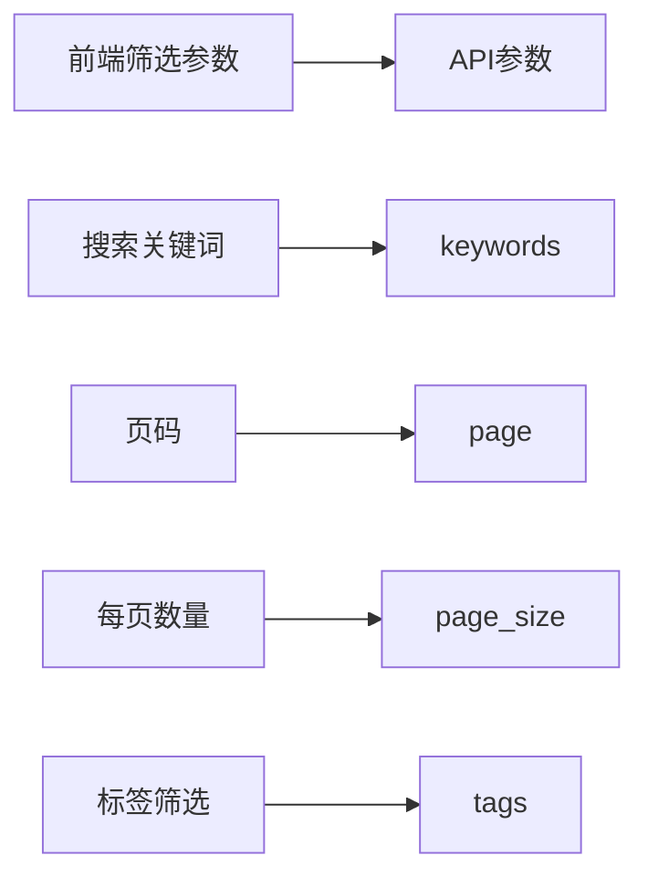

# 素材管理页面重构计划

## 项目概述

将素材管理页面从使用 `/api/v1/core/projects/{project_id}/materials` 接口重构为使用 `/api/v1/core/materials` 接口，统一所有素材操作。

## 现状分析

### 当前实现

- **获取素材**: `/api/v1/core/projects/{project_id}/materials` (按项目获取)
- **创建素材**: `/api/v1/core/materials/batch` (批量创建)
- **删除素材**: `/api/v1/core/materials` (DELETE)
- **更新素材**: `/api/v1/core/materials/{material_id}` (PUT)

### 目标实现

- **获取素材**: `/api/v1/core/materials` (GET) - 获取所有素材，支持分页和筛选
- **创建素材**: `/api/v1/core/materials/batch` (保持不变)
- **删除素材**: `/api/v1/core/materials` (DELETE) (保持不变)
- **更新素材**: `/api/v1/core/materials/{material_id}` (PUT) (保持不变)

## 技术架构

### 数据流架构

```mermaid
graph TD
    A[素材管理页面] --> B[Material Store]
    B --> C[MaterialApiService]
    C --> D[/api/v1/core/materials]

    A --> E[分页组件]
    A --> F[筛选组件]
    A --> G[搜索组件]

    E --> B
    F --> B
    G --> B

    D --> H[MaterialListResponse]
    H --> I[前端Material格式]
    I --> A
```

### API接口参数映射



## 实施计划

### 第一阶段：API服务层更新

1. **在MaterialApiService中添加getAllMaterials方法**

   - 支持分页参数：page, page_size
   - 支持搜索参数：keywords
   - 支持筛选参数：tags
   - 返回MaterialListResponse格式

2. **验证现有删除和更新方法**
   - 确认deleteMaterials方法符合新接口要求
   - 确认updateMaterial方法符合新接口要求

### 第二阶段：状态管理更新

1. **在store中添加使用新接口的方法**

   - 添加loadAllMaterialsFromDatabase方法
   - 支持分页加载
   - 支持搜索和筛选参数

2. **更新现有方法**
   - 修改loadProjectMaterialsFromDatabase为使用新接口
   - 保持向后兼容性

### 第三阶段：前端页面重构

1. **添加分页组件**

   - 使用Element Plus的分页组件
   - 支持页码和每页数量调整
   - 与API分页参数联动

2. **更新数据加载逻辑**

   - 页面初始化时调用新的API方法
   - 支持分页加载
   - 处理加载状态

3. **修改筛选和搜索功能**

   - 将筛选参数转换为API参数格式
   - 实现实时搜索
   - 重置筛选条件时重新加载数据

4. **更新删除和编辑功能**
   - 确保使用正确的API方法
   - 操作成功后刷新当前页数据
   - 处理错误状态

### 第四阶段：测试和优化

1. **功能测试**

   - 测试分页功能
   - 测试搜索功能
   - 测试筛选功能
   - 测试删除和编辑功能

2. **用户体验优化**
   - 添加加载状态指示
   - 优化错误提示
   - 添加操作成功反馈

## 关键代码变更

### MaterialApiService新增方法

```typescript
async getAllMaterials(params?: {
  page?: number
  page_size?: number
  keywords?: string
  tags?: string[]
}): Promise<MaterialListResponse>
```

### Store新增方法

```typescript
async loadAllMaterialsFromDatabase(params?: {
  page?: number
  page_size?: number
  keywords?: string
  tags?: string[]
}): Promise<{
  materials: Material[]
  totalCount: number
  page: number
  pageSize: number
  totalPages: number
}>
```

### 页面组件变更

1. 添加分页状态管理
2. 修改筛选表单提交逻辑
3. 更新数据加载函数
4. 添加API参数转换逻辑

## 风险评估

### 技术风险

- **API兼容性**: 新接口可能返回不同的数据结构
- **性能影响**: 获取所有素材可能比按项目获取慢
- **分页实现**: 需要正确处理分页状态和数据缓存

### 缓解措施

- 添加数据格式转换逻辑
- 实现合理的默认分页大小
- 添加加载状态和错误处理

## 验收标准

1. **功能完整性**

   - 所有现有功能正常工作
   - 新增的分页功能正常
   - 搜索和筛选功能符合预期

2. **性能标准**

   - 页面加载时间不超过3秒
   - 分页切换响应时间不超过1秒
   - 搜索响应时间不超过2秒

3. **用户体验**
   - 操作流畅，无明显卡顿
   - 错误提示清晰友好
   - 加载状态明确

## 后续优化建议

1. **缓存策略**: 实现客户端数据缓存，减少API调用
2. **虚拟滚动**: 对于大量数据，考虑实现虚拟滚动
3. **批量操作**: 优化批量删除和编辑的性能
4. **实时更新**: 考虑WebSocket实现数据实时更新
