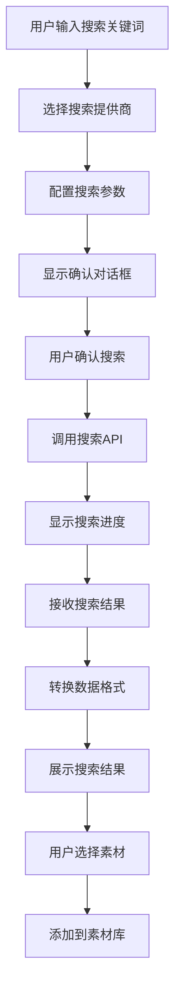
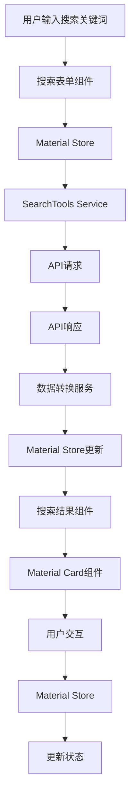
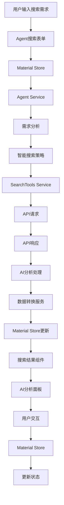

# 素材检索功能设计方案

## 1. API集成方案

### 1.1 API接口分析

基于 `@ai_api/search-tools` 的API文档，我们有以下关键接口：

- **搜索接口**: `/api/v1/ai/search-tools/search`
- **状态检查**: `/api/v1/ai/search-tools/status`
- **提供商信息**: `/api/v1/ai/search-tools/providers`

### 1.2 API请求结构

```typescript
// API请求参数
interface SearchToolsRequest {
  queries: string[] // 搜索查询列表
  provider: 'tavily' | 'bocha' // 搜索提供商
  max_results?: number // 最大结果数 (默认10)
  enable_structured_summaries?: boolean // 启用AI摘要 (默认true)
  summarization_model?: string // 摘要模型 (默认deepseek:deepseek-chat)
  max_content_length?: number // 最大内容长度 (默认50000)

  // Tavily特定参数
  topic?: 'general' | 'news' | 'finance' // 搜索主题
  include_raw_content?: boolean // 包含原始内容

  // Bocha特定参数
  freshness?: string // 时间范围过滤
  summary?: boolean // 返回AI摘要
  include?: string // 包含域名
  exclude?: string // 排除域名
}
```

### 1.3 API响应结构

```typescript
// API响应结构
interface SearchToolsResponse {
  success: boolean
  provider: string
  results: SearchResultItem[]
  total_results: number
  search_queries: string[]
  search_time: number
  api_execution_time: number
  query_count: number
}

// 搜索结果项
interface SearchResultItem {
  url: string
  webtitle: string
  score: number
  query: string
  aititle?: string
  summary?: string
  key_excerpts: string[]
  published_date?: string
}
```

### 1.4 响应转换逻辑

我们需要将 `SearchResultItem` 转换为项目中的 `Material` 类型：

```typescript
// 转换函数
function transformSearchResultToMaterial(result: SearchResultItem, provider: string): Material {
  // 从URL提取域名作为来源
  const url = new URL(result.url)
  const source = url.hostname

  // 生成唯一ID
  const id = `${provider}-${Date.now()}-${Math.random().toString(36).substr(2, 9)}`

  // 确定素材类型（基于URL和内容）
  const type = determineMaterialType(result.url, result.summary)

  // 提取标签
  const tags = extractTags(result.aititle || result.webtitle, result.summary, result.key_excerpts)

  return {
    id,
    title: result.aititle || result.webtitle,
    source,
    summary: result.summary || result.key_excerpts.join(' ') || '无可用摘要',
    tags,
    type,
    url: result.url,
    thumbnail: generateThumbnailUrl(result.url, type),
    content: result.key_excerpts.join('\n\n'),
    createdAt: result.published_date ? new Date(result.published_date) : new Date(),
    selected: false
  }
}

// 辅助函数：确定素材类型
function determineMaterialType(url: string, summary?: string): Material['type'] {
  const imageExtensions = ['.jpg', '.jpeg', '.png', '.gif', '.webp', '.svg']
  const videoExtensions = ['.mp4', '.avi', '.mov', '.wmv', '.flv', '.webm']
  const audioExtensions = ['.mp3', '.wav', '.ogg', '.flac', '.aac']

  const lowerUrl = url.toLowerCase()

  if (imageExtensions.some((ext) => lowerUrl.includes(ext))) {
    return 'image'
  }

  if (videoExtensions.some((ext) => lowerUrl.includes(ext))) {
    return 'video'
  }

  if (audioExtensions.some((ext) => lowerUrl.includes(ext))) {
    return 'audio'
  }

  // 基于URL和摘要内容判断
  if (
    summary &&
    (summary.includes('图片') || summary.includes('图像') || summary.includes('照片'))
  ) {
    return 'image'
  }

  if (summary && (summary.includes('视频') || summary.includes('影片'))) {
    return 'video'
  }

  if (
    summary &&
    (summary.includes('音频') || summary.includes('音乐') || summary.includes('声音'))
  ) {
    return 'audio'
  }

  // 默认为文本类型
  return 'text'
}

// 辅助函数：提取标签
function extractTags(title: string, summary?: string, excerpts: string[] = []): string[] {
  const allText = [title, summary || '', ...excerpts].join(' ')

  // 简单的关键词提取逻辑
  const commonTags = ['设计', '素材', '创意', '灵感', '艺术', '图片', '视频', '音频', '文本']
  const foundTags: string[] = []

  commonTags.forEach((tag) => {
    if (allText.includes(tag)) {
      foundTags.push(tag)
    }
  })

  // 如果没有找到常见标签，使用标题中的关键词
  if (foundTags.length === 0) {
    const titleWords = title.split(/\s+/).filter((word) => word.length > 1)
    foundTags.push(...titleWords.slice(0, 3))
  }

  return foundTags.slice(0, 5) // 最多返回5个标签
}

// 辅助函数：生成缩略图URL
function generateThumbnailUrl(url: string, type: Material['type']): string | undefined {
  if (type === 'image') {
    return url // 图片直接使用原URL
  }

  // 对于其他类型，可以生成占位图
  if (type === 'video') {
    return `https://picsum.photos/300/200?random=${encodeURIComponent(url)}&type=video`
  }

  if (type === 'audio') {
    return `https://picsum.photos/300/200?random=${encodeURIComponent(url)}&type=audio`
  }

  return `https://picsum.photos/300/200?random=${encodeURIComponent(url)}`
}
```

### 1.5 API服务封装

```typescript
// 扩展现有的 materialSearchService
class MaterialSearchService {
  // ... 现有方法 ...

  // 集成 search-tools API
  async searchWithSearchTools(params: SearchParams): Promise<SearchResult> {
    try {
      // 构建API请求
      const request: SearchToolsRequest = {
        queries: [params.keywords],
        provider: params.providers[0] as 'tavily' | 'bocha',
        max_results: params.pageSize || 20,
        enable_structured_summaries: true,
        summarization_model: 'deepseek:deepseek-chat'
      }

      // 添加提供商特定参数
      if (request.provider === 'tavily') {
        request.topic = 'general'
        request.include_raw_content = true
      } else if (request.provider === 'bocha') {
        request.summary = true
      }

      // 发送请求
      const response = await http.post('/api/v1/ai/search-tools/search', request)
      const apiResponse: SearchToolsResponse = response.data

      // 转换结果
      const materials = apiResponse.results.map((result) =>
        transformSearchResultToMaterial(result, apiResponse.provider)
      )

      return {
        materials,
        total: apiResponse.total_results,
        page: params.page || 1,
        pageSize: params.pageSize || 20
      }
    } catch (error) {
      console.error('Search tools API error:', error)
      throw new Error('搜索失败，请稍后重试')
    }
  }

  // 检查搜索工具状态
  async checkSearchToolsStatus(): Promise<SearchToolsStatusResponse> {
    try {
      const response = await http.get('/api/v1/ai/search-tools/status')
      return response.data
    } catch (error) {
      console.error('Check search tools status error:', error)
      throw new Error('无法检查搜索工具状态')
    }
  }

  // 获取搜索提供商信息
  async getSearchToolsProviders(): Promise<Record<string, any>> {
    try {
      const response = await http.get('/api/v1/ai/search-tools/providers')
      return response.data
    } catch (error) {
      console.error('Get search providers error:', error)
      throw new Error('获取搜索提供商信息失败')
    }
  }
}
```

## 2. 简单情景设计

### 2.1 基本素材检索流程



### 2.2 搜索配置组件

```typescript
// 搜索配置接口
interface SimpleSearchConfig {
  keywords: string
  provider: 'tavily' | 'bocha'
  maxResults: number
  enableSummary: boolean
  topic?: 'general' | 'news' | 'finance'
  freshness?: string
}
```

### 2.3 搜索结果展示

利用现有的 [`MaterialCard`](src/components/custom/material-card/MaterialCard.vue:1) 组件展示搜索结果：

```vue
<template>
  <div class="search-results">
    <div class="search-results__header">
      <h3>搜索结果 ({{ materials.length }} 个素材)</h3>
      <div class="search-results__actions">
        <el-button @click="selectAll">全选</el-button>
        <el-button @click="clearSelection">取消选择</el-button>
        <el-button type="primary" @click="addToLibrary" :disabled="selectedMaterials.length === 0">
          添加到素材库 ({{ selectedMaterials.length }})
        </el-button>
      </div>
    </div>

    <div class="search-results__grid">
      <MaterialCard
        v-for="material in materials"
        :key="material.id"
        :material="material"
        :selected="selectedMaterials.includes(material.id)"
        :loading="loadingMaterials.includes(material.id)"
        :show-type="true"
        @select="toggleMaterialSelection"
        @preview="showPreview"
        @download="downloadMaterial"
        @click="selectMaterial(material)"
      />
    </div>
  </div>
</template>
```

### 2.4 素材选择和添加功能

```typescript
// 素材选择逻辑
function toggleMaterialSelection(materialId: string) {
  const index = selectedMaterials.value.indexOf(materialId)
  if (index > -1) {
    selectedMaterials.value.splice(index, 1)
  } else {
    selectedMaterials.value.push(materialId)
  }
}

// 添加到素材库
async function addToLibrary() {
  if (selectedMaterials.value.length === 0) {
    ElMessage.warning('请先选择要添加的素材')
    return
  }

  try {
    await materialStore.addToLibrary(selectedMaterials.value)
    ElMessage.success(`已添加 ${selectedMaterials.value.length} 个素材到素材库`)
    clearSelection()
  } catch (error) {
    ElMessage.error('添加到素材库失败')
  }
}
```

## 3. Agent情景设计

### 3.1 Agent情景接口

```typescript
// Agent搜索配置
interface AgentSearchConfig extends SimpleSearchConfig {
  searchScope: string // AI理解的检索范围
  aiProvider: string // AI提供商
  agentMode: 'simple' | 'advanced' // Agent模式
  contextData?: any // 上下文数据
  requirements?: string[] // 特殊需求
}

// Agent搜索结果
interface AgentSearchResult extends SearchResult {
  aiAnalysis: {
    relevanceScore: number // AI相关性评分
    qualityScore: number // AI质量评分
    recommendations: string[] // AI推荐
    insights: string[] // AI洞察
  }
  processingInfo: {
    aiModel: string // 使用的AI模型
    processingTime: number // 处理时间
    queryExpansion: string[] // 查询扩展
  }
}
```

### 3.2 Agent情景数据结构

```typescript
// Agent状态管理
interface AgentState {
  isActive: boolean
  currentTask: string | null
  processingStage: 'idle' | 'analyzing' | 'searching' | 'processing' | 'completed'
  context: Record<string, any>
  history: AgentSearchConfig[]
  capabilities: string[]
}

// Agent服务接口
interface AgentService {
  // 分析搜索需求
  analyzeSearchRequest(config: AgentSearchConfig): Promise<SearchAnalysis>

  // 执行智能搜索
  performIntelligentSearch(config: AgentSearchConfig): Promise<AgentSearchResult>

  // 获取推荐
  getRecommendations(materials: Material[], context: any): Promise<Material[]>

  // 生成搜索报告
  generateSearchReport(results: AgentSearchResult[]): Promise<SearchReport>
}
```

### 3.3 Agent情景UI设计

```vue
<template>
  <div class="agent-search">
    <!-- 简单模式/高级模式切换 -->
    <el-tabs v-model="activeMode" @tab-change="handleModeChange">
      <el-tab-pane label="简单搜索" name="simple">
        <SimpleSearchForm @search="handleSimpleSearch" />
      </el-tab-pane>
      <el-tab-pane label="AI智能搜索" name="agent">
        <AgentSearchForm @search="handleAgentSearch" />
      </el-tab-pane>
    </el-tabs>

    <!-- AI分析面板 -->
    <div v-if="activeMode === 'agent' && aiAnalysis" class="ai-analysis">
      <h3>AI分析结果</h3>
      <div class="ai-analysis__content">
        <div class="ai-analysis__insights">
          <h4>搜索洞察</h4>
          <ul>
            <li v-for="insight in aiAnalysis.insights" :key="insight">
              {{ insight }}
            </li>
          </ul>
        </div>
        <div class="ai-analysis__recommendations">
          <h4>推荐策略</h4>
          <ul>
            <li v-for="rec in aiAnalysis.recommendations" :key="rec">
              {{ rec }}
            </li>
          </ul>
        </div>
      </div>
    </div>

    <!-- 搜索结果 -->
    <SearchResults
      :materials="materials"
      :loading="loading"
      :ai-enhanced="activeMode === 'agent'"
      @select="handleMaterialSelect"
      @add-to-library="handleAddToLibrary"
    />
  </div>
</template>
```

## 4. 技术实现方案

### 4.1 需要创建的新组件和服务

1. **新组件**:

   - `SimpleSearchForm.vue` - 简单搜索表单
   - `AgentSearchForm.vue` - Agent搜索表单
   - `SearchResults.vue` - 搜索结果展示组件
   - `AIAnalysisPanel.vue` - AI分析面板
   - `SearchProgress.vue` - 搜索进度组件（可能已存在）

2. **新服务**:

   - `searchToolsService.ts` - search-tools API服务
   - `agentService.ts` - Agent功能服务
   - `dataTransformService.ts` - 数据转换服务

3. **新类型定义**:
   - 扩展现有的 `material.ts` 类型文件
   - 添加Agent相关的类型定义

### 4.2 状态管理扩展

```typescript
// 扩展 material store
export const useMaterialStore = defineStore('material', () => {
  // ... 现有状态 ...

  // Agent相关状态
  const agentState = ref<AgentState>({
    isActive: false,
    currentTask: null,
    processingStage: 'idle',
    context: {},
    history: [],
    capabilities: []
  })

  // 搜索模式
  const searchMode = ref<'simple' | 'agent'>('simple')

  // AI分析结果
  const aiAnalysis = ref<SearchAnalysis | null>(null)

  // Agent方法
  async function searchWithAgent(config: AgentSearchConfig) {
    agentState.value.processingStage = 'analyzing'

    try {
      // 分析搜索需求
      const analysis = await agentService.analyzeSearchRequest(config)
      aiAnalysis.value = analysis

      // 执行智能搜索
      agentState.value.processingStage = 'searching'
      const results = await agentService.performIntelligentSearch(config)

      // 转换并添加结果
      const materials = results.materials.map(transformAgentResultToMaterial)
      addMaterials(materials)

      agentState.value.processingStage = 'completed'
      return results
    } catch (error) {
      agentState.value.processingStage = 'idle'
      throw error
    }
  }

  function setSearchMode(mode: 'simple' | 'agent') {
    searchMode.value = mode
  }

  return {
    // ... 现有返回值 ...
    agentState,
    searchMode,
    aiAnalysis,
    searchWithAgent,
    setSearchMode
  }
})
```

### 4.3 错误处理和加载状态

```typescript
// 错误处理
class SearchErrorHandler {
  static handle(error: any, context: string) {
    console.error(`Search error in ${context}:`, error)

    if (error.response) {
      // API错误
      const status = error.response.status
      const message = error.response.data?.message || '搜索服务错误'

      switch (status) {
        case 401:
          ElMessage.error('API认证失败，请检查配置')
          break
        case 429:
          ElMessage.error('请求过于频繁，请稍后重试')
          break
        case 500:
          ElMessage.error('服务器内部错误，请稍后重试')
          break
        default:
          ElMessage.error(`搜索失败: ${message}`)
      }
    } else if (error.request) {
      // 网络错误
      ElMessage.error('网络连接失败，请检查网络设置')
    } else {
      // 其他错误
      ElMessage.error(`搜索失败: ${error.message}`)
    }
  }
}

// 加载状态管理
interface LoadingState {
  searching: boolean
  processing: boolean
  downloading: string[]
  analyzing: boolean
}

const loadingState = ref<LoadingState>({
  searching: false,
  processing: false,
  downloading: [],
  analyzing: false
})

// 加载状态计算属性
const isLoading = computed(
  () =>
    loadingState.value.searching || loadingState.value.processing || loadingState.value.analyzing
)
```

## 5. 数据流设计

### 5.1 简单情景数据流



### 5.2 Agent情景数据流



## 6. 关键接口设计

### 6.1 搜索服务接口

```typescript
interface ISearchService {
  // 简单搜索
  simpleSearch(params: SimpleSearchConfig): Promise<SearchResult>

  // Agent搜索
  agentSearch(params: AgentSearchConfig): Promise<AgentSearchResult>

  // 获取搜索状态
  getStatus(): Promise<SearchStatus>

  // 取消搜索
  cancelSearch(): Promise<void>
}
```

### 6.2 数据转换接口

```typescript
interface IDataTransformService {
  // 转换搜索结果为素材
  transformSearchResult(result: SearchResultItem, provider: string): Material

  // 转换Agent搜索结果
  transformAgentResult(result: AgentSearchResultItem): Material

  // 批量转换
  batchTransform(results: SearchResultItem[], provider: string): Material[]
}
```

### 6.3 Agent服务接口

```typescript
interface IAgentService {
  // 分析搜索需求
  analyzeRequest(config: AgentSearchConfig): Promise<SearchAnalysis>

  // 执行智能搜索
  intelligentSearch(config: AgentSearchConfig): Promise<AgentSearchResult>

  // 获取推荐
  getRecommendations(context: SearchContext): Promise<Material[]>

  // 生成报告
  generateReport(results: AgentSearchResult[]): Promise<SearchReport>
}
```

## 7. 实现优先级和阶段规划

### 阶段1：基础API集成

1. 实现 `searchToolsService` 基础功能
2. 创建数据转换逻辑
3. 集成到现有的 `materialSearchService`

### 阶段2：简单情景实现

1. 创建 `SimpleSearchForm` 组件
2. 优化现有的搜索结果展示
3. 实现素材选择和添加功能

### 阶段3：Agent情景预留

1. 设计Agent相关接口和数据结构
2. 创建 `AgentSearchForm` 组件框架
3. 预留Agent功能扩展点

### 阶段4：错误处理和优化

1. 完善错误处理机制
2. 优化加载状态管理
3. 添加搜索进度反馈

## 8. 总结

本设计方案提供了素材检索功能的完整实现路径，包括：

1. **API集成方案**：详细设计了如何集成 `@ai_api/search-tools` API，包括请求构建、响应处理和数据转换
2. **简单情景设计**：基于现有组件设计了基本的素材检索流程
3. **Agent情景预留**：为未来的AI增强功能预留了接口和数据结构
4. **技术实现方案**：提供了具体的组件、服务和状态管理设计

该方案充分利用了现有的 [`MaterialCard`](src/components/custom/material-card/MaterialCard.vue:1) 组件和 [`MaterialStore`](src/store/material.ts:1) 状态管理，确保了与现有系统的良好集成，同时为未来的功能扩展提供了灵活的架构。
