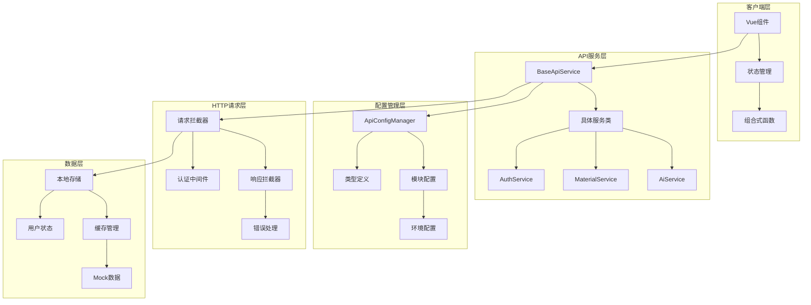
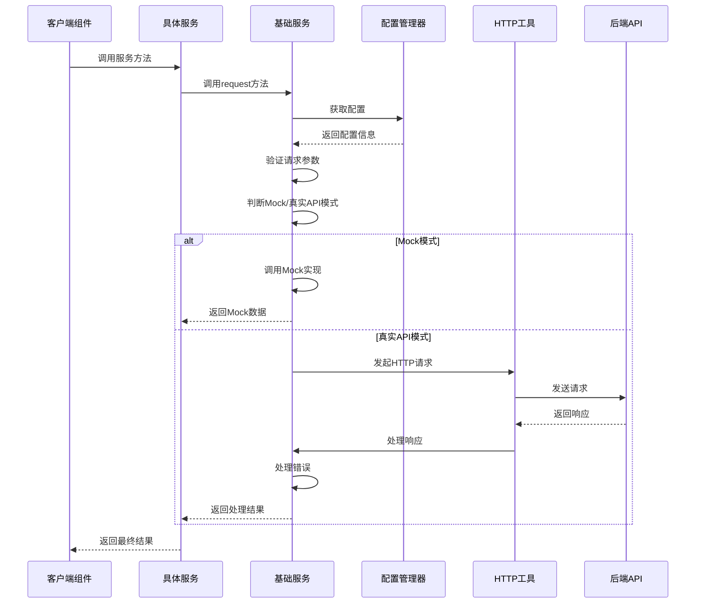
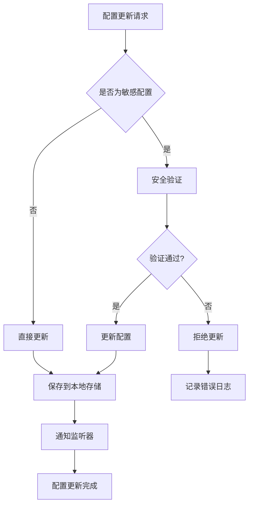
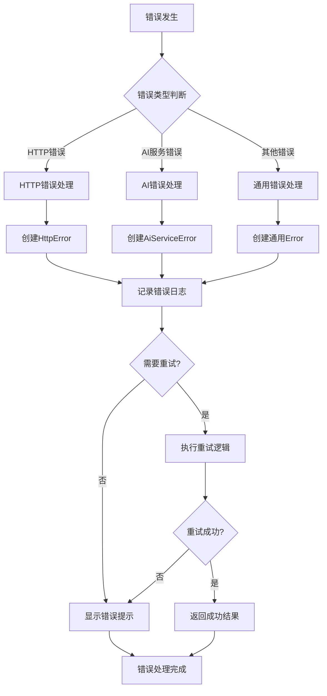
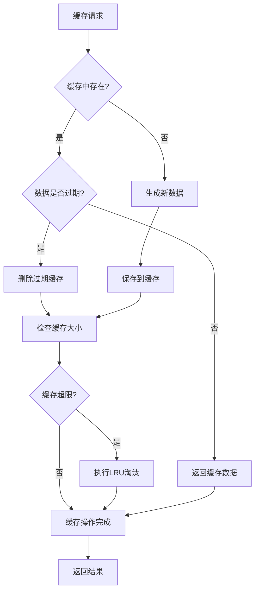

# API响应架构系统架构与文件结构详解

## 目录

1. [系统架构概览](#系统架构概览)
2. [核心架构层次](#核心架构层次)
3. [配置管理架构](#配置管理架构)
4. [服务层架构](#服务层架构)
5. [错误处理架构](#错误处理架构)
6. [缓存架构](#缓存架构)
7. [安全架构](#安全架构)
8. [文件结构详解](#文件结构详解)
9. [架构交互流程](#架构交互流程)

## 系统架构概览

### 整体架构图



### 架构设计原则

1. **分层架构**：清晰的职责分离，每层只关注自己的核心功能
2. **模块化设计**：高内聚、低耦合的模块结构
3. **依赖注入**：通过配置管理器注入依赖，提高可测试性
4. **统一接口**：所有API服务继承自基础服务类，确保一致性
5. **错误边界**：每层都有独立的错误处理机制

## 核心架构层次

### 1. 表示层 (Presentation Layer)

**文件位置**：

- `src/components/` - Vue组件
- `src/composables/` - 组合式函数
- `src/store/` - 状态管理

**功能描述**：

- 处理用户界面交互
- 管理组件状态和生命周期
- 调用API服务获取数据
- 响应用户操作和系统事件

**关键文件**：

```typescript
// src/composables/useAuth.ts
export function useAuth() {
  // 认证相关的组合式函数
  const hasAuth = (auth: string): boolean => {
    // 权限检查逻辑
  }

  return { hasAuth }
}

// src/store/modules/user.ts
export const useUserStore = defineStore('user', () => {
  // 用户状态管理
  const accessToken = ref<string | null>(null)
  const refreshToken = ref<string | null>(null)

  return { accessToken, refreshToken }
})
```

### 2. 业务逻辑层 (Business Logic Layer)

**文件位置**：

- `src/services/` - API服务类
- `src/utils/` - 工具函数
- `src/types/` - 类型定义

**功能描述**：

- 封装API调用逻辑
- 处理业务规则和数据转换
- 提供可复用的工具函数
- 定义系统类型接口

**关键文件**：

```typescript
// src/services/base/apiService.ts
abstract class BaseApiService {
  protected serviceName: string
  protected aiErrorHandler: AiErrorHandler

  protected async request<T>(config: ApiRequestConfig): Promise<T> {
    // 统一的请求处理逻辑
  }

  protected validateRequest(path: string, method: HttpMethod): void {
    // 请求验证逻辑
  }
}

// src/services/aiService.ts
class AiService extends BaseApiService {
  constructor() {
    super('ai')
  }

  async searchTools(request: SearchToolsRequest): Promise<SearchToolsResponse> {
    // AI搜索工具实现
  }
}
```

### 3. 数据访问层 (Data Access Layer)

**文件位置**：

- `src/utils/http/` - HTTP请求工具
- `src/utils/storage/` - 本地存储工具
- `src/mock/` - Mock数据管理

**功能描述**：

- 处理HTTP请求和响应
- 管理本地数据存储
- 提供Mock数据支持
- 实现数据缓存机制

**关键文件**：

```typescript
// src/utils/http/index.ts
const axiosInstance = axios.create({
  timeout: REQUEST_TIMEOUT,
  baseURL: VITE_API_URL,
  withCredentials: VITE_WITH_CREDENTIALS === 'true'
})

// src/utils/storage/storage.ts
export class StorageManager {
  static setItem(key: string, value: any): void {
    localStorage.setItem(key, JSON.stringify(value))
  }

  static getItem<T>(key: string): T | null {
    const item = localStorage.getItem(key)
    return item ? JSON.parse(item) : null
  }
}
```

## 配置管理架构

### 配置管理器核心

**文件位置**：`src/config/api/index.ts`

**功能描述**：

- 统一管理所有API配置
- 支持配置热更新和持久化
- 提供配置验证和错误检查
- 实现Mock/真实API模式切换

**核心功能**：

```typescript
class ApiConfigManager {
  private config: ApiConfig
  private listeners: Array<(config: ApiConfig) => void> = []

  // 配置更新
  updateConfig(updates: Partial<ApiConfig>): void {
    this.config = { ...this.config, ...updates }
    this.saveToStorage()
    this.notifyListeners()
  }

  // Mock模式切换
  setUseMock(useMock: boolean): void {
    // 智能的Mock/真实API切换逻辑
  }

  // 配置验证
  validateApiConfig(): { isValid: boolean; errors: string[] } {
    // 完整的配置验证逻辑
  }
}
```

### 模块配置系统

**文件位置**：`src/config/api/modules/`

**功能描述**：

- 每个API服务的独立配置
- 统一的配置接口和类型
- 支持模块化配置管理
- 提供配置验证机制

**配置示例**：

```typescript
// src/config/api/modules/search-tools.ts
export const searchToolsService: ApiEndpointConfig = {
  name: '搜索工具服务',
  baseUrl: '/api/v1/ai',
  methods: ['GET', 'POST'],
  enableMock: true,
  mockPath: '/mock/data/ai',
  defaults: {
    timeout: 120000,
    headers: { 'Content-Type': 'application/json' },
    retryCount: 1,
    enableCache: false
  },
  paths: {
    '/search-tools/search': {
      description: 'Execute search using the specified provider',
      methods: ['POST'],
      request: {
        bodyType: 'json',
        requireAuth: true,
        params: {
          queries: 'string[]',
          provider: 'string',
          max_results: 'number'
        }
      }
    }
  }
}
```

### 类型定义系统

**文件位置**：`src/config/api/types.ts`

**功能描述**：

- 定义所有配置相关的TypeScript类型
- 提供类型安全保障
- 支持配置验证和自动补全
- 确保配置结构的一致性

**核心类型**：

```typescript
export interface ApiConfig {
  useMock: boolean
  mockDelay: number
  showDebugInfo: boolean
}

export interface ApiEndpointConfig {
  name: string
  baseUrl: string
  methods: HttpMethod[]
  paths: Record<string, ApiPathConfig>
  defaults: ApiEndpointDefaults
  enableMock: boolean
  mockPath: string
}

export interface ApiRequestConfig {
  url: string
  method: HttpMethod
  data?: any
  params?: any
  headers?: Record<string, string>
  timeout?: number
  useMock?: boolean
}
```

## 服务层架构

### 基础服务类

**文件位置**：`src/services/base/apiService.ts`

**功能描述**：

- 提供所有API服务的基础功能
- 实现统一的请求处理流程
- 支持Mock/真实API模式切换
- 提供请求验证和错误处理

**核心功能**：

```typescript
abstract class BaseApiService {
  protected serviceName: string
  protected aiErrorHandler: AiErrorHandler

  // 统一请求方法
  protected async request<T>(config: ApiRequestConfig): Promise<T> {
    // 1. 请求验证
    this.validateRequest(config.path, config.method)

    // 2. Mock/真实API模式判断
    if (this.shouldUseMock(config)) {
      return this.handleMockRequest<T>(config)
    }

    // 3. 真实API请求
    return this.handleRealRequest<T>(config)
  }

  // Mock请求处理
  private async handleMockRequest<T>(config: ApiRequestConfig): Promise<T> {
    // Mock请求逻辑实现
  }

  // 真实请求处理
  private async handleRealRequest<T>(config: ApiRequestConfig): Promise<T> {
    // 真实API请求逻辑实现
  }

  // 请求验证
  protected validateRequest(path: string, method: HttpMethod): void {
    if (!apiConfigManager.isMethodSupported(this.serviceName, path, method)) {
      throw new Error(`API请求验证失败`)
    }
  }
}
```

### 具体服务实现

**文件位置**：

- `src/services/aiService.ts` - AI服务
- `src/services/materialService.ts` - 素材管理服务
- `src/services/authService.ts` - 认证服务

**功能描述**：

- 继承BaseApiService实现具体业务逻辑
- 封装特定领域的API调用
- 提供类型安全的接口方法
- 实现Mock数据支持

**AI服务示例**：

```typescript
// src/services/aiService.ts
class AiService extends BaseApiService {
  constructor() {
    super('ai')
  }

  // 搜索工具API
  async searchTools(request: SearchToolsRequest): Promise<SearchToolsResponse> {
    return this.post<SearchToolsResponse>('/search-tools/search', request)
  }

  // 获取搜索工具状态
  async getSearchToolsStatus(): Promise<SearchToolsStatusResponse> {
    return this.get<SearchToolsStatusResponse>('/search-tools/status')
  }

  // Mock实现
  protected async mockImplementation(config: ApiRequestConfig): Promise<any> {
    const url = config.url
    const method = config.method

    if (method === 'GET' && url.includes('/search-tools/status')) {
      return mockDataManager.getMockData('ai-search-tools-status')
    }

    if (method === 'POST' && url.includes('/search-tools/search')) {
      const requestData = config.data
      return mockDataManager.getMockData('ai-search-tools', requestData.queries)
    }
  }
}
```

### 服务统一导出

**文件位置**：`src/services/index.ts`

**功能描述**：

- 统一导出所有服务类
- 提供服务注册和管理
- 简化服务导入和使用

**导出示例**：

```typescript
// src/services/index.ts
export { default as BaseApiService } from './base/apiService'
export { aiService } from './aiService'
export { materialApiService } from './materialService'
export { authService } from './authService'

// 服务注册表
export const API_SERVICES = {
  ai: aiService,
  material: materialApiService,
  auth: authService
} as const
```

## 错误处理架构

### HTTP错误处理

**文件位置**：`src/utils/http/error.ts`

**功能描述**：

- 处理HTTP请求和响应错误
- 提供统一的错误类型定义
- 实现错误日志记录和用户通知
- 支持错误分类和严重程度判断

**核心功能**：

```typescript
export class HttpError extends Error {
  public readonly code: number
  public readonly data?: unknown
  public readonly timestamp: string
  public readonly url?: string
  public readonly method?: string

  constructor(
    message: string,
    code: number,
    options?: {
      data?: unknown
      url?: string
      method?: string
    }
  ) {
    super(message)
    this.name = 'HttpError'
    this.code = code
    this.data = options?.data
    this.timestamp = new Date().toISOString()
    this.url = options?.url
    this.method = options?.method
  }

  public toLogData(): ErrorLogData {
    return {
      code: this.code,
      message: this.message,
      data: this.data,
      timestamp: this.timestamp,
      url: this.url,
      method: this.method,
      stack: this.stack
    }
  }
}

export function handleError(error: AxiosError<ErrorResponse>): never {
  // 统一的错误处理逻辑
  const statusCode = error.response?.status
  const responseData = error.response?.data as any
  const errorMessage = responseData?.msg || error.message

  throw new HttpError(errorMessage, statusCode || ApiStatus.error, {
    data: error.response.data,
    url: error.config?.url,
    method: error.config?.method?.toUpperCase()
  })
}
```

### AI服务错误处理

**文件位置**：`src/utils/http/ai-error.ts`

**功能描述**：

- 处理AI服务特有的错误类型
- 提供智能的错误恢复机制
- 实现错误重试和降级策略
- 支持错误监控和统计

**核心功能**：

```typescript
export class AiServiceError extends HttpError {
  public readonly aiErrorCode: AiErrorCodes
  public readonly errorType: AiErrorTypes
  public readonly severity: AiErrorSeverity
  public readonly details: AiErrorDetails
  public readonly retryable: boolean
  public readonly retryAfter?: number

  constructor(
    message: string,
    aiErrorCode: AiErrorCodes,
    errorType: AiErrorTypes,
    severity: AiErrorSeverity = AiErrorSeverity.MEDIUM,
    details: AiErrorDetails = {},
    statusCode: number = ApiStatus.error
  ) {
    super(message, statusCode, {
      url: details.endpoint,
      method: details.service
    })

    this.aiErrorCode = aiErrorCode
    this.errorType = errorType
    this.severity = severity
    this.details = details
    this.retryable = details.retryable ?? false
    this.retryAfter = details.retryAfter
  }

  public getUserFriendlyMessage(): string {
    const baseMessage = this.message
    const suggestedAction = this.details.suggestedAction

    if (suggestedAction) {
      return `${baseMessage}\n建议操作：${suggestedAction}`
    }

    return baseMessage
  }

  public shouldRetry(): boolean {
    if (!this.retryable) return false

    if (this.retryAfter) {
      return Date.now() >= this.retryAfter
    }

    return true
  }
}
```

### 错误监控

**文件位置**：`src/utils/http/ai-error-monitor.ts`

**功能描述**：

- 监控AI服务错误统计和趋势
- 提供错误报告和分析
- 支持自动告警和通知
- 实现错误恢复建议生成

**核心功能**：

```typescript
export class AiErrorMonitor {
  private errorMetrics: ErrorMetrics = {
    totalErrors: 0,
    errorsByType: {},
    errorsByService: {},
    recentErrors: [],
    performanceMetrics: {
      averageResponseTime: 0,
      errorRate: 0,
      uptime: 0
    }
  }

  public recordError(error: AiServiceError): void {
    this.errorMetrics.totalErrors++

    // 按类型统计
    const errorType = error.errorType
    this.errorMetrics.errorsByType[errorType] = (this.errorMetrics.errorsByType[errorType] || 0) + 1

    // 按服务统计
    const service = error.details.service || 'unknown'
    this.errorMetrics.errorsByService[service] =
      (this.errorMetrics.errorsByService[service] || 0) + 1

    // 记录最近错误
    this.errorMetrics.recentErrors.unshift({
      timestamp: error.timestamp,
      message: error.message,
      errorType: error.errorType,
      severity: error.severity,
      service: error.details.service,
      endpoint: error.details.endpoint
    })

    // 保持最近错误列表不超过50条
    if (this.errorMetrics.recentErrors.length > 50) {
      this.errorMetrics.recentErrors = this.errorMetrics.recentErrors.slice(0, 50)
    }
  }

  public generateErrorReport(): ErrorReport {
    return {
      summary: this.errorMetrics,
      recentErrors: this.getRecentErrors(),
      performance: this.getPerformanceMetrics(),
      recommendations: this.generateRecommendations()
    }
  }
}
```

## 缓存架构

### 表格缓存系统

**文件位置**：`src/utils/table/tableCache.ts`

**功能描述**：

- 为表格数据提供高效的缓存机制
- 支持多种缓存失效策略
- 实现LRU淘汰算法
- 提供缓存统计和监控

**核心功能**：

```typescript
export class TableCache<T> {
  private cache = new Map<string, CacheItem<T>>()
  private cacheTime: number
  private maxSize: number

  constructor(cacheTime = 5 * 60 * 1000, maxSize = 50) {
    this.cacheTime = cacheTime
    this.maxSize = maxSize
  }

  set(params: unknown, data: T[], response: ApiResponse<T>): void {
    const key = this.generateKey(params)
    const tags = this.generateTags(params as Record<string, unknown>)
    const now = Date.now()

    // LRU清理
    this.evictLRU()

    this.cache.set(key, {
      data,
      response,
      timestamp: now,
      tags,
      hits: 0
    })
  }

  get(params: unknown): CacheItem<T> | null {
    const key = this.generateKey(params)
    const item = this.cache.get(key)

    if (!item) return null

    // 检查是否过期
    if (Date.now() - item.timestamp > this.cacheTime) {
      this.cache.delete(key)
      return null
    }

    item.hits++
    item.lastAccessed = Date.now()

    return item
  }

  private evictLRU(): void {
    if (this.cache.size <= this.maxSize) return

    let lruKey = ''
    let lruTime = Date.now()

    for (const [key, item] of this.cache.entries()) {
      if (item.lastAccessed < lruTime) {
        lruTime = item.lastAccessed
        lruKey = key
      }
    }

    if (lruKey) {
      this.cache.delete(lruKey)
    }
  }
}
```

### 缓存策略管理

**文件位置**：`src/composables/useTable.ts`

**功能描述**：

- 提供缓存策略的统一管理
- 支持多种缓存失效策略
- 实现智能缓存清理
- 提供缓存统计和监控

**核心功能**：

```typescript
const clearCache = (strategy: CacheInvalidationStrategy, context?: string): void => {
  if (!cache) return

  switch (strategy) {
    case CacheInvalidationStrategy.CLEAR_ALL:
      cache.clear()
      logger.log(`清空所有缓存 - ${context || ''}`)
      break

    case CacheInvalidationStrategy.CLEAR_CURRENT:
      clearedCount = cache.clearCurrentSearch(searchParams)
      logger.log(`清空当前搜索缓存 ${clearedCount} 条 - ${context || ''}`)
      break

    case CacheInvalidationStrategy.CLEAR_PAGINATION:
      clearedCount = cache.clearPagination()
      logger.log(`清空分页缓存 ${clearedCount} 条 - ${context || ''}`)
      break
  }

  // 手动触发缓存状态更新
  cacheUpdateTrigger.value++
}
```

### Mock数据缓存

**文件位置**：`src/mock/index.ts`

**功能描述**：

- 为Mock数据提供缓存支持
- 实现Mock数据的智能管理
- 支持Mock数据的动态生成
- 提供Mock数据统计和清理

**核心功能**：

```typescript
export class MockDataManager {
  private dataCache = new Map<string, any>()

  getMockData(key: string, ...args: any[]): any {
    const cacheKey = `${key}-${JSON.stringify(args)}`

    if (this.dataCache.has(cacheKey)) {
      return this.dataCache.get(cacheKey)
    }

    let data: any

    // 根据key生成相应的Mock数据
    switch (key) {
      case 'ai-search-tools':
        data = generateMockSearchToolsResponse(args[0], args[1])
        break
      case 'ai-search-tools-status':
        data = generateMockSearchToolsStatus()
        break
    }

    // 缓存数据
    this.dataCache.set(cacheKey, data)
    return data
  }

  clearCache(key?: string): void {
    if (key) {
      // 清除特定key的缓存
      for (const cacheKey of this.dataCache.keys()) {
        if (cacheKey.startsWith(key)) {
          this.dataCache.delete(cacheKey)
        }
      }
    } else {
      // 清空所有缓存
      this.dataCache.clear()
    }
  }

  getCacheStats(): CacheStats {
    return {
      totalEntries: this.dataCache.size,
      cacheKeys: Array.from(this.dataCache.keys()),
      memoryUsage: this.calculateMemoryUsage()
    }
  }
}
```

## 安全架构

### 认证安全

**文件位置**：`src/utils/auth/index.ts`

**功能描述**：

- 处理JWT令牌的解析和验证
- 实现令牌过期检查和自动刷新
- 支持Mock和真实令牌的区分
- 提供用户信息提取和验证

**核心功能**：

```typescript
export function isTokenExpired(token: string, bufferSeconds: number = 30): boolean {
  try {
    // Mock token检查
    if (token.startsWith('mock-')) {
      return isMockTokenExpired(token, bufferSeconds)
    }

    // JWT token检查
    const tokenData = parseToken(token)

    if (!tokenData.exp) {
      return false
    }

    const expirationTime = tokenData.exp - bufferSeconds
    const currentTime = Math.floor(Date.now() / 1000)

    return currentTime >= expirationTime
  } catch (error) {
    console.error('[Auth] 令牌验证失败:', error)
    return true
  }
}

export function extractAndValidateUserInfo(token: string): {
  valid: boolean
  userInfo?: any
  error?: string
} {
  try {
    if (isTokenExpired(token)) {
      return { valid: false, error: '令牌已过期' }
    }

    const userId = getUserIdFromToken(token)
    const roles = getRolesFromToken(token)

    return {
      valid: true,
      userInfo: { userId, roles }
    }
  } catch (error) {
    return {
      valid: false,
      error: error instanceof Error ? error.message : '未知错误'
    }
  }
}
```

### 请求安全

**文件位置**：`src/utils/http/index.ts`

**功能描述**：

- 实现HTTP请求的安全处理
- 提供令牌自动刷新机制
- 支持请求重试和错误恢复
- 实现请求拦截和响应处理

**核心功能**：

```typescript
// 请求拦截器
axiosInstance.interceptors.request.use(
  (request: InternalAxiosRequestConfig) => {
    const { accessToken } = useUserStore()

    if (accessToken) {
      // 令牌过期检查
      if (isTokenExpired(accessToken)) {
        useUserStore().refreshAccessToken()
      }

      // 添加认证头
      request.headers.set('Authorization', `Bearer ${accessToken}`)
    }

    return request
  },
  (error) => {
    console.error('[HTTP Request] 请求配置错误:', error)
    throw error
  }
)

// 响应拦截器
axiosInstance.interceptors.response.use(
  (response: AxiosResponse<Api.Http.BaseResponse>) => {
    // 处理认证API特殊响应格式
    const isAuthAPI = AUTH_API_PATTERNS.some((pattern) => response.config.url?.includes(pattern))

    if (isAuthAPI) {
      const responseData = response.data as any
      if (responseData.success === true) {
        return response
      } else {
        throw createHttpError(responseData.message || '请求失败', ApiStatus.error)
      }
    }

    // 标准API响应处理
    const { code, msg } = response.data
    if (code === ApiStatus.success) {
      return response
    }

    throw createHttpError(msg || '请求失败', code)
  },
  async (error) => {
    // 401错误和令牌刷新处理
    if (error.response?.status === ApiStatus.unauthorized && !originalRequest._retry) {
      return handleTokenRefreshError(originalRequest)
    }

    return Promise.reject(handleError(error))
  }
)
```

### 数据安全

**文件位置**：`src/utils/http/error.ts`

**功能描述**：

- 实现敏感数据的过滤和保护
- 提供安全的错误日志记录
- 支持错误信息的本地化
- 实现用户友好的错误提示

**核心功能**：

```typescript
export function showError(error: HttpError, showMessage: boolean = true): void {
  if (showMessage) {
    ElMessage.error(error.message)
  }

  // 记录错误日志，但不暴露敏感信息
  console.error('[HTTP Error]', error.toLogData())
}

export function sanitizeLogData(data: any): any {
  const sensitiveFields = ['password', 'token', 'apiKey', 'secret']

  return JSON.parse(
    JSON.stringify(data, (key, value) => {
      if (sensitiveFields.some((field) => key.toLowerCase().includes(field.toLowerCase()))) {
        return '***REDACTED***'
      }
      return value
    })
  )
}
```

## 文件结构详解

### 根目录结构

```
src/
├── components/           # Vue组件
│   ├── core/            # 核心组件
│   ├── custom/          # 自定义组件
│   └── dev/             # 开发工具组件
├── composables/         # 组合式函数
├── config/              # 配置文件
│   └── api/             # API配置
├── services/            # API服务
│   ├── base/            # 基础服务类
│   └── [service-name].ts # 具体服务
├── store/               # 状态管理
│   └── modules/         # 状态模块
├── types/               # 类型定义
├── utils/               # 工具函数
│   ├── http/            # HTTP工具
│   ├── storage/         # 存储工具
│   └── auth/            # 认证工具
├── mock/                # Mock数据
└── locales/             # 国际化文件
```

### API配置目录详解

```
src/config/api/
├── index.ts              # 配置管理器核心实现
├── types.ts              # 配置相关类型定义
└── modules/              # API模块配置
    ├── index.ts          # 模块导出文件
    ├── auth.ts           # 认证服务配置
    ├── ai.ts             # AI服务配置
    ├── material.ts       # 素材服务配置
    ├── search-tools.ts   # 搜索工具配置
    └── [other-modules].ts # 其他模块配置
```

**配置管理器** (`src/config/api/index.ts`)：

- 实现ApiConfigManager类
- 提供配置的增删改查功能
- 支持配置热更新和持久化
- 实现配置验证和错误检查

**类型定义** (`src/config/api/types.ts`)：

- 定义所有配置相关的TypeScript类型
- 提供类型安全保障
- 支持配置验证和自动补全

**模块配置** (`src/config/api/modules/`)：

- 每个API服务的独立配置
- 统一的配置接口和结构
- 支持Mock数据和真实API配置

### 服务层目录详解

```
src/services/
├── index.ts              # 服务统一导出
├── base/                # 基础服务类
│   └── apiService.ts    # BaseApiService实现
├── authService.ts       # 认证服务
├── aiService.ts         # AI服务
├── materialService.ts   # 素材管理服务
└── [other-services].ts # 其他服务
```

**基础服务类** (`src/services/base/apiService.ts`)：

- 提供所有API服务的基础功能
- 实现统一的请求处理流程
- 支持Mock/真实API模式切换
- 提供请求验证和错误处理

**具体服务** (`src/services/[service-name].ts`)：

- 继承BaseApiService实现具体业务逻辑
- 封装特定领域的API调用
- 提供类型安全的接口方法
- 实现Mock数据支持

### 工具函数目录详解

```
src/utils/
├── http/                # HTTP请求工具
│   ├── index.ts          # HTTP请求核心实现
│   ├── error.ts          # HTTP错误处理
│   ├── ai-error.ts       # AI服务错误处理
│   ├── ai-error-monitor.ts # 错误监控
│   └── status.ts         # 状态码定义
├── storage/             # 本地存储工具
│   ├── storage.ts        # 存储管理器
│   ├── storage-config.ts # 存储配置
│   └── storage-key-manager.ts # 存储密钥管理
├── auth/                # 认证工具
│   └── index.ts          # 认证核心功能
├── table/               # 表格工具
│   ├── tableCache.ts     # 表格缓存
│   └── tableUtils.ts     # 表格工具函数
└── dev/                 # 开发工具
```

**HTTP工具** (`src/utils/http/`)：

- 实现HTTP请求和响应处理
- 提供统一的错误处理机制
- 支持AI服务专用错误处理
- 实现请求拦截和响应拦截

**存储工具** (`src/utils/storage/`)：

- 管理本地数据存储
- 提供数据加密和解密功能
- 实现存储版本管理和数据迁移
- 支持存储空间管理和清理

**认证工具** (`src/utils/auth/`)：

- 处理JWT令牌的解析和验证
- 实现令牌过期检查和自动刷新
- 提供用户信息提取和验证
- 支持Mock和真实令牌的区分

### 类型定义目录详解

```
src/typings/
├── api.d.ts              # API类型定义
├── component/            # 组件类型定义
├── router/               # 路由类型定义
├── store/                # 状态管理类型定义
└── [other-types].ts     # 其他类型定义
```

**API类型** (`src/typings/api.d.ts`)：

- 定义所有API相关的TypeScript类型
- 提供命名空间组织类型定义
- 支持请求和响应类型的统一管理
- 确保类型安全和自动补全

## 架构交互流程

### API请求流程



### 配置更新流程



### 错误处理流程



### 缓存管理流程



---

_本文档详细描述了API响应架构的各个层次、组件和文件结构，为开发和维护提供了全面的技术参考。_
