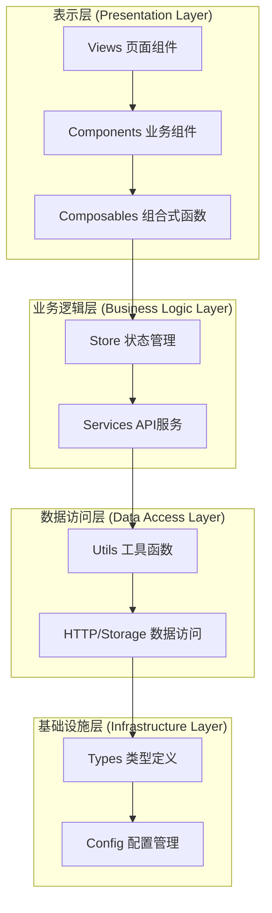
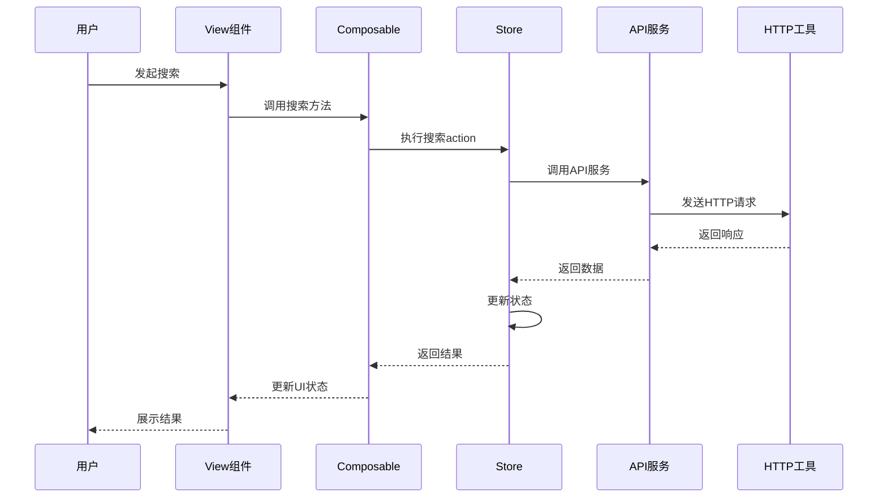
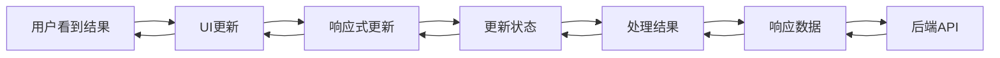

# 系统架构简化版

## 整体架构概览

## 核心架构原则

1. **分层架构**：清晰的职责分离，每层只关注自己的核心功能
2. **单向数据流**：数据从上到下流动，事件从下到上传递
3. **模块化设计**：高内聚、低耦合的模块结构
4. **类型安全**：使用TypeScript确保类型安全

## 文件夹功能边界

### 📁 表示层 (Presentation Layer)

#### `src/views/`

- **职责**：页面级组件，路由对应的视图
- **特点**：组合多个业务组件，处理页面级布局
- **示例**：dashboard、article、material-management等页面

#### `src/components/`

- **职责**：可复用的UI组件
- **子目录**：
  - `core/` - 核心UI组件（基础组件、布局、图表）
  - `custom/` - 自定义业务组件（素材搜索、素材卡片）
  - `dev/` - 开发工具组件

#### `src/composables/`

- **职责**：可复用的业务逻辑和UI状态管理
- **特点**：组合式函数，封装复杂的用户交互流程
- **示例**：useMaterialSearch、useAuth、useTheme等

### 📁 状态管理层 (State Management Layer)

#### `src/store/`

- **职责**：全局状态管理
- **子目录**：
  - `modules/` - 模块化状态（用户、项目、设置等）
  - `material.ts` - 素材相关状态管理
- **特点**：使用Pinia，集中管理应用状态

### 📁 业务逻辑层 (Business Logic Layer)

#### `src/services/`

- **职责**：API调用和业务逻辑封装
- **子目录**：
  - `base/` - 基础API服务类
  - 具体服务文件（aiService、materialService等）
- **特点**：继承BaseApiService，支持Mock/真实API切换

### 📁 数据访问层 (Data Access Layer)

#### `src/utils/http/`

- **职责**：HTTP请求处理
- **功能**：请求拦截、响应处理、错误处理、认证管理

#### `src/utils/storage/`

- **职责**：本地存储管理
- **功能**：数据持久化、版本管理、兼容性检查

#### `src/mock/`

- **职责**：Mock数据管理
- **功能**：开发环境数据模拟、API响应模拟

### 📁 基础设施层 (Infrastructure Layer)

#### `src/types/`

- **职责**：TypeScript类型定义
- **子目录**：api、common、component、store等

#### `src/utils/`

- **职责**：通用工具函数
- **子目录**：auth、dataprocess、theme、validation等

#### `src/router/`

- **职责**：路由配置和导航
- **功能**：路由守卫、权限控制、路由别名

#### `src/locales/`

- **职责**：国际化管理
- **功能**：多语言支持、文本本地化

#### `src/directives/`

- **职责**：Vue自定义指令
- **示例**：auth、highlight、ripple、roles等

## 核心业务流程

### 素材搜索流程

### 数据流向

## 架构优势

### 1. 清晰的分层结构

- 每层职责明确，便于维护和扩展
- 依赖关系清晰，降低耦合度

### 2. 高度模块化

- 组件可复用，提高开发效率
- 业务逻辑封装，便于测试

### 3. 类型安全

- TypeScript提供编译时类型检查
- 减少运行时错误，提高代码质量

### 4. 开发体验

- Mock数据支持，便于前端独立开发
- 热重载和调试工具，提高开发效率

## 最佳实践

### 1. 组件设计

- 单一职责原则
- 组合优于继承
- 使用插槽提供扩展点

### 2. 状态管理

- 单一数据源
- 异步操作封装在action中
- 使用computed派生状态

### 3. API调用

- 通过服务层统一调用
- 错误处理集中管理
- 支持Mock/真实API切换

### 4. 代码组织

- 按功能模块组织
- 统一的命名规范
- 完善的类型定义

## 技术栈

- **前端框架**：Vue 3 + TypeScript
- **状态管理**：Pinia
- **UI组件库**：Element Plus
- **HTTP客户端**：Axios
- **构建工具**：Vite
- **代码规范**：ESLint + Prettier

---

_此文档提供了系统架构的简化概览，详细的技术实现请参考具体的代码文档。_
