# Art Design Pro 系统架构设计文档

## 文档信息

- **版本**: v3.0
- **更新日期**: 2025-11-07
- **架构师**: Claude Code
- **文档类型**: 架构设计说明
- **适用范围**: 前端开发团队、技术决策者

---

## 目录

1. [架构概览](#架构概览)
2. [架构设计原则](#架构设计原则)
3. [技术栈与选型依据](#技术栈与选型依据)
4. [分层架构设计](#分层架构设计)
5. [🔥 业务域模块化架构](#🔥-业务域模块化架构)
6. [🔥 AI Agent 智能体系统](#🔥-ai-agent-智能体系统)
7. [核心模块设计](#核心模块设计)
8. [数据流与状态管理](#数据流与状态管理)
9. [服务层架构](#服务层架构)
10. [API架构设计](#api架构设计)
11. [异步任务处理](#异步任务处理)
12. [路由与导航系统](#路由与导航系统)
13. [开发规范与标准](#开发规范与标准)
14. [质量属性与性能](#质量属性与性能)
15. [安全架构设计](#安全架构设计)
16. [部署与运维](#部署与运维)

---

## 架构概览

### 系统定位

Art Design Pro 是一个基于 **Vue 3 + TypeScript** 的现代化企业级后台管理系统，专注于**AI驱动的文档智能生成**和**素材管理**。系统采用**分层架构** + **业务域模块化**设计，集成**AI Agent智能体系统**，遵循**单向数据流**原则，支持高并发访问和复杂业务逻辑处理。

### 架构特征

- ✅ **模块化设计**: 高内聚、低耦合的模块结构
- ✅ **业务域驱动**: Document/Material/Project 三大业务域
- ✅ **AI驱动**: 集成 AI Agent 智能体系统
- ✅ **类型安全**: 100% TypeScript 覆盖
- ✅ **响应式**: 基于 Vue 3 Composition API
- ✅ **可扩展**: 插件化架构，易于扩展
- ✅ **高性能**: 异步任务处理、智能缓存
- ✅ **企业级**: 完整的权限管理、审计日志
- ✅ **OpenAPI 3.1.0**: 标准化 API 规范

### 系统边界

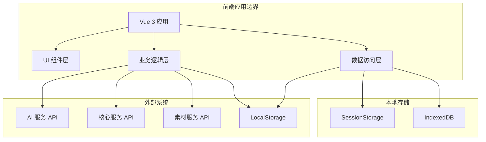

---

## 架构设计原则

### 核心原则

#### 1. 分层架构 (Layered Architecture)

**原则**: 清晰的职责分离，每层只关注自己的核心功能

**实施**:

- 表示层：UI 渲染、用户交互
- 业务逻辑层：业务规则、数据处理
- 数据访问层：数据获取、存储管理
- 基础设施层：类型定义、配置管理

**优势**:

- 降低系统复杂度
- 便于测试和维护
- 支持独立开发
- 提高代码复用性

#### 2. 单向数据流 (Unidirectional Data Flow)

**原则**: 数据在系统中单向流动，状态变化可预测

**数据流向**:

```
用户操作 → 组件事件 → Composable → Store Action → API服务 → 更新状态 → UI响应
```

**优势**:

- 状态变化可追踪
- 调试更容易
- 避免数据竞争
- 提高系统稳定性

#### 3. 单一职责 (Single Responsibility)

**原则**: 每个模块、组件、服务只负责一项具体功能

**实践**:

- 组件设计：单一 UI 职责
- 服务设计：单一业务领域
- 工具函数：单一功能点
- 类型定义：单一数据模型

#### 4. 开闭原则 (Open-Closed)

**原则**: 对扩展开放，对修改封闭

**实践**:

- 基于接口编程
- 插件化架构
- 事件驱动设计
- 配置驱动开发

#### 5. 依赖倒置 (Dependency Inversion)

**原则**: 依赖抽象而不是具体实现

**实践**:

- BaseApiService 提供抽象
- Mock/真实 API 可切换
- 依赖注入模式
- 面向接口开发

### 架构约束

1. **类型安全**: 所有代码必须通过 TypeScript 类型检查
2. **代码质量**: ESLint + Prettier 强制代码规范
3. **测试覆盖**: 核心业务逻辑必须有单元测试
4. **性能预算**: 首屏加载时间 < 2s
5. **兼容性**: 支持现代浏览器（Chrome 90+、Firefox 88+、Safari 14+）

---

## 技术栈与选型依据

### 前端框架

| 技术 | 版本 | 选型理由 |
| --- | --- | --- |
| Vue.js | 3.5.12 | - 渐进式框架，学习曲线平缓<br>- Composition API 逻辑复用性强<br>- 响应式系统性能优秀<br>- 社区活跃，生态完善 |
| TypeScript | 5.6.3 | - 静态类型检查，减少运行时错误<br>- 优秀的 IDE 支持和智能提示<br>- 大型项目维护性强<br>- 与 Vue 3 深度集成 |
| Vite | 6.1.0 | - 极速冷启动<br>- 基于 ESM 的开发体验<br>- 内置 TypeScript 支持<br>- 生产构建优化 |

**决策记录 (ADR-001)**:

- 2025-01-15: 从 Vue 2 迁移到 Vue 3
- 原因：Composition API、更好的 TypeScript 支持、性能提升 30%
- 影响：需要重写部分组件、培训团队新 API

### 状态管理

| 技术 | 版本 | 选型理由 |
| --- | --- | --- |
| Pinia | 3.0.2 | - Vue 3 官方推荐<br>- 更好的 TypeScript 支持<br>- 简化 API，降低学习成本<br>- 内置 DevTools 支持 |
| pinia-plugin-persistedstate | 4.3.0 | - 状态持久化方案成熟<br>- 支持多种存储方式<br>- 配置灵活<br>- 性能优秀 |

**决策记录 (ADR-002)**:

- 2025-02-01: 从 Vuex 迁移到 Pinia
- 原因：Vue 3 生态、简化 API、TypeScript 支持更好
- 影响：重构所有 store、简化状态管理代码

### UI 组件库

| 技术 | 版本 | 选型理由 |
| --- | --- | --- |
| Element Plus | 2.10.2 | - Vue 3 官方推荐<br>- 组件丰富，企业级设计<br>- 主题定制能力强<br>- 文档完善，社区活跃 |
| @element-plus/icons-vue | 2.3.1 | - 与 Element Plus 完美集成<br>- SVG 图标，清晰度高<br>- 按需引入，减少包体积 |

### HTTP 客户端

| 技术 | 版本 | 选型理由 |
| --- | --- | --- |
| Axios | 1.7.5 | - 生态成熟，文档完善<br>- 支持请求/响应拦截<br>- 自动转换 JSON<br>- 浏览器兼容性良好<br>- 内置 XSRF 保护 |

### 工具库

| 技术 | 版本 | 选型理由 |
| --- | --- | --- |
| @vueuse/core | 11.0.0 | - Vue 3 组合式函数库<br>- 提升开发效率<br>- Tree-shaking 友好<br>- 高质量实现 |
| lodash-es | 4.17.21 | - JavaScript 工具库事实标准<br>- 模块化，按需引入<br>- 性能优化版本<br>- TypeScript 类型完整 |
| mitt | 3.0.1 | - 轻量级事件发射器<br>- 支持 TypeScript<br>- API 简洁<br>- 体积小（< 200B） |

### 开发工具

| 技术       | 版本  | 选型理由                                                               |
| ---------- | ----- | ---------------------------------------------------------------------- |
| ESLint     | 9.9.1 | - 代码质量检查<br>- 可配置规则<br>- 自动修复功能<br>- IDE 集成         |
| Prettier   | 3.5.3 | - 代码格式化<br>- 统一代码风格<br>- 减少代码审查争议<br>- 支持多种语言 |
| Husky      | 9.1.5 | - Git 钩子管理<br>- 提交前检查<br>- 自动化工作流                       |
| commitizen | 4.3.0 | - 标准化提交信息<br>- 自动化版本管理<br>- 生成变更日志                 |

---

## 分层架构设计

### 架构图

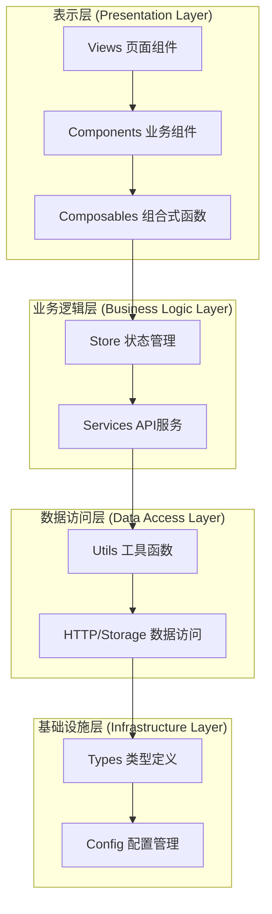

### 层次职责

#### 表示层 (Presentation Layer)

**职责**: 用户界面展示、用户交互处理

**技术组件**:

- `src/views/` - 页面级组件

  - 职责：路由对应页面，组合业务组件
  - 规范：一个路由对应一个页面组件
  - 示例：`DashboardView.vue`、`MaterialManagementView.vue`

- `src/components/` - 可复用组件

  - `core/` - 核心 UI 组件
    - 基础组件：`ArtButton.vue`、`ArtInput.vue`
    - 布局组件：`ArtLayout.vue`、`ArtHeaderBar.vue`
    - 图表组件：`ArtLineChart.vue`、`ArtBarChart.vue`
  - `custom/` - 业务定制组件
    - 素材组件：`MaterialCard.vue`、`MaterialSearch.vue`
    - 文档组件：`DocumentEditor.vue`、`OutlineView.vue`
    - 搜索组件：`SearchProgress.vue`、`AgentSearch.vue`

- `src/composables/` - 组合式函数
  - 职责：封装可复用逻辑，状态管理
  - 规范：使用 `useXxx` 命名方式
  - 示例：`useAuth()`、`useMaterialSearch()`、`useTheme()`

**设计规范**:

- 组件只负责 UI 渲染和用户交互
- 业务逻辑通过 composables 提取
- 不直接访问 API 或操作状态
- Props 和 emits 定义清晰

**代码示例**:

```typescript
// views/MaterialManagementView.vue
<template>
  <div class="material-management">
    <MaterialSearch @search="handleSearch" />
    <MaterialList :materials="materials" @select="handleSelect" />
  </div>
</template>

<script setup lang="ts">
import { useMaterialSearch } from '@/composables/useMaterialSearch'
import MaterialSearch from '@/components/custom/material-search/MaterialSearch.vue'
import MaterialList from '@/components/custom/material-search/MaterialList.vue'

// 使用 composable 提取业务逻辑
const { materials, search } = useMaterialSearch()

const handleSearch = async (query: string) => {
  await search(query)
}

const handleSelect = (material: Material) => {
  // 处理选择逻辑
}
</script>
```

#### 业务逻辑层 (Business Logic Layer)

**职责**: 业务规则处理、状态管理、数据转换

**技术组件**:

- `src/store/` - Pinia 状态管理

  - `modules/` - 模块化状态（按业务域组织）
    - `documentGenerate.ts` - 文档生成状态
    - `materialRelation.ts` - 素材关系状态
    - `outline.ts` - 大纲状态
    - `outlineSection.ts` - 大纲章节状态
    - `project.ts` - 项目状态
    - `user.ts` - 用户状态
    - `setting.ts` - 设置状态
    - `worktab.ts` - 工作标签状态
  - 根级别 store
    - `material.ts` - 素材状态
    - `documentGenerate.ts` - 文档生成状态（根级）
    - `polling.ts` - 轮询状态

- `src/services/` - API 服务层
  - `base/` - 基础服务类
    - `apiService.ts` - BaseApiService
  - `modules/` - **模块化服务**（按业务域组织）
    - `ai/` - AI智能服务
    - `auth/` - 认证服务
    - `document/` - 文档生成服务（包含所有 Agent）
    - `material/` - 素材管理服务
    - `outline/` - 大纲管理服务
    - `project/` - 项目管理服务
    - `research-brief/` - 研究简报服务
    - `title/` - 标题管理服务
    - `user/` - 用户服务
    - `validation/` - 验证服务
  - 具体服务（统一入口）
    - `authService.ts` - 认证服务
    - `materialService.ts` - 素材服务
    - `documentGenerateService.ts` - 文档生成服务（统一入口）
    - `materialRelationService.ts` - 素材关系服务
    - `outlineService.ts` - 大纲服务
    - `outlineSectionService.ts` - 大纲章节服务
    - `bodyService.ts` - 正文管理服务
    - `searchService.ts` - 搜索服务
    - `projectService.ts` - 项目服务

**设计规范**:

- Store 负责状态管理，不直接操作 API
- Service 负责 API 调用，封装业务逻辑
- 使用 action 封装异步操作
- 状态变化可预测和可追踪

**代码示例**:

```typescript
// store/modules/materialRelation.ts - 模块化状态管理
export const useMaterialRelationStore = defineStore('materialRelation', () => {
  const relations = ref<Map<string, MaterialRelation[]>>(new Map())
  const loading = ref(false)

  // 绑定素材到标题
  const bindMaterialToTitle = async (materialId: string, titleId: string, score: number) => {
    loading.value = true
    try {
      await materialRelationService.bindMaterialToTitle(materialId, titleId, score)
      // 更新本地状态
      updateRelationInMap(materialId, titleId, 'title', score)
    } finally {
      loading.value = false
    }
  }

  return { relations, loading, bindMaterialToTitle }
})

// services/modules/document/scope-agent/scopeAgentService.ts
export class ScopeAgentService extends BaseApiService {
  async execute(input: ScopeAgentInput): Promise<ScopeAgentOutput> {
    return this.post('/scope-agent/execute', input)
  }

  async getStatus(taskId: string): Promise<TaskStatus> {
    return this.get(`/scope-agent/status/${taskId}`)
  }
}

// services/materialService.ts - 统一入口服务
export class MaterialService extends BaseApiService {
  protected basePath = '/materials'

  async search(query: string, filters?: SearchFilters): Promise<ApiResponse<Material[]>> {
    return this.get('/search', { query, ...filters })
  }

  // 使用模块化服务
  getRelationService() {
    return new MaterialRelationService()
  }
}
```

#### 数据访问层 (Data Access Layer)

**职责**: 数据获取、存储管理、缓存处理

**技术组件**:

- `src/utils/http/` - HTTP 客户端

  - `index.ts` - Axios 实例、拦截器

- `src/utils/storage/` - 本地存储

  - `index.ts` - localStorage/sessionStorage 封装

- `src/utils/polling/` - 轮询机制

  - `asyncTaskPoller.ts` - 通用轮询器

- `src/mock/` - Mock 数据
  - `index.ts` - Mock 数据管理器
  - `data/` - 分模块 Mock 数据

**设计规范**:

- 统一 HTTP 请求处理
- 统一的错误处理机制
- 缓存策略明确
- Mock 数据可配置

#### 基础设施层 (Infrastructure Layer)

**职责**: 类型定义、配置管理、公共工具

**技术组件**:

- `src/types/` - TypeScript 类型

  - `api.ts` - API 相关类型
  - `common.ts` - 通用类型
  - `component.ts` - 组件类型
  - `store.ts` - Store 类型
  - `router.ts` - 路由类型
  - `config.ts` - 配置类型
  - `ai.ts` - AI 相关类型
  - `auto-imports.d.ts` - 自动导入类型
  - `components.d.ts` - 组件类型声明
  - `markdown-it.d.ts` - Markdown 类型声明

  - `business/` - **业务域类型**（按领域组织）
    - `document/` - 文档业务类型
    - `material/` - 素材业务类型
    - `project/` - 项目业务类型
    - `search/` - 搜索业务类型

- `src/config/` - 配置文件

  - `api/index.ts` - API 配置
  - `mock/index.ts` - Mock 配置
  - `menu/index.ts` - 菜单配置

- `src/utils/` - 工具函数

  - `auth/` - 认证工具
  - `dataprocess/` - 数据处理
  - `validation/` - 验证工具
  - `theme/` - 主题工具

- `src/router/` - 路由配置
- `src/locales/` - 国际化
- `src/directives/` - 自定义指令

**设计规范**:

- 类型定义集中管理
- 配置外部化
- 工具函数模块化
- 文档化公共 API

---

## 🔥 业务域模块化架构

### 架构概述

项目采用**业务域驱动的模块化架构**，将代码按功能领域组织，提高代码的内聚性和可维护性。

### 三大业务域

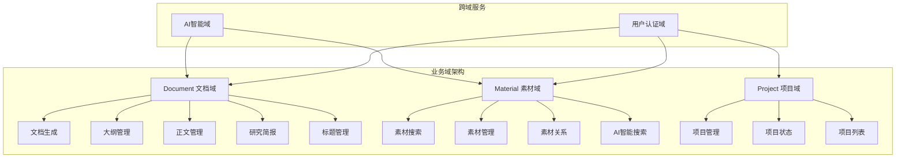

### 目录结构

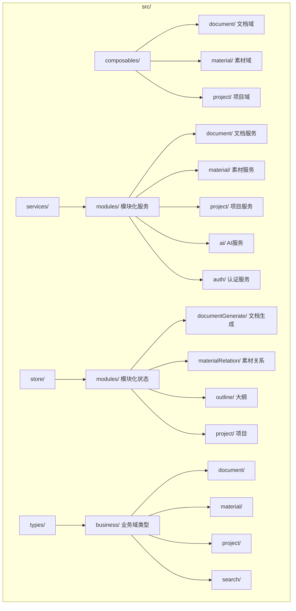

### 业务域职责

#### 📄 Document（文档域）

**核心职责**: AI 驱动的完整文档生成工作流

**包含模块**:

- Scope Agent（范围研究）
- Search2Title Agent（搜索转标题）
- Title Agent（标题生成）
- Outline Agent（大纲生成）
- Body Service（正文管理）
- Research Brief（研究简报）
- Title Management（标题管理）

#### 📦 Material（素材域）

**核心职责**: 素材搜索、管理与关联

**包含模块**:

- 素材搜索（MaterialSearch）
- AI 智能搜索（AgentMaterialSearch）
- 素材关系管理（MaterialRelationService）
- 素材库管理

#### 📊 Project（项目域）

**核心职责**: 项目全生命周期管理

**包含模块**:

- 项目 CRUD
- 项目状态管理
- 项目列表
- 项目模板

### 开发优势

✅ **高内聚低耦合**: 每个业务域职责清晰 ✅ **模块化复用**: 相同业务域的功能可复用 ✅ **类型安全**: 业务域类型集中管理 ✅ **开发效率**: 新功能只需在对应业务域开发 ✅ **易于维护**: 业务逻辑变更影响范围小 ✅ **团队协作**: 不同团队可负责不同业务域

---

## 🔥 AI Agent 智能体系统

### 概述

AI Agent 系统是文档生成的核心驱动力，通过多个智能体协作完成从研究到内容生成的完整流程。

### Agent 协作流程

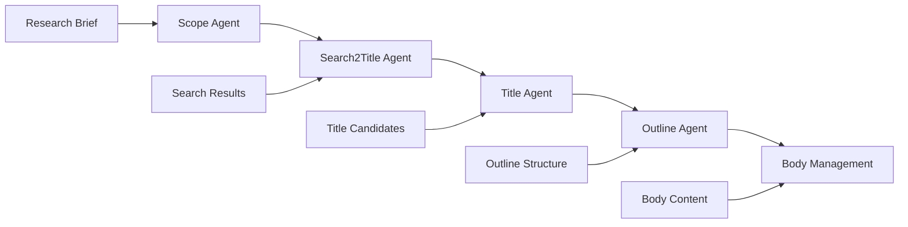

### Agent 详细设计

#### 1. Scope Agent（范围研究）

**职责**: 确定文档研究范围和方向

**输入**:

```typescript
interface ScopeAgentInput {
  projectId: string
  researchTopic: string
  constraints: {
    wordCount: number
    targetAudience: string
    tone: string
  }
}
```

**输出**:

```typescript
interface ScopeAgentOutput {
  researchBrief: ResearchBrief
  keyQuestions: string[]
  researchDirections: string[]
  estimatedDuration: number
}
```

**实现位置**: `src/services/modules/document/scope-agent/`

#### 2. Search2Title Agent（搜索转标题）

**职责**: 将搜索结果转换为标题候选

**输入**:

```typescript
interface Search2TitleInput {
  researchBrief: ResearchBrief
  searchResults: SearchResult[]
}
```

**输出**:

```typescript
interface Search2TitleOutput {
  titleCandidates: TitleCandidate[]
  relevanceScores: Map<string, number>
  categories: string[]
}
```

**实现位置**: `src/services/modules/document/search2title-agent/`

#### 3. Title Agent（标题生成）

**职责**: 生成最终标题并提供评分

**输入**:

```typescript
interface TitleAgentInput {
  titleCandidates: TitleCandidate[]
  researchBrief: ResearchBrief
}
```

**输出**:

```typescript
interface TitleAgentOutput {
  finalTitles: Title[]
  scores: Map<string, number>
  angles: TitleAngle[]
  timeliness: TimelinessAnalysis
  feasibility: FeasibilityAnalysis
}
```

**实现位置**: `src/services/modules/document/title-agent/`

#### 4. Outline Agent（大纲生成）

**职责**: 基于标题生成结构化大纲

**输入**:

```typescript
interface OutlineAgentInput {
  title: Title
  researchBrief: ResearchBrief
  materials: Material[]
}
```

**输出**:

```typescript
interface OutlineAgentOutput {
  outline: Outline
  sections: OutlineSection[]
  materialBindings: MaterialBinding[]
  estimatedWordCount: number
}
```

**实现位置**: `src/services/modules/document/outline-agent/`

### 轮询机制

每个 Agent 执行都是异步任务，需要轮询机制跟踪状态：

```typescript
// 使用 AsyncTaskPoller 跟踪 Agent 执行
const result = await poller.poll(
  taskId,
  {
    interval: 2000,
    timeout: 120000,
    maxAttempts: 60
  },
  async (id) => {
    const status = await agentService.checkStatus(id)
    return status.state
  }
)
```

### 状态管理

```typescript
// store/polling.ts
export const usePollingStore = defineStore('polling', () => {
  const tasks = ref<Map<string, PollingTask>>(new Map())

  const startAgentPolling = (agentType: string, taskId: string) => {
    // 启动特定 Agent 的轮询
  }

  return { tasks, startAgentPolling }
})
```

### Agent 组件集成

```vue
<!-- AgentSearchProgress.vue -->
<template>
  <div class="agent-progress">
    <el-steps :active="currentStep">
      <el-step title="范围研究" />
      <el-step title="搜索转标题" />
      <el-step title="标题生成" />
      <el-step title="大纲生成" />
    </el-steps>
  </div>
</template>
```

---

## 核心模块设计

### 文档生成模块

**模块职责**: 提供从项目创建到内容生成的完整工作流

**功能边界**:

- 项目管理
- 选题管理
- 大纲生成
- 内容生成
- 素材关联
- 文档导出

**模块架构**:

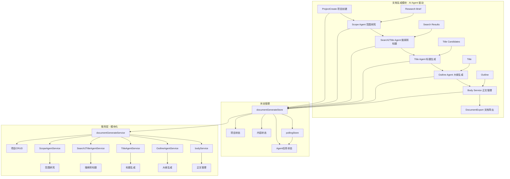

**核心组件**:

1. **ProjectCreate** - 项目创建组件

   - 项目基本信息设置
   - 配置选项管理
   - 模板选择功能

2. **ResearchBrief** - 研究简报组件

   - 简报内容编辑
   - AI 辅助生成
   - 版本历史管理

3. **TitleCandidate** - 标题候选组件

   - 标题列表展示
   - 评分与排序
   - 标题编辑功能

4. **OutlineGeneration** - 大纲生成组件

   - 结构化展示
   - 拖拽排序
   - 导入导出

5. **ContentGeneration** - 内容生成组件
   - 章节编辑器
   - 素材引用
   - 实时预览

**关键设计决策**:

- 异步任务轮询机制
- 状态持久化策略
- 组件间通信方案

### 素材管理模块

**模块职责**: 素材搜索、管理和组织

**功能边界**:

- 多源素材搜索
- 智能搜索（AI）
- 素材分类管理
- 批量操作
- 关联关系管理

**模块架构**:

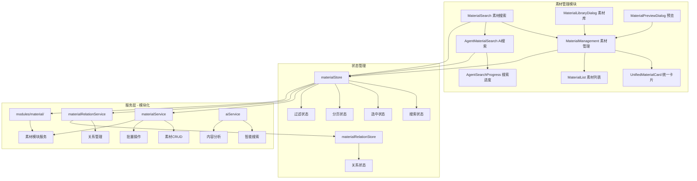

**核心组件**:

1. **MaterialSearch** - 素材搜索

   - 关键词搜索
   - 高级筛选
   - 搜索历史
   - 搜索建议

2. **AgentSearch** - AI 智能搜索

   - 自然语言查询
   - 搜索结果分析
   - 路径可视化
   - 智能推荐

3. **MaterialList** - 素材列表

   - 虚拟滚动
   - 懒加载
   - 排序筛选
   - 分页处理

4. **MaterialCard** - 素材卡片
   - 信息预览
   - 快速操作
   - 批量选择
   - 标签管理

**技术亮点**:

- 虚拟列表优化性能
- 智能缓存机制
- 搜索防抖处理
- 图片懒加载

### 素材关系管理

**模块职责**: 管理素材与标题、章节的关联关系

**关系模型**:

- 素材-标题：一对多，支持相关性评分
- 素材-章节：一对多，支持绑定类型
- 支持批量操作
- 支持解绑和重新绑定

**API 设计**:

```typescript
// 素材-标题关系
bindMaterialToTitle(materialId: string, titleId: string, score: number)
unbindMaterialFromTitle(materialId: string, titleId: string)
getTitleMaterials(titleId: string): Material[]
batchBindMaterialsToTitle(titleId: string, materials: MaterialBindInfo[])

// 素材-章节关系
bindMaterialToSection(materialId: string, sectionId: string, type: BindingType)
unbindMaterialFromSection(materialId: string, sectionId: string)
getSectionMaterials(sectionId: string): Material[]
batchBindMaterialsToSection(sectionId: string, materials: MaterialBindInfo[])

// 综合查询
getMaterialAllRelations(materialId: string): MaterialRelationsResponse
```

**绑定类型**:

- `primary` - 主要素材：章节核心参考
- `reference` - 参考资料：辅助理解
- `supporting` - 支持素材：提供论据

---

## 数据流与状态管理

### 状态管理架构

**技术选型**: Pinia 3.0.2

**架构优势**:

- Vue 3 官方推荐
- TypeScript 支持完善
- API 简洁，学习成本低
- 内置 DevTools 支持
- 良好的模块化支持

**模块划分**:

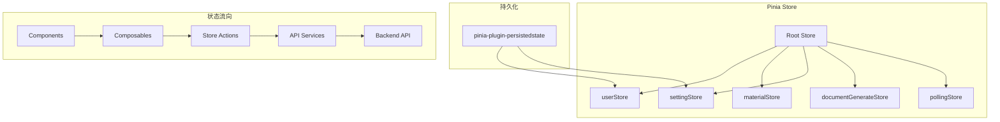

**状态持久化策略**:

| Store                 | 持久化 | 存储位置     | 包含字段                     |
| --------------------- | ------ | ------------ | ---------------------------- |
| userStore             | ✅     | localStorage | token, userInfo, preferences |
| settingStore          | ✅     | localStorage | theme, language, layout      |
| materialStore         | ❌     | -            | 搜索结果、缓存               |
| documentGenerateStore | ❌     | -            | 当前项目、任务状态           |
| pollingStore          | ❌     | -            | 任务状态、进度               |

**代码示例**:

```typescript
// store/user.ts
export const useUserStore = defineStore(
  'user',
  () => {
    const isLogin = ref(false)
    const userInfo = ref<UserInfo | null>(null)
    const accessToken = ref<string | null>(null)

    const login = async (credentials: LoginCredentials) => {
      const response = await authService.login(credentials)
      isLogin.value = true
      userInfo.value = response.data.user
      accessToken.value = response.data.token
    }

    const logout = () => {
      isLogin.value = false
      userInfo.value = null
      accessToken.value = null
    }

    return {
      isLogin,
      userInfo,
      accessToken,
      login,
      logout
    }
  },
  {
    persist: {
      key: 'user',
      storage: localStorage,
      paths: ['isLogin', 'userInfo', 'accessToken']
    }
  }
)
```

### 数据流向设计

**单向数据流模式**:

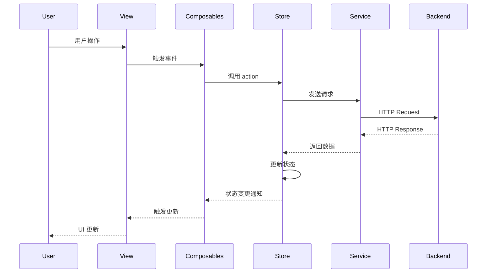

**状态更新规则**:

1. 状态只能通过 Store action 修改
2. 组件通过 computed 或 watch 响应状态变化
3. 状态变化必须可追踪（DevTools）
4. 避免直接修改 store 状态

---

## 服务层架构

### BaseApiService 设计

**核心职责**:

- 统一 API 调用方式
- 请求/响应拦截
- 错误处理
- Mock 数据支持
- Token 管理

**类结构**:

```typescript
abstract class BaseApiService {
  protected apiClient: AxiosInstance
  protected mockDataManager: MockDataManager

  // 基础 HTTP 方法
  async get<T>(path: string, params?: any): Promise<T>
  async post<T>(path: string, data?: any): Promise<T>
  async put<T>(path: string, data?: any): Promise<T>
  async delete<T>(path: string, data?: any): Promise<T>

  // 统一请求方法
  async request<T>(config: ApiRequestConfig): Promise<T>

  // Mock 实现
  protected abstract mockImplementation(config: ApiRequestConfig): Promise<any>
}
```

**请求拦截器**:

```typescript
// 添加 token
apiClient.interceptors.request.use((config) => {
  const token = userStore.accessToken
  if (token) {
    config.headers.Authorization = `Bearer ${token}`
  }
  return config
})

// 处理响应
apiClient.interceptors.response.use(
  (response) => response.data,
  (error) => {
    // 统一错误处理
    if (error.response?.status === 401) {
      userStore.logout()
      router.push('/login')
    }
    return Promise.reject(error)
  }
)
```

### 具体服务实现

**MaterialService**:

```typescript
export class MaterialService extends BaseApiService {
  async search(query: string, filters?: SearchFilters): Promise<ApiResponse<Material[]>> {
    return this.get('/materials/search', { query, ...filters })
  }

  async getById(id: string): Promise<ApiResponse<Material>> {
    return this.get(`/materials/${id}`)
  }

  async create(material: CreateMaterialRequest): Promise<ApiResponse<Material>> {
    return this.post('/materials', material)
  }

  async update(id: string, data: UpdateMaterialRequest): Promise<ApiResponse<Material>> {
    return this.put(`/materials/${id}`, data)
  }

  async delete(id: string): Promise<ApiResponse<void>> {
    return this.delete(`/materials/${id}`)
  }
}
```

**Mock 支持**:

```typescript
protected async mockImplementation(config: ApiRequestConfig): Promise<any> {
  const { url, method } = config

  if (method === 'GET' && url.includes('/materials/search')) {
    return this.mockDataManager.getMockData('materials-search', config.params.query)
  }

  if (method === 'GET' && url.match(/\/materials\/\d+/)) {
    const id = url.split('/').pop()
    return this.mockDataManager.getMockData('material-detail', id)
  }

  return {
    success: true,
    message: `Mock响应 - ${method} ${url}`,
    data: { mock: true }
  }
}
```

---

## API 架构设计

### 基于 OpenAPI 3.1.0 规范

**设计目标**:

- 标准化 API 设计
- 类型安全
- 自动生成文档
- 前后端并行开发

**类型系统**:

```typescript
// @/types/business/document/ - 文档业务类型
export namespace Document {
  interface ResearchBrief {
    id: string
    projectId: string
    content: string
    keyQuestions: string[]
    createdAt: string
  }

  interface Title {
    id: string
    text: string
    score: number
    angle: string
    category: string
  }

  interface Outline {
    id: string
    titleId: string
    structure: OutlineNode[]
    totalSections: number
  }

  interface Body {
    id: string
    outlineId: string
    sections: BodySection[]
    wordCount: number
  }
}

// @/types/api/auth.ts - API 通用类型
export namespace Auth {
  interface UserRegisterRequest {
    email: string
    password: string
    name: string
  }

  interface UserLoginRequest {
    email: string
    password: string
    remember_me: boolean
  }

  interface AuthResponse {
    token: string
    user: User
    expires_in: number
  }

  interface User {
    id: string
    email: string
    name: string
    role: UserRole
  }
}

// @/types/business/material/ - 素材业务类型
export namespace Material {
  interface MaterialRelation {
    materialId: string
    targetId: string
    targetType: 'title' | 'section'
    score: number
    bindingType: 'primary' | 'reference' | 'supporting'
  }
}
```

**API 端点分类**:

```mermaid
graph TB
    subgraph "认证模块"
        A[POST /api/v1/auth/register] --> B[用户注册]
        A --> C[邮箱验证]
        D[POST /api/v1/auth/login] --> E[用户登录]
        F[POST /api/v1/auth/refresh] --> G[刷新令牌]
        H[POST /api/v1/auth/logout] --> I[用户登出]
    end

    subgraph "素材模块"
        J[GET /api/v1/materials] --> K[获取素材列表]
        L[POST /api/v1/materials] --> M[创建素材]
        N[GET /api/v1/materials/{id}] --> O[获取素材详情]
        P[PUT /api/v1/materials/{id}] --> Q[更新素材]
        R[DELETE /api/v1/materials/{id}] --> S[删除素材]
    end
```

**错误处理规范**:

```typescript
interface ApiError {
  success: false
  message: string
  error_code: string
  details?: Record<string, any>
  timestamp: string
  request_id: string
}
```

**API 版本控制**:

- 使用 URL 版本控制：`/api/v1/`
- 保持向后兼容
- 新版本发布时旧版本保留 6 个月
- 重大变更需提前通知

---

## 异步任务处理

### 任务轮询系统

**使用场景**:

- **AI Agent 任务**:
  - Scope Agent（范围研究）
  - Search2Title Agent（搜索转标题）
  - Title Agent（标题生成）
  - Outline Agent（大纲生成）
- 长时间运行的后端任务
- 需要实时状态更新的操作

**AsyncTaskPoller 设计**:

```typescript
interface PollingConfig {
  interval: number // 轮询间隔 (ms)
  timeout: number // 超时时间 (ms)
  maxAttempts: number // 最大轮询次数
  onProgress?: (attempts: number, max: number) => void
  onStatusChange?: (status: TaskStatus) => void
}

enum TaskStatus {
  PENDING = 'PENDING',
  RUNNING = 'RUNNING',
  COMPLETED = 'COMPLETED',
  FAILED = 'FAILED',
  CANCELLED = 'CANCELLED',
  TIMEOUT = 'TIMEOUT'
}

class AsyncTaskPoller {
  async poll<T>(
    taskId: string,
    config: PollingConfig,
    checkFn: (taskId: string) => Promise<TaskStatus>
  ): Promise<T> {
    // 轮询逻辑实现
  }
}
```

**使用示例**:

```typescript
// 1. 服务层使用 - 直接调用 Agent 服务
const scopeService = new ScopeAgentService()
const result = await scopeService.execute({
  projectId: 'proj_123',
  researchTopic: '人工智能发展趋势',
  constraints: { wordCount: 5000 }
})

// 2. Store 层使用 - 带轮询
const documentStore = useDocumentStore()
await documentStore.executeScopeAgent(brief, {
  interval: 2000,
  timeout: 120000,
  onProgress: (attempts, max) => {
    progress.value = (attempts / max) * 100
  }
})

// 3. 组合式函数使用 - 封装业务逻辑
const { useNewOutline } = DocumentComposables
const { generateOutline, loading } = useNewOutline()

await generateOutline({
  titleId: 'title_123',
  materials: selectedMaterials
})
```

**状态管理**:

```typescript
// store/polling.ts
export const usePollingStore = defineStore('polling', () => {
  const tasks = ref<Map<string, PollingTask>>(new Map())

  const startPolling = (taskId: string, config: PollingConfig) => {
    const task: PollingTask = {
      id: taskId,
      status: TaskStatus.PENDING,
      progress: 0,
      attempts: 0,
      maxAttempts: config.maxAttempts
    }
    tasks.value.set(taskId, task)
  }

  const updateTaskStatus = (taskId: string, status: TaskStatus, progress?: number) => {
    const task = tasks.value.get(taskId)
    if (task) {
      task.status = status
      if (progress !== undefined) {
        task.progress = progress
      }
    }
  }

  return {
    tasks,
    startPolling,
    updateTaskStatus
  }
})
```

---

## 路由与导航系统

### 路由架构

**技术选型**: Vue Router 4.4.2

**路由模式**: 动态路由 + 路由守卫

**路由分类**:

| 类型     | 说明             | 示例                          |
| -------- | ---------------- | ----------------------------- |
| 公共路由 | 无需登录即可访问 | `/login`、`/register`、`/404` |
| 认证路由 | 需要登录访问     | `/dashboard`、`/profile`      |
| 权限路由 | 需要特定权限     | `/admin`、`/system`           |

**路由配置**:

```typescript
// router/index.ts
export const routes = [
  // 公共路由
  {
    path: '/login',
    name: 'Login',
    component: () => import('@/views/auth/LoginView.vue'),
    meta: { public: true }
  },

  // 认证路由
  {
    path: '/',
    component: () => import('@/layouts/DefaultLayout.vue'),
    redirect: '/dashboard',
    children: [
      {
        path: 'dashboard',
        name: 'Dashboard',
        component: () => import('@/views/DashboardView.vue'),
        meta: { requiresAuth: true }
      },
      {
        path: 'materials',
        name: 'MaterialManagement',
        component: () => import('@/views/material/MaterialManagementView.vue'),
        meta: { requiresAuth: true }
      },
      {
        path: 'documents',
        name: 'DocumentGeneration',
        component: () => import('@/views/document-generation/IndexView.vue'),
        meta: { requiresAuth: true }
      }
    ]
  },

  // 404 页面
  {
    path: '/:pathMatch(.*)*',
    name: 'NotFound',
    component: () => import('@/views/error/NotFoundView.vue')
  }
]
```

**路由守卫**:

```typescript
router.beforeEach((to, from, next) => {
  const userStore = useUserStore()

  // 检查是否需要登录
  if (to.meta.requiresAuth && !userStore.isLogin) {
    next({ name: 'Login', query: { redirect: to.fullPath } })
    return
  }

  // 检查权限
  if (to.meta.requiresRole) {
    const userRole = userStore.userInfo?.role
    if (!userRole || !hasPermission(userRole, to.meta.requiresRole)) {
      next({ name: 'Forbidden' })
      return
    }
  }

  next()
})
```

---

## 开发规范与标准

### 代码规范

#### 1. 命名规范

**文件命名**:

```typescript
// Vue 组件: PascalCase
MaterialManagement.vue
MaterialCard.vue
DocumentEditor.vue

// 服务文件: camelCase + Service 后缀
materialService.ts
documentGenerateService.ts
authService.ts

// 工具文件: camelCase
request.ts
storage.ts
asyncTaskPoller.ts

// 类型文件: camelCase
api.ts
material.ts
user.ts

// 常量文件: UPPER_CASE
API_ENDPOINTS.ts
ERROR_CODES.ts
REGEX_PATTERNS.ts
```

**变量命名**:

```typescript
// 使用 camelCase
const materialList = ref<Material[]>([])
const isLoading = ref(false)
const userPreferences = ref<UserPreferences>()

// Boolean 变量使用 is/has/can 前缀
const isVisible = ref(true)
const hasPermission = ref(false)
const canEdit = ref(true)

// 私有属性使用 _ 前缀
const _privateMethod = () => {}
const _internalState = ref('')
```

**组件命名**:

```vue
<!-- 使用 PascalCase -->
<template>
  <MaterialSearch @search="handleSearch" />
  <MaterialList :items="materials" />
  <DocumentEditor v-model="content" />
</template>
```

#### 2. 组件设计规范

**单一职责**:

```vue
<!-- ✅ 好的实践: 单一职责 -->
<template>
  <div class="material-card">
    
    <h3>{{ material.title }}</h3>
    <p>{{ material.description }}</p>
    <el-button @click="$emit('select', material)">选择</el-button>
  </div>
</template>

<script setup lang="ts">
  interface Props {
    material: Material
  }

  defineProps<Props>()
  defineEmits<{
    select: [material: Material]
  }>()
</script>
```

**Props 定义**:

```typescript
// ✅ 必选属性
interface Props {
  title: string
  content: string
}

// ✅ 可选属性 + 默认值
interface Props {
  size?: 'small' | 'medium' | 'large'
  disabled?: boolean
}

const props = withDefaults(defineProps<Props>(), {
  size: 'medium',
  disabled: false
})

// ✅ 使用类型约束
defineProps<{
  user: User
  readonly: boolean
}>()
```

**Emits 定义**:

```typescript
// ✅ 使用类型约束
const emit = defineEmits<{
  submit: [data: FormData]
  cancel: []
  error: [message: string]
}>()

// 调用
emit('submit', formData)
emit('cancel')
emit('error', '提交失败')
```

#### 3. 组合式函数规范

**命名**: useXxx 格式

```typescript
// ✅ 正确命名
export const useMaterialSearch = () => { ... }
export const useAuth = () => { ... }
export const useTheme = () => { ... }
```

**返回值**:

```typescript
export const useMaterialSearch = () => {
  const materials = ref<Material[]>([])
  const loading = ref(false)
  const error = ref<string | null>(null)

  const search = async (query: string) => {
    // 搜索逻辑
  }

  // ✅ 返回响应式数据和方法的引用
  return {
    materials: readonly(materials),
    loading: readonly(loading),
    error: readonly(error),
    search
  }
}
```

**参数传递**:

```typescript
// ✅ 接收配置参数
export const useApi = <T>(config: ApiConfig) => {
  // 实现
}

// ✅ 使用泛型
export const usePagination = <T>(initialData: T[] = []) => {
  const data = ref<T[]>(initialData)
  // 实现
  return { data }
}
```

#### 4. Store 规范

**状态管理**:

```typescript
export const useUserStore = defineStore('user', () => {
  // 1. 状态定义
  const isLogin = ref(false)
  const userInfo = ref<UserInfo | null>(null)

  // 2. 计算属性
  const userName = computed(() => userInfo.value?.name || 'Guest')
  const isAdmin = computed(() => userInfo.value?.role === 'admin')

  // 3. Actions
  const login = async (credentials: LoginCredentials) => {
    // 登录逻辑
  }

  const logout = () => {
    isLogin.value = false
    userInfo.value = null
  }

  // 4. 返回响应式状态和方法
  return {
    isLogin,
    userInfo,
    userName,
    isAdmin,
    login,
    logout
  }
})
```

**异步操作**:

```typescript
// ✅ 在 action 中处理异步
const fetchUserData = async () => {
  loading.value = true
  try {
    const data = await userService.getProfile()
    userInfo.value = data
  } catch (error) {
    error.value = error.message
    throw error
  } finally {
    loading.value = false
  }
}
```

#### 5. 服务层规范

**继承 BaseApiService**:

```typescript
export class MaterialService extends BaseApiService {
  protected basePath = '/materials'

  async search(params: SearchParams): Promise<ApiResponse<Material[]>> {
    return this.get('/search', params)
  }

  async getById(id: string): Promise<ApiResponse<Material>> {
    return this.get(`/${id}`)
  }

  protected mockImplementation(config: ApiRequestConfig): Promise<any> {
    // Mock 实现
  }
}
```

**错误处理**:

```typescript
try {
  const result = await materialService.search({ query: 'keyword' })
  return result.data
} catch (error) {
  // 统一错误处理
  if (error.code === 'UNAUTHORIZED') {
    // 处理未授权
  } else if (error.code === 'NETWORK_ERROR') {
    // 处理网络错误
  }
  throw error
}
```

### Git 规范

#### 提交信息规范 (Conventional Commits)

**格式**:

```
<type>[optional scope]: <subject>

[optional body]

[optional footer(s)]
```

**类型**:

- `feat`: 新功能
- `fix`: 修复 bug
- `docs`: 文档更新
- `style`: 代码格式调整
- `refactor`: 代码重构
- `test`: 测试相关
- `chore`: 构建过程或辅助工具的变动
- `perf`: 性能优化
- `ci`: CI/CD 相关

**示例**:

```bash
# 新功能
feat(material): add material search functionality

- Add search form component
- Implement search API integration
- Add search results display

Closes #123

# 修复
fix(auth): resolve token refresh issue

- Fix token refresh logic
- Add error handling for expired tokens
- Update user logout flow

Fixes #456

# 重构
refactor(store): simplify material store structure

- Remove redundant computed properties
- Combine similar actions
- Improve type safety

BREAKING CHANGE: materialStore API changed
```

#### 分支管理 (Git Flow)

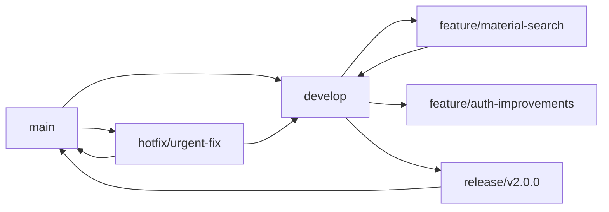

**分支命名规范**:

- `main` - 主分支，生产环境代码
- `develop` - 开发分支，集成功能
- `feature/xxx` - 功能分支
- `release/xxx` - 发布分支
- `hotfix/xxx` - 热修复分支

**工作流**:

1. 从 `develop` 创建 `feature/xxx` 分支
2. 开发完成后提交 PR 到 `develop`
3. 代码审查通过后合并
4. 准备发布时创建 `release/xxx` 分支
5. 发布完成后合并到 `main` 和 `develop`
6. 紧急修复从 `main` 创建 `hotfix/xxx`

### 代码审查规范

#### 审查清单

**功能**:

- [ ] 代码实现是否符合需求
- [ ] 边界条件是否处理
- [ ] 错误处理是否完善
- [ ] 单元测试是否通过

**代码质量**:

- [ ] 命名是否清晰
- [ ] 函数/组件是否职责单一
- [ ] 代码是否有重复
- [ ] 复杂逻辑是否有注释

**性能**:

- [ ] 是否存在性能问题
- [ ] 组件是否过度渲染
- [ ] 是否有不必要的计算
- [ ] 资源是否合理加载

**安全**:

- [ ] 是否存在 XSS 风险
- [ ] 是否存在 SQL 注入
- [ ] 敏感信息是否泄露
- [ ] 权限验证是否完整

**可维护性**:

- [ ] 代码结构是否清晰
- [ ] 是否易于扩展
- [ ] 依赖是否合理
- [ ] 文档是否完整

#### 审查示例

```diff
- const materials = ref([])
+ const materials = ref<Material[]>([])
  // ✅ 改进：添加类型定义

- const getData = async () => {
-   loading.value = true
-   const res = await api.get()
-   data.value = res
-   loading.value = false
- }
+ const getData = async () => {
+   loading.value = true
+   try {
+     const res = await api.get()
+     data.value = res
+   } catch (error) {
+     // TODO: 添加错误处理
+   } finally {
+     loading.value = false
+   }
+ }
  // ✅ 改进：添加 try-catch 错误处理

- <div v-for="item in data" :key="item.id">
+ <div v-for="item in data" :key="item.id" class="list-item">
    // ✅ 改进：添加 CSS 类名
```

### 测试规范

#### 单元测试

**测试工具**: Vitest + Vue Test Utils

**覆盖范围**:

- 核心业务逻辑
- 工具函数
- 组合式函数
- Store Actions

**示例**:

```typescript
// tests/composables/useMaterialSearch.test.ts
import { describe, it, expect, vi } from 'vitest'
import { useMaterialSearch } from '@/composables/useMaterialSearch'

describe('useMaterialSearch', () => {
  it('should search materials correctly', async () => {
    const { search, materials } = useMaterialSearch()

    await search('test query')

    expect(materials.value).toHaveLength(10)
    expect(materials.value[0].title).toContain('test')
  })

  it('should handle search error', async () => {
    const { search, error } = useMaterialSearch()
    const mockError = new Error('API Error')
    vi.spyOn(console, 'error').mockImplementation(() => {})

    await expect(search('invalid')).rejects.toThrow('API Error')
  })
})
```

#### E2E 测试

**测试工具**: Cypress

**覆盖范围**:

- 关键用户流程
- 跨浏览器兼容
- 移动端适配

**示例**:

```typescript
// cypress/e2e/material-search.cy.ts
describe('Material Search', () => {
  it('should search and display results', () => {
    cy.visit('/materials')
    cy.get('[data-testid="search-input"]').type('art')
    cy.get('[data-testid="search-button"]').click()
    cy.get('[data-testid="material-card"]').should('have.length.gt', 0)
  })
})
```

---

## 质量属性与性能

### 性能指标

**目标**:

- 首屏加载时间 (FCP): < 1.5s
- 最大内容绘制 (LCP): < 2.5s
- 累积布局偏移 (CLS): < 0.1
- 首次输入延迟 (FID): < 100ms
- 包体积 < 500KB (gzipped)

**性能优化策略**:

#### 1. 代码分割

```typescript
// 路由级别代码分割
const MaterialManagementView = () => import('@/views/material/MaterialManagementView.vue')
const DocumentGenerationView = () => import('@/views/document-generation/IndexView.vue')

// 组件懒加载
const HeavyChart = defineAsyncComponent(() => import('@/components/core/charts/HeavyChart.vue'))
```

#### 2. 资源优化

```typescript
// 图片懒加载


// 虚拟滚动（大列表）
<VirtualList
  :data-sources="materials"
  :data-component="MaterialCard"
  :data-key="'id'"
  :item-size="200"
/>

// 缓存计算结果
const expensiveValue = computed(() => {
  return heavyCalculation(props.data)
})
```

#### 3. 网络优化

```typescript
// 请求防抖
const debouncedSearch = useDebounceFn((query: string) => {
  materialStore.search(query)
}, 300)

// 请求合并
const searchMaterials = useDebounceFn(
  () => Promise.all(searchQueries.map((q) => api.search(q))),
  100
)

// 缓存策略
const cache = new Map()
const getCachedData = (key: string) => {
  if (cache.has(key)) {
    return cache.get(key)
  }
  const data = api.getData(key)
  cache.set(key, data)
  return data
}
```

### 可维护性

**代码组织**:

- 清晰的目录结构
- 单一职责原则
- DRY (Don't Repeat Yourself)
- SOLID 原则

**文档**:

- JSDoc 注释
- README 文档
- API 文档
- 变更日志

**类型安全**:

- 严格的 TypeScript 配置
- 泛型使用
- 类型守卫
- 装饰器模式

---

## 安全架构设计

### 认证与授权

**认证方式**: JWT Token

**安全措施**:

```typescript
// Token 存储
const token = useCookie('access_token', {
  httpOnly: true,
  secure: true,
  sameSite: 'strict',
  maxAge: 60 * 60 * 24 // 1 天
})

// 请求头设置
apiClient.interceptors.request.use((config) => {
  const token = userStore.accessToken
  if (token) {
    config.headers.Authorization = `Bearer ${token}`
  }
  return config
})

// 响应拦截器处理 401
apiClient.interceptors.response.use(
  (response) => response,
  (error) => {
    if (error.response?.status === 401) {
      userStore.logout()
      router.push('/login')
    }
    return Promise.reject(error)
  }
)
```

**权限控制**:

```typescript
// 指令实现
app.directive('has-permission', {
  mounted(el, binding) {
    const userRole = userStore.userInfo?.role
    if (!hasPermission(userRole, binding.value)) {
      el.style.display = 'none'
    }
  }
})

// 路由守卫
router.beforeEach((to, from, next) => {
  if (to.meta.requiresRole) {
    const userRole = userStore.userInfo?.role
    if (!hasPermission(userRole, to.meta.requiresRole)) {
      next({ name: 'Forbidden' })
      return
    }
  }
  next()
})
```

### 数据安全

**XSS 防护**:

```typescript
// 手动转义
const escapeHtml = (text: string) => {
  const div = document.createElement('div')
  div.textContent = text
  return div.innerHTML
}

// CSP 头部
app.use((req, res, next) => {
  res.setHeader('Content-Security-Policy', "default-src 'self'; script-src 'self' 'unsafe-eval'")
  next()
})
```

**CSRF 防护**:

```typescript
// Axios 配置
const csrfToken = getCsrfToken()
apiClient.defaults.headers.common['X-CSRF-Token'] = csrfToken

// 随机令牌验证
const validateToken = (token: string, sessionToken: string) => {
  return token === sessionToken
}
```

---

## 部署与运维

### 构建配置

**Vite 配置**:

```typescript
// vite.config.ts
export default defineConfig({
  plugins: [vue()],
  build: {
    target: 'es2015',
    outDir: 'dist',
    assetsDir: 'assets',
    sourcemap: false,
    minify: 'terser',
    terserOptions: {
      compress: {
        drop_console: true,
        drop_debugger: true
      }
    },
    rollupOptions: {
      output: {
        manualChunks: {
          vendor: ['vue', 'vue-router', 'pinia'],
          ui: ['element-plus'],
          utils: ['lodash-es', '@vueuse/core']
        }
      }
    }
  }
})
```

**环境配置**:

```typescript
// .env.development
VITE_API_BASE_URL=http://localhost:3000/api
VITE_MOCK_MODE=true

// .env.production
VITE_API_BASE_URL=https://api.example.com
VITE_MOCK_MODE=false
```

### CI/CD 流程

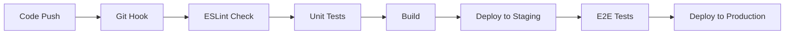

**GitHub Actions**:

```yaml
# .github/workflows/deploy.yml
name: Deploy

on:
  push:
    branches: [main]

jobs:
  build-and-deploy:
    runs-on: ubuntu-latest
    steps:
      - uses: actions/checkout@v3
      - name: Setup Node.js
        uses: actions/setup-node@v3
        with:
          node-version: '18'
      - name: Install dependencies
        run: pnpm install
      - name: Run lint
        run: pnpm lint
      - name: Run tests
        run: pnpm test
      - name: Build
        run: pnpm build
      - name: Deploy
        run: pnpm deploy
```

### 监控与日志

**性能监控**:

```typescript
// Web Vitals
import { getCLS, getFID, getFCP, getLCP, getTTFB } from 'web-vitals'

getCLS(console.log)
getFID(console.log)
getFCP(console.log)
getLCP(console.log)
getTTFB(console.log)
```

**错误追踪**:

```typescript
// 全局错误处理
window.addEventListener('error', (event) => {
  console.error('Global error:', event.error)
  // 发送到错误追踪服务
})

window.addEventListener('unhandledrejection', (event) => {
  console.error('Unhandled promise rejection:', event.reason)
  // 发送到错误追踪服务
})
```

---

## 总结

### 架构优势

1. **清晰的分层架构**: 职责分离，便于维护和测试
2. **业务域模块化**: Document/Material/Project 三大业务域，高内聚低耦合
3. **AI Agent 驱动**: 智能体协作，自动化文档生成流程
4. **类型安全**: 100% TypeScript 覆盖，减少运行时错误
5. **高度模块化**: 组件、服务、状态独立，易于扩展
6. **OpenAPI 3.1.0 规范**: 标准化 API 设计，自动生成文档
7. **标准化的开发流程**: Git 规范、代码审查、自动化测试
8. **优秀的性能表现**: 代码分割、懒加载、缓存优化
9. **完善的安全措施**: 认证授权、XSS/CSRF 防护
10. **完整的 DevOps**: CI/CD 自动化、监控告警

### 演进路线

**短期目标 (3 个月)**:

- [ ] 完善单元测试覆盖率达 80%
- [ ] 优化首屏加载时间至 1.5s
- [ ] 完善 AI Agent 系统性能
- [ ] 完善文档体系

**中期目标 (6 个月)**:

- [ ] 更多业务域支持（数据分析、报表等）
- [ ] PWA 支持
- [ ] 移动端适配优化
- [ ] AI 模型优化与升级

**长期目标 (1 年)**:

- [ ] 微前端架构改造
- [ ] 跨平台支持（Tauri/Electron）
- [ ] Serverless 部署
- [ ] 国际化完善
- [ ] 插件生态系统

### 关键指标

| 指标       | 当前  | 目标  | 状态      |
| ---------- | ----- | ----- | --------- |
| 代码覆盖率 | 65%   | 80%   | 🟡 进行中 |
| 首屏加载   | 2.1s  | 1.5s  | 🟡 进行中 |
| 性能评分   | 82    | 90    | 🟡 进行中 |
| Bug 数量   | 12/月 | <5/月 | 🟡 进行中 |
| 部署时间   | 15min | 5min  | 🟡 进行中 |

---

**文档维护**: 本文档应随系统迭代持续更新，每次重大变更后必须更新相关章节。

**责任人**:

- 整体架构设计: 架构师
- Document 业务域: 文档开发团队
- Material 业务域: 素材开发团队
- Project 业务域: 项目开发团队
- AI Agent 系统: AI 团队
- 技术实现: 全体开发团队
- 代码审查: 技术负责人
- 文档更新: 所有开发者

**文档维护说明**:

本架构文档应随系统迭代持续更新，每次重大变更后必须更新相关章节，特别是：

- 业务域模块化架构章节（当新增业务域时）
- AI Agent 系统章节（当新增 Agent 或流程变更时）
- 服务层架构章节（当新增模块化服务时）
- API 架构设计章节（当 OpenAPI 规范更新时）

建议每季度进行一次全面文档审查和更新。
