# Art Design Pro 系统架构文档

## 目录

1. [项目概述和技术栈](#项目概述和技术栈)
2. [系统整体架构设计](#系统整体架构设计)
3. [分层架构详细说明](#分层架构详细说明)
4. [核心模块和组件设计](#核心模块和组件设计)
5. [数据流和状态管理](#数据流和状态管理)
6. [服务层架构](#服务层架构)
7. [路由和导航系统](#路由和导航系统)
8. [安全和权限设计](#安全和权限设计)
9. [性能优化策略](#性能优化策略)
10. [开发规范和最佳实践](#开发规范和最佳实践)
11. [部署和运维考虑](#部署和运维考虑)

---

## 项目概述和技术栈

### 项目简介

Art Design Pro 是一个基于 Vue 3 + TypeScript 的现代化后台管理系统，专注于用户体验和快速开发。项目采用 Element Plus 设计规范，提供了美观、实用的前端界面，支持多种主题模式和自定义设置。

### 核心特性

- 🎨 **现代化UI设计**：基于 Element Plus 的精美界面设计
- 🌓 **多主题支持**：浅色/暗黑主题切换，支持自定义主题
- 🔍 **全局搜索**：支持全文搜索和智能搜索
- 📱 **移动端适配**：响应式设计，完美适配移动设备
- 🤖 **AI集成**：集成多种AI服务，支持智能搜索和内容生成
- 📊 **丰富组件**：提供丰富的业务组件和图表组件
- 🔐 **权限管理**：完整的权限控制系统
- 🌍 **国际化**：支持多语言切换

### 技术栈

#### 前端框架

- **Vue 3.5.12**：采用 Composition API 和 `<script setup>` 语法
- **TypeScript 5.6.3**：提供类型安全和更好的开发体验
- **Vite 6.1.0**：现代化的构建工具，提供快速的开发体验

#### 状态管理

- **Pinia 3.0.2**：Vue 3 官方推荐的状态管理库
- **pinia-plugin-persistedstate 4.3.0**：状态持久化插件

#### UI组件库

- **Element Plus 2.10.2**：基于 Vue 3 的企业级UI组件库
- **@element-plus/icons-vue 2.3.1**：Element Plus 图标库

#### 路由和导航

- **Vue Router 4.4.2**：Vue 3 官方路由管理器

#### HTTP客户端

- **Axios 1.7.5**：基于 Promise 的 HTTP 客户端

#### 工具库

- **@vueuse/core 11.0.0**：Vue 组合式函数工具集
- **lodash-es 4.17.21**：实用的 JavaScript 工具库
- **crypto-js 4.2.0**：加密算法库
- **mitt 3.0.1**：小型事件发射器

#### 图表和可视化

- **ECharts 5.6.0**：强大的数据可视化库

#### 编辑器和富文本

- **@wangeditor/editor 5.1.23**：富文本编辑器
- **@wangeditor/editor-for-vue**：WangEditor 的 Vue 3 组件

#### 其他功能

- **vue-i18n 9.14.0**：国际化支持
- **nprogress 0.2.0**：页面加载进度条
- **xlsx 0.18.5**：Excel 文件处理
- **file-saver 2.0.5**：文件保存工具
- **qrcode.vue 3.6.0**：二维码生成
- **vue-draggable-plus 0.6.0**：拖拽功能

#### 开发工具

- **ESLint 9.9.1**：代码质量检查
- **Prettier 3.5.3**：代码格式化
- **Stylelint 16.20.0**：样式代码检查
- **Husky 9.1.5**：Git 钩子管理
- **lint-staged 15.5.2**：暂存文件检查
- **commitizen 4.3.0**：规范化提交信息

---

## 系统整体架构设计

### 架构概览

Art Design Pro 采用分层架构设计，从上到下分为表示层、业务逻辑层、数据访问层和基础设施层。系统遵循单向数据流原则，确保数据流向清晰可预测。

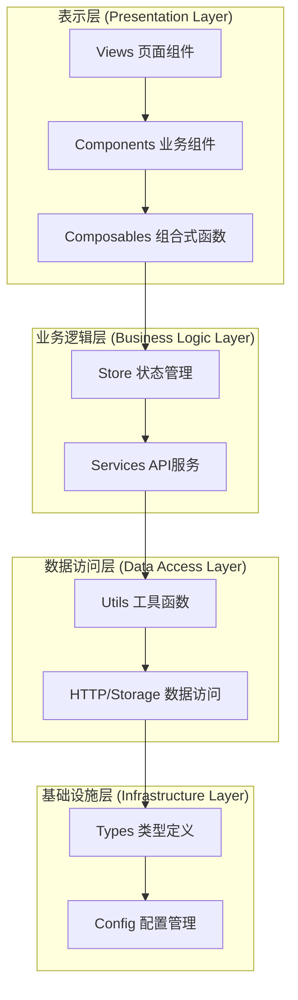

### 核心架构原则

1. **分层架构**：清晰的职责分离，每层只关注自己的核心功能
2. **单向数据流**：数据从上到下流动，事件从下到上传递
3. **模块化设计**：高内聚、低耦合的模块结构
4. **类型安全**：使用 TypeScript 确保类型安全
5. **组件化开发**：可复用的组件设计，提高开发效率
6. **响应式设计**：基于 Vue 3 的响应式系统

### 系统边界与接口

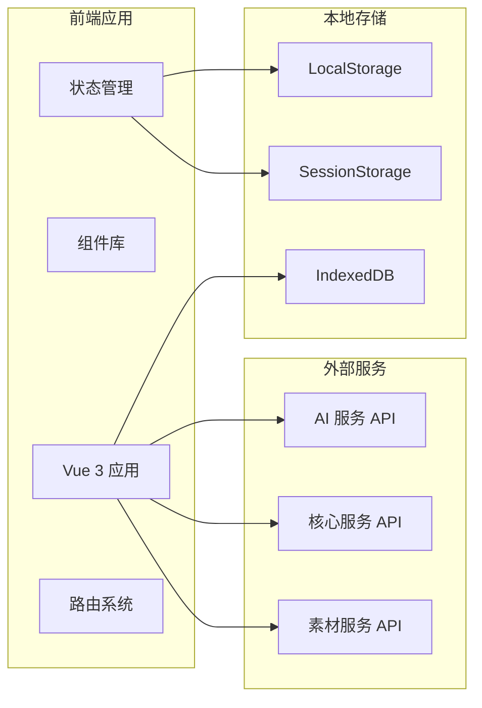

---

## 分层架构详细说明

### 📁 表示层 (Presentation Layer)

#### `src/views/`

**职责**：页面级组件，路由对应的视图 **特点**：组合多个业务组件，处理页面级布局 **示例**：dashboard、article、material-management等页面

```typescript
// 页面组件示例
export default defineComponent({
  name: 'MaterialSearch',
  setup() {
    // 使用组合式函数管理页面逻辑
    const { searchResults, searching, executeSearch } = useMaterialSearch()

    return {
      searchResults,
      searching,
      executeSearch
    }
  }
})
```

#### `src/components/`

**职责**：可复用的UI组件 **子目录**：

- `core/` - 核心UI组件（基础组件、布局、图表）
- `custom/` - 自定义业务组件（素材搜索、素材卡片）
- `dev/` - 开发工具组件

**组件设计原则**：

- 单一职责原则
- 组合优于继承
- 使用插槽提供扩展点
- Props 验证和默认值
- 事件命名规范

#### `src/composables/`

**职责**：可复用的业务逻辑和UI状态管理 **特点**：组合式函数，封装复杂的用户交互流程 **示例**：useMaterialSearch、useAuth、useTheme等

```typescript
// 组合式函数示例
export function useMaterialSearch() {
  const searching = ref(false)
  const searchResults = ref<Material[]>([])

  const executeSearch = async (config: SearchConfig) => {
    searching.value = true
    try {
      const results = await materialApiService.search(config)
      searchResults.value = results
    } finally {
      searching.value = false
    }
  }

  return {
    searching: readonly(searching),
    searchResults: readonly(searchResults),
    executeSearch
  }
}
```

### 📁 状态管理层 (State Management Layer)

#### `src/store/`

**职责**：全局状态管理 **子目录**：

- `modules/` - 模块化状态（用户、项目、设置等）
- `material.ts` - 素材相关状态管理
- `user.ts` - 用户相关状态管理

**状态管理原则**：

- 单一数据源
- 异步操作封装在action中
- 使用computed派生状态
- 状态持久化策略

```typescript
// Store 示例
export const useMaterialStore = defineStore('material', () => {
  // 状态
  const materials = ref<Material[]>([])
  const selectedMaterials = ref<string[]>([])
  const loading = ref(false)

  // 计算属性
  const selectedMaterialList = computed(() =>
    materials.value.filter((m) => selectedMaterials.value.includes(m.id))
  )

  // 操作
  const addMaterial = (material: Material) => {
    materials.value.unshift(material)
  }

  const toggleSelection = (id: string) => {
    const index = selectedMaterials.value.indexOf(id)
    if (index > -1) {
      selectedMaterials.value.splice(index, 1)
    } else {
      selectedMaterials.value.push(id)
    }
  }

  return {
    materials: readonly(materials),
    selectedMaterials: readonly(selectedMaterials),
    selectedMaterialList,
    loading: readonly(loading),
    addMaterial,
    toggleSelection
  }
})
```

### 📁 业务逻辑层 (Business Logic Layer)

#### `src/services/`

**职责**：API调用和业务逻辑封装 **子目录**：

- `base/` - 基础API服务类
- 具体服务文件（aiService、materialService等）

**服务层设计**：

- 继承BaseApiService，支持Mock/真实API切换
- 统一错误处理
- 请求/响应拦截
- 类型安全的API调用

```typescript
// 服务层示例
class MaterialApiService extends BaseApiService {
  constructor() {
    super('material')
  }

  async createMaterials(projectId: number, materials: MaterialCreateRequest[]) {
    const request: AddCompleteMaterialRequest = {
      project_id: projectId,
      materials
    }
    return this.post<MaterialListResponse>('/materials/batch', request)
  }

  async getProjectMaterials(projectId: number, params?: any) {
    return this.get<MaterialListResponse>(`/projects/${projectId}/materials`, params)
  }
}
```

### 📁 数据访问层 (Data Access Layer)

#### `src/utils/http/`

**职责**：HTTP请求处理 **功能**：请求拦截、响应处理、错误处理、认证管理

```typescript
// HTTP 拦截器示例
axiosInstance.interceptors.request.use((request) => {
  const { accessToken } = useUserStore()
  if (accessToken) {
    request.headers.set('Authorization', `Bearer ${accessToken}`)
  }
  return request
})

axiosInstance.interceptors.response.use(
  (response) => {
    // 统一响应处理
    return response
  },
  (error) => {
    // 统一错误处理
    return Promise.reject(handleError(error))
  }
)
```

#### `src/utils/storage/`

**职责**：本地存储管理 **功能**：数据持久化、版本管理、兼容性检查

#### `src/mock/`

**职责**：Mock数据管理 **功能**：开发环境数据模拟、API响应模拟

### 📁 基础设施层 (Infrastructure Layer)

#### `src/types/`

**职责**：TypeScript类型定义 **子目录**：api、common、component、store等

#### `src/utils/`

**职责**：通用工具函数 **子目录**：auth、dataprocess、theme、validation等

#### `src/router/`

**职责**：路由配置和导航 **功能**：路由守卫、权限控制、路由别名

#### `src/locales/`

**职责**：国际化管理 **功能**：多语言支持、文本本地化

#### `src/directives/`

**职责**：Vue自定义指令 **示例**：auth、highlight、ripple、roles等

---

## 核心模块和组件设计

### 素材管理模块

素材管理是系统的核心功能模块，包含素材搜索、管理和组织等功能。

#### 模块结构

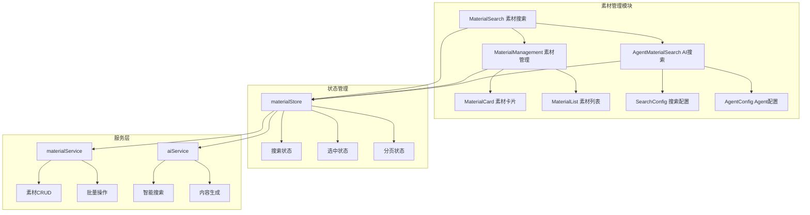

#### 核心组件

1. **MaterialSearch**：素材搜索组件

   - 支持关键词搜索
   - 多种搜索提供商
   - 搜索历史记录
   - 高级筛选功能

2. **AgentMaterialSearch**：AI智能搜索组件

   - AI驱动的智能搜索
   - 搜索结果分析
   - 相关推荐
   - 搜索路径可视化

3. **MaterialManagement**：素材管理组件

   - 素材列表展示
   - 批量操作
   - 标签管理
   - 分页加载

4. **MaterialCard**：素材卡片组件
   - 素材信息展示
   - 预览功能
   - 选择操作
   - 快捷操作

### 用户认证模块

用户认证模块负责用户登录、注册、权限验证等功能。

#### 认证流程

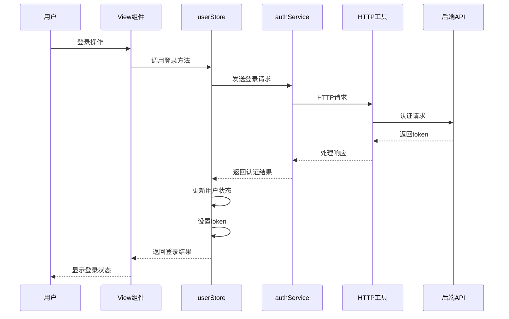

#### 权限控制

系统实现了多层次的权限控制：

1. **路由级权限**：基于用户角色控制路由访问
2. **组件级权限**：使用指令控制组件显示
3. **操作级权限**：基于权限标记控制具体操作
4. **API级权限**：后端API权限验证

```typescript
// 路由权限配置
{
  path: '/system',
  name: 'System',
  meta: {
    roles: ['R_SUPER', 'R_ADMIN']
  }
}

// 组件权限指令
<v-auth auth-mark="add">
  <el-button>新增</el-button>
</v-auth>

// 操作权限检查
const hasPermission = (authMark: string) => {
  return userStore.info.roles?.some(role =>
    role.permissions?.includes(authMark)
  )
}
```

### 主题系统

主题系统支持多种主题模式和自定义配置。

#### 主题架构

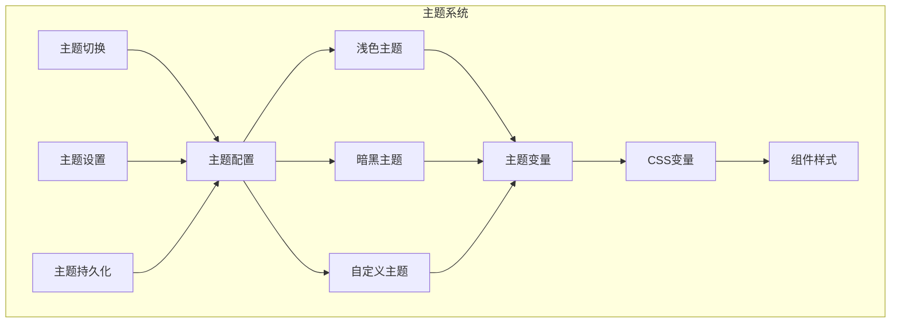

#### 主题实现

```scss
// 主题变量定义
:root {
  // 主色调
  --el-color-primary: #409eff;
  --el-color-success: #67c23a;
  --el-color-warning: #e6a23c;
  --el-color-danger: #f56c6c;
  --el-color-info: #909399;

  // 背景色
  --el-bg-color: #ffffff;
  --el-bg-color-page: #f2f3f5;

  // 文字颜色
  --el-text-color-primary: #303133;
  --el-text-color-regular: #606266;
  --el-text-color-secondary: #909399;
}

// 暗黑主题
[data-theme='dark'] {
  --el-bg-color: #141414;
  --el-bg-color-page: #0a0a0a;
  --el-text-color-primary: #e5eaf3;
  --el-text-color-regular: #cfd3dc;
  --el-text-color-secondary: #a3a6ad;
}
```

---

## 数据流和状态管理

### 状态管理架构

系统采用 Pinia 作为状态管理库，实现了模块化的状态管理。

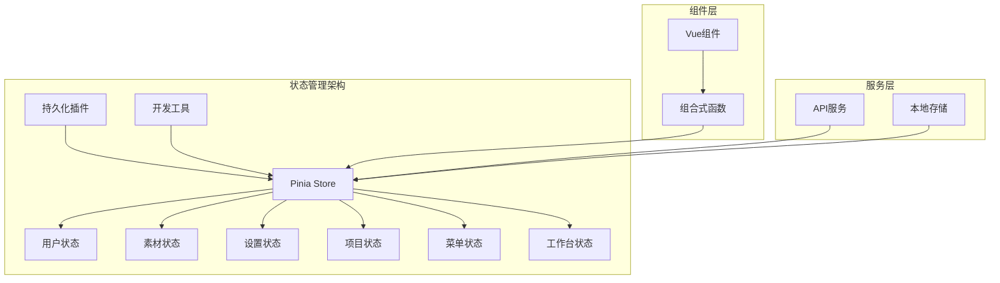

### 核心状态模块

#### 用户状态 (userStore)

```typescript
export const useUserStore = defineStore('userStore', () => {
  // 状态
  const isLogin = ref(false)
  const info = ref<Partial<Api.Auth.UserResponse>>({})
  const accessToken = ref('')
  const refreshToken = ref('')

  // 操作
  const loginWithAuthResponse = async (authResponse: Api.Auth.AuthResponse) => {
    if (authResponse.success && authResponse.token) {
      setToken(authResponse.token, authResponse.refresh_token)
      setLoginStatus(true)
      await fetchUserInfo()
      return true
    }
    return false
  }

  const logOut = async () => {
    // 清空状态
    info.value = {}
    isLogin.value = false
    accessToken.value = ''
    refreshToken.value = ''

    // 调用登出API
    await authService.logout()

    // 跳转到登录页
    router.push(RoutesAlias.Login)
  }

  return {
    isLogin: readonly(isLogin),
    info: readonly(info),
    accessToken: readonly(accessToken),
    loginWithAuthResponse,
    logOut
  }
})
```

#### 素材状态 (materialStore)

```typescript
export const useMaterialStore = defineStore('material', () => {
  // 状态
  const materials = ref<Material[]>([])
  const selectedMaterials = ref<string[]>([])
  const searchResults = ref<Material[]>([])
  const loading = ref(false)

  // 计算属性
  const selectedMaterialList = computed(() =>
    materials.value.filter((m) => selectedMaterials.value.includes(m.id))
  )

  // 操作
  const addMaterial = (material: Material) => {
    materials.value.unshift(material)
  }

  const toggleSelection = (id: string) => {
    const index = selectedMaterials.value.indexOf(id)
    if (index > -1) {
      selectedMaterials.value.splice(index, 1)
    } else {
      selectedMaterials.value.push(id)
    }
  }

  const searchWithSearchTools = async (config: SearchConfig) => {
    loading.value = true
    try {
      const result = await aiService.searchTools(config)
      const materials = transformSearchResultsToMaterials(result.results)
      searchResults.value = materials
      return materials
    } finally {
      loading.value = false
    }
  }

  return {
    materials: readonly(materials),
    selectedMaterials: readonly(selectedMaterials),
    searchResults: readonly(searchResults),
    loading: readonly(loading),
    selectedMaterialList,
    addMaterial,
    toggleSelection,
    searchWithSearchTools
  }
})
```

### 数据流向

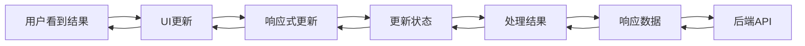

### 状态持久化

系统使用 `pinia-plugin-persistedstate` 插件实现状态持久化：

```typescript
// 用户状态持久化配置
{
  persist: {
    key: 'user',
    storage: localStorage,
    paths: [
      'language',
      'isLogin',
      'info',
      'accessToken',
      'refreshToken'
    ]
  }
}

// 设置状态持久化配置
{
  persist: {
    key: 'setting',
    storage: localStorage,
    paths: [
      'theme',
      'layout',
      'menu'
    ]
  }
}
```

---

## 服务层架构

### API服务架构

系统采用分层的服务架构，所有API服务继承自 `BaseApiService`，提供统一的功能和接口。

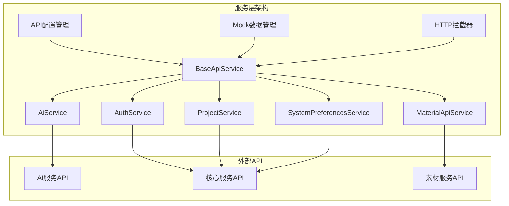

### 基础API服务 (BaseApiService)

`BaseApiService` 提供了所有API服务的通用功能：

```typescript
abstract class BaseApiService {
  protected serviceName: string
  private serviceConfig: ApiEndpointConfig | null = null

  constructor(serviceName: string) {
    this.serviceName = serviceName
    this.serviceConfig = apiConfigManager.getServiceConfig(serviceName)
  }

  // 统一请求方法
  protected async request<T>(config: ApiRequestConfig): Promise<T> {
    const apiConfig = apiConfigManager.getConfig()

    // 检查是否启用Mock模式
    if (config.useMock !== false && apiConfig.useMock && this.mockImplementation) {
      return this.handleMockRequest<T>(config)
    }

    // 使用真实API
    return this.handleRealRequest<T>(config)
  }

  // HTTP方法封装
  protected async get<T>(
    path: string,
    params?: any,
    options?: Partial<ApiRequestConfig>
  ): Promise<T>
  protected async post<T>(path: string, data?: any, options?: Partial<ApiRequestConfig>): Promise<T>
  protected async put<T>(path: string, data?: any, options?: Partial<ApiRequestConfig>): Promise<T>
  protected async delete<T>(
    path: string,
    data?: any,
    options?: Partial<ApiRequestConfig>
  ): Promise<T>

  // Mock实现（子类重写）
  protected async mockImplementation?(config: ApiRequestConfig): Promise<any>
}
```

### AI服务 (AiService)

AI服务负责与后端AI API的交互，提供多种AI功能：

```typescript
class AiService extends BaseApiService {
  constructor() {
    super('ai')
  }

  // 搜索工具
  async searchTools(request: {
    queries: string[]
    provider: 'tavily' | 'bocha'
    max_results?: number
  }) {
    return this.post<SearchToolsResponse>('/search-tools/search', request)
  }

  // 搜索Agent
  async executeSearchAgent(
    userId: string,
    projectId: string,
    request: {
      brief: string
      max_concurrent_research_units?: number
      max_researcher_iterations?: number
    }
  ) {
    return this.post<SearchAgentResponse>('/search-agent/execute', request, {
      params: { user_id: userId, project_id: projectId }
    })
  }

  // 网页总结
  async summarizeWebpageAsync(request: { url: string; model_name?: string; max_tokens?: number }) {
    return this.post<WebpageSummaryAsyncResponse>('/webpage-summary/summarize-async', request)
  }

  // 标题生成
  async generateTitles(request: { research_brief: string; web_search_data: any[] }) {
    return this.post<TitleGenerationResponse>('/title-generate/generate', request)
  }

  // 大纲生成
  async generateOutline(request: { title: any; research_brief: string; web_search_data: any[] }) {
    return this.post<OutlineGenerationResponse>('/outline-generate/generate', request)
  }
}
```

### 素材服务 (MaterialApiService)

素材服务负责素材相关的API操作：

```typescript
class MaterialApiService extends BaseApiService {
  constructor() {
    super('material')
  }

  // 批量创建素材
  async createMaterials(projectId: number, materials: MaterialCreateRequest[]) {
    const request: AddCompleteMaterialRequest = {
      project_id: projectId,
      materials
    }
    return this.post<MaterialListResponse>('/materials/batch', request)
  }

  // 获取项目素材
  async getProjectMaterials(projectId: number, params?: any) {
    return this.get<MaterialListResponse>(`/projects/${projectId}/materials`, params)
  }

  // 更新素材
  async updateMaterial(materialId: number, updateData: Partial<MaterialCreateRequest>) {
    const request: MaterialUpdateRequest = {
      update_data: updateData
    }
    return this.put<MaterialResponse>(`/materials/${materialId}`, request)
  }

  // 批量删除素材
  async deleteMaterials(materialIds: number[]) {
    const request: MaterialDeleteRequest = {
      material_ids: materialIds
    }
    return this.delete<MaterialDeleteResponse>('/materials', request)
  }

  // 搜索素材
  async searchMaterials(params: MaterialSearchRequest) {
    return this.post<MaterialSearchResponse>('/materials/search', params)
  }
}
```

### API配置管理

系统提供了灵活的API配置管理，支持Mock/真实API切换：

```typescript
class ApiConfigManager {
  private config: ApiConfig

  // 获取配置
  getConfig(): ApiConfig {
    return { ...this.config }
  }

  // 更新配置
  updateConfig(updates: Partial<ApiConfig>): void {
    this.config = { ...this.config, ...updates }
    this.saveToStorage()
    this.notifyListeners()
  }

  // 设置是否使用Mock数据
  setUseMock(useMock: boolean): void {
    const currentConfig = this.getConfig()
    if (currentConfig.useMock === useMock) return

    const userStore = useUserStore()
    if (userStore.isLogin) {
      const userType = userStore.getUserType

      // Mock用户无法切换到真实API模式
      if (!useMock && userType === 'mock') {
        userStore.logOut()
        alert('Mock用户无法使用真实API，请使用真实账户重新登录')
        return
      }
    }

    this.updateConfig({ useMock })
  }

  // 获取服务配置
  getServiceConfig(serviceName: string): ApiEndpointConfig | null {
    const service = API_REGISTRY.services[serviceName]
    return service || null
  }
}
```

### Mock数据管理

系统提供了完整的Mock数据支持，便于前端独立开发：

```typescript
// Mock实现示例
protected async mockImplementation(config: ApiRequestConfig): Promise<any> {
  const url = config.url
  const method = config.method

  // 模拟网络延迟
  await new Promise(resolve => setTimeout(resolve, 1000))

  // 根据API路径返回相应的Mock数据
  if (method === 'GET' && url.includes('/search-tools/status')) {
    return mockDataManager.getMockData('search-tools-status')
  }

  if (method === 'POST' && url.includes('/search-tools/search')) {
    const requestData = config.data
    return mockDataManager.getMockData(
      'search-tools',
      requestData.queries || [],
      requestData.provider || 'tavily'
    )
  }

  // 默认Mock响应
  return {
    success: true,
    message: `AI服务Mock响应 - ${method} ${url}`,
    data: {
      mock: true,
      timestamp: Date.now()
    }
  }
}
```

---

## 路由和导航系统

### 路由架构

系统采用 Vue Router 4 实现路由管理，支持静态路由和动态路由两种模式。

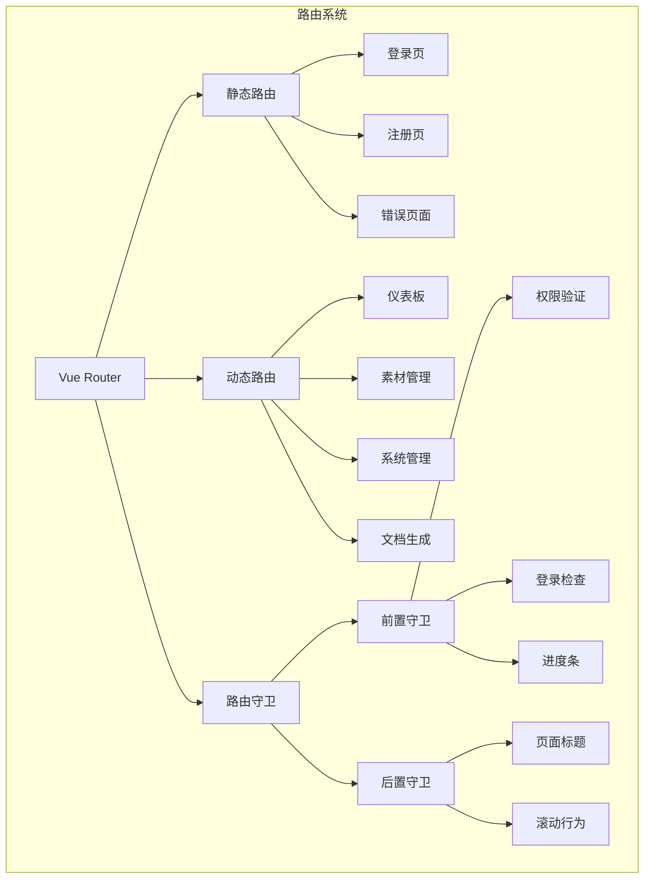

### 路由配置

#### 静态路由

静态路由是不需要权限就能访问的路由，如登录、注册、错误页面等：

```typescript
export const staticRoutes: AppRouteRecordRaw[] = [
  {
    path: RoutesAlias.Login,
    name: 'Login',
    component: () => import('@views/auth/login/index.vue'),
    meta: { title: 'menus.login.title', isHideTab: true, setTheme: true }
  },
  {
    path: RoutesAlias.Register,
    name: 'Register',
    component: () => import('@views/auth/register/index.vue'),
    meta: { title: 'menus.register.title', isHideTab: true, noLogin: true, setTheme: true }
  },
  {
    path: '/403',
    name: 'Exception403',
    component: () => import('@views/exception/403/index.vue'),
    meta: { title: '403', noLogin: true }
  },
  {
    path: '/:pathMatch(.*)*',
    name: 'Exception404',
    component: () => import('@views/exception/404/index.vue'),
    meta: { title: '404' }
  }
]
```

#### 动态路由

动态路由是需要权限控制的路由，根据用户权限动态加载：

```typescript
export const asyncRoutes: AppRouteRecord[] = [
  {
    path: '/dashboard',
    name: 'Dashboard',
    component: RoutesAlias.Layout,
    meta: {
      title: 'menus.dashboard.title',
      icon: '&#xe721;',
      roles: ['R_SUPER', 'R_ADMIN']
    },
    children: [
      {
        path: 'console',
        name: 'Console',
        component: RoutesAlias.Dashboard,
        meta: {
          title: 'menus.dashboard.console',
          keepAlive: false,
          fixedTab: true
        }
      }
    ]
  },
  {
    path: '/material',
    name: 'Material',
    component: RoutesAlias.Layout,
    meta: {
      title: 'menus.material.title',
      icon: '&#xe651;',
      showTextBadge: 'New'
    },
    children: [
      {
        path: 'search',
        name: 'MaterialSearch',
        component: RoutesAlias.MaterialSearch,
        meta: {
          title: 'menus.material.search',
          keepAlive: true,
          showTextBadge: 'AI'
        }
      },
      {
        path: 'management',
        name: 'MaterialManagement',
        component: RoutesAlias.MaterialManagement,
        meta: {
          title: 'menus.material.management',
          keepAlive: true,
          authList: [
            { title: '管理', authMark: 'manage' },
            { title: '删除', authMark: 'delete' }
          ]
        }
      }
    ]
  }
]
```

### 路由守卫

#### 前置守卫

前置守卫负责权限验证、登录检查和进度条显示：

```typescript
export function setupBeforeEachGuard(router: Router) {
  router.beforeEach(async (to, from, next) => {
    // 开始进度条
    NProgress.start()

    // 设置页面标题
    document.title = getPageTitle(to.meta.title)

    // 获取用户store
    const userStore = useUserStore()

    // 检查是否需要登录
    if (to.meta.noLogin) {
      next()
      return
    }

    // 检查登录状态
    if (!userStore.isLogin) {
      // 尝试初始化认证状态
      const isValid = await userStore.initializeAuthState()
      if (!isValid) {
        next(RoutesAlias.Login)
        return
      }
    }

    // 检查权限
    if (to.meta.roles && !hasPermission(to.meta.roles)) {
      next('/403')
      return
    }

    next()
  })
}
```

#### 后置守卫

后置守卫负责完成进度条和滚动行为：

```typescript
export function setupAfterEachGuard(router: Router) {
  router.afterEach((to, from) => {
    // 结束进度条
    NProgress.done()

    // 滚动到顶部
    window.scrollTo(0, 0)

    // 记录路由历史
    const userStore = useUserStore()
    userStore.addRouteHistory(to)
  })
}
```

### 权限控制

系统实现了多层次的权限控制：

1. **路由级权限**：基于用户角色控制路由访问
2. **组件级权限**：使用指令控制组件显示
3. **操作级权限**：基于权限标记控制具体操作

```typescript
// 权限检查函数
function hasPermission(roles: string[]): boolean {
  const userStore = useUserStore()
  const userRoles = userStore.info.roles || []
  return roles.some((role) => userRoles.includes(role))
}

// 权限指令
const auth = {
  mounted(el: HTMLElement, binding: DirectiveBinding) {
    const { authMark } = binding.value
    if (!hasAuthPermission(authMark)) {
      el.style.display = 'none'
    }
  }
}

// 权限检查
function hasAuthPermission(authMark: string): boolean {
  const userStore = useUserStore()
  return userStore.info.roles?.some((role) => role.permissions?.includes(authMark)) || false
}
```

---

## 安全和权限设计

### 安全架构

系统实现了多层次的安全防护，确保应用和数据的安全性。

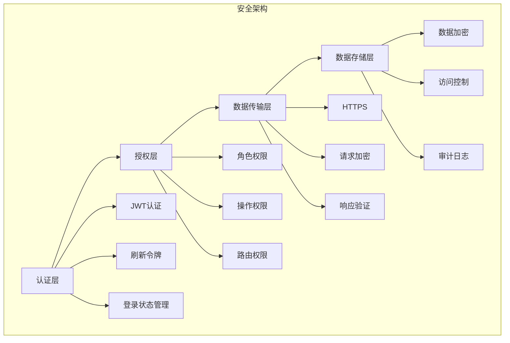

### 认证机制

#### JWT认证

系统使用JWT（JSON Web Token）进行用户认证：

```typescript
// JWT结构
interface JWTPayload {
  sub: string // 用户ID
  iat: number // 签发时间
  exp: number // 过期时间
  roles: string[] // 用户角色
  permissions: string[] // 用户权限
}

// 令牌管理
const setToken = (accessToken: string, refreshToken?: string, expiresIn?: number) => {
  userStore.accessToken = accessToken
  if (refreshToken) {
    userStore.refreshToken = refreshToken
  }

  // 设置过期时间
  if (expiresIn) {
    userStore.tokenExpiresAt = Date.now() + expiresIn * 1000
  } else {
    // 从令牌中解析过期时间
    const tokenData = parseToken(accessToken)
    if (tokenData.exp) {
      userStore.tokenExpiresAt = tokenData.exp * 1000
    }
  }
}
```

#### 令牌刷新

系统实现了自动令牌刷新机制：

```typescript
// 自动令牌刷新
const setupTokenRefresh = () => {
  // 清除现有定时器
  if (tokenRefreshTimer) {
    clearTimeout(tokenRefreshTimer)
    tokenRefreshTimer = null
  }

  // 计算刷新时间（在过期前5分钟刷新）
  const refreshTime = tokenExpiresAt.value - 5 * 60 * 1000
  const currentTime = Date.now()

  // 如果令牌即将过期，立即刷新
  if (currentTime >= refreshTime || isTokenExpired(accessToken.value)) {
    refreshAccessToken()
    return
  }

  // 设置定时器
  const delay = refreshTime - currentTime
  tokenRefreshTimer = setTimeout(async () => {
    const success = await refreshAccessToken()
    if (success) {
      setupTokenRefresh()
    } else {
      logOut()
    }
  }, delay)
}

// 刷新访问令牌
const refreshAccessToken = async (): Promise<boolean> => {
  try {
    if (!refreshToken.value) {
      return false
    }

    const response = await authService.refreshToken(refreshToken.value)

    // 处理刷新响应
    if (response && typeof response === 'object' && Object.keys(response).length === 0) {
      return true
    }

    return false
  } catch (error) {
    console.error('刷新令牌失败:', error)
    return false
  }
}
```

### 权限控制

#### 角色权限模型

系统采用基于角色的访问控制（RBAC）模型：

```typescript
// 角色定义
enum UserRole {
  SUPER = 'R_SUPER', // 超级管理员
  ADMIN = 'R_ADMIN', // 管理员
  USER = 'R_USER', // 普通用户
  GUEST = 'R_GUEST' // 访客
}

// 权限定义
interface Permission {
  id: string
  name: string
  resource: string
  action: string
  conditions?: Record<string, any>
}

// 角色权限关联
interface RolePermission {
  roleId: string
  permissionId: string
  conditions?: Record<string, any>
}
```

#### 权限检查

```typescript
// 权限检查函数
function hasPermission(roles: string[]): boolean {
  const userStore = useUserStore()
  const userRoles = userStore.info.roles || []
  return roles.some((role) => userRoles.includes(role))
}

function hasAuthPermission(authMark: string): boolean {
  const userStore = useUserStore()
  return userStore.info.roles?.some((role) => role.permissions?.includes(authMark)) || false
}

// 权限指令
const auth = {
  mounted(el: HTMLElement, binding: DirectiveBinding) {
    const { authMark } = binding.value
    if (!hasAuthPermission(authMark)) {
      el.style.display = 'none'
    }
  },
  updated(el: HTMLElement, binding: DirectiveBinding) {
    const { authMark } = binding.value
    if (!hasAuthPermission(authMark)) {
      el.style.display = 'none'
    } else {
      el.style.display = ''
    }
  }
}
```

### 数据安全

#### 请求加密

系统对敏感数据进行加密传输：

```typescript
// 数据加密
import CryptoJS from 'crypto-js'

const encryptData = (data: any, key: string): string => {
  const dataStr = JSON.stringify(data)
  return CryptoJS.AES.encrypt(dataStr, key).toString()
}

const decryptData = (encryptedData: string, key: string): any => {
  const bytes = CryptoJS.AES.decrypt(encryptedData, key)
  const decryptedStr = bytes.toString(CryptoJS.enc.Utf8)
  return JSON.parse(decryptedStr)
}

// HTTP请求拦截器
axiosInstance.interceptors.request.use((config) => {
  // 对敏感数据进行加密
  if (config.data && config.encrypt) {
    config.data = encryptData(config.data, getEncryptionKey())
  }
  return config
})
```

#### 响应验证

```typescript
// 响应验证
axiosInstance.interceptors.response.use((response) => {
  // 验证响应完整性
  if (response.headers['x-content-hash']) {
    const contentHash = CryptoJS.SHA256(JSON.stringify(response.data)).toString()
    if (contentHash !== response.headers['x-content-hash']) {
      throw new Error('响应数据完整性验证失败')
    }
  }
  return response
})
```

### 安全最佳实践

1. **输入验证**：对所有用户输入进行验证和清理
2. **XSS防护**：使用DOMPurify等库防止XSS攻击
3. **CSRF防护**：使用CSRF令牌防止跨站请求伪造
4. **安全头**：设置适当的安全HTTP头
5. **错误处理**：避免在错误信息中泄露敏感信息
6. **日志记录**：记录安全相关事件和操作

```typescript
// 输入验证
const validateInput = (input: string, rules: ValidationRule[]): boolean => {
  return rules.every((rule) => rule.test(input))
}

// XSS防护
import DOMPurify from 'dompurify'

const sanitizeHtml = (html: string): string => {
  return DOMPurify.sanitize(html)
}

// CSRF防护
const getCSRFToken = (): string => {
  return document.querySelector('meta[name="csrf-token"]')?.getAttribute('content') || ''
}

// 安全头设置
const securityHeaders = {
  'X-Content-Type-Options': 'nosniff',
  'X-Frame-Options': 'DENY',
  'X-XSS-Protection': '1; mode=block',
  'Strict-Transport-Security': 'max-age=31536000; includeSubDomains'
}
```

---

## 性能优化策略

### 性能优化架构

系统从多个维度实现了性能优化，确保应用的高效运行。

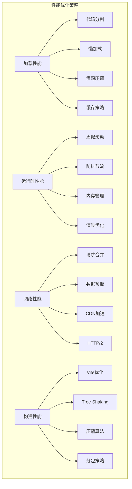

### 加载性能优化

#### 代码分割

系统采用动态导入实现代码分割，按需加载页面组件：

```typescript
// 路由懒加载
const routes = [
  {
    path: '/dashboard',
    component: () => import('@/views/dashboard/index.vue')
  },
  {
    path: '/material',
    component: () => import('@/views/material/index.vue')
  }
]

// 组件懒加载
const HeavyComponent = defineAsyncComponent(() => import('@/components/HeavyComponent.vue'))
```

#### 资源压缩

在Vite配置中启用资源压缩：

```typescript
// vite.config.ts
export default defineConfig({
  build: {
    minify: 'terser',
    terserOptions: {
      compress: {
        drop_console: true, // 生产环境去除 console
        drop_debugger: true // 生产环境去除 debugger
      }
    }
  },
  plugins: [
    // Gzip压缩
    viteCompression({
      algorithm: 'gzip',
      ext: '.gz',
      threshold: 10240
    })
  ]
})
```

#### 缓存策略

实现多层次的缓存策略：

```typescript
// HTTP缓存
const cacheConfig = {
  headers: {
    'Cache-Control': 'public, max-age=31536000',
    ETag: generateETag()
  }
}

// 浏览器缓存
const setLocalStorage = (key: string, data: any, ttl: number) => {
  const item = {
    data,
    expires: Date.now() + ttl
  }
  localStorage.setItem(key, JSON.stringify(item))
}

const getLocalStorage = (key: string) => {
  const item = JSON.parse(localStorage.getItem(key) || '{}')
  if (item.expires && Date.now() > item.expires) {
    localStorage.removeItem(key)
    return null
  }
  return item.data
}

// 内存缓存
class MemoryCache {
  private cache = new Map<string, { data: any; expires: number }>()

  set(key: string, data: any, ttl: number) {
    this.cache.set(key, {
      data,
      expires: Date.now() + ttl
    })
  }

  get(key: string) {
    const item = this.cache.get(key)
    if (!item) return null

    if (Date.now() > item.expires) {
      this.cache.delete(key)
      return null
    }

    return item.data
  }
}
```

### 运行时性能优化

#### 虚拟滚动

对于大量数据的列表，使用虚拟滚动提高性能：

```vue
<template>
  <div class="virtual-list" ref="containerRef">
    <div class="virtual-list-phantom" :style="{ height: totalHeight + 'px' }"></div>
    <div class="virtual-list-content" :style="{ transform: `translateY(${offsetY}px)` }">
      <div v-for="item in visibleItems" :key="item.id" class="virtual-list-item">
        {{ item.content }}
      </div>
    </div>
  </div>
</template>

<script setup lang="ts">
  const props = defineProps<{
    items: any[]
    itemHeight: number
    containerHeight: number
  }>()

  const containerRef = ref<HTMLElement>()
  const scrollTop = ref(0)
  const startIndex = computed(() => Math.floor(scrollTop.value / props.itemHeight))
  const endIndex = computed(() =>
    Math.min(
      startIndex.value + Math.ceil(props.containerHeight / props.itemHeight),
      props.items.length
    )
  )
  const visibleItems = computed(() => props.items.slice(startIndex.value, endIndex.value))
  const offsetY = computed(() => startIndex.value * props.itemHeight)
  const totalHeight = computed(() => props.items.length * props.itemHeight)

  const handleScroll = () => {
    scrollTop.value = containerRef.value?.scrollTop || 0
  }

  onMounted(() => {
    containerRef.value?.addEventListener('scroll', handleScroll)
  })
</script>
```

#### 防抖节流

对频繁触发的事件进行防抖和节流处理：

```typescript
// 防抖函数
function debounce<T extends (...args: any[]) => any>(
  func: T,
  wait: number
): (...args: Parameters<T>) => void {
  let timeout: NodeJS.Timeout
  return function executedFunction(...args: Parameters<T>) {
    const later = () => {
      clearTimeout(timeout)
      func(...args)
    }
    clearTimeout(timeout)
    timeout = setTimeout(later, wait)
  }
}

// 节流函数
function throttle<T extends (...args: any[]) => any>(
  func: T,
  limit: number
): (...args: Parameters<T>) => void {
  let inThrottle: boolean
  return function executedFunction(...args: Parameters<T>) {
    if (!inThrottle) {
      func(...args)
      inThrottle = true
      setTimeout(() => (inThrottle = false), limit)
    }
  }
}

// 使用示例
const handleSearch = debounce((keyword: string) => {
  searchMaterials(keyword)
}, 300)

const handleScroll = throttle(() => {
  updateScrollPosition()
}, 100)
```

#### 内存管理

合理管理内存，避免内存泄漏：

```typescript
// 组件卸载时清理资源
onUnmounted(() => {
  // 清理定时器
  if (timer) {
    clearInterval(timer)
  }

  // 清理事件监听器
  window.removeEventListener('resize', handleResize)

  // 清理WebSocket连接
  if (websocket) {
    websocket.close()
  }
})

// 使用WeakMap避免内存泄漏
const weakMap = new WeakMap<object, any>()

const setItem = (key: object, value: any) => {
  weakMap.set(key, value)
}

const getItem = (key: object) => {
  return weakMap.get(key)
}
```

### 网络性能优化

#### 请求合并

合并多个小请求为一个批量请求：

```typescript
// 请求合并器
class RequestBatcher {
  private queue: Array<{ resolve: Function; reject: Function; params: any }> = []
  private timer: NodeJS.Timeout | null = null

  addRequest(params: any): Promise<any> {
    return new Promise((resolve, reject) => {
      this.queue.push({ resolve, reject, params })

      if (!this.timer) {
        this.timer = setTimeout(() => {
          this.flush()
        }, 100)
      }
    })
  }

  private async flush() {
    if (this.queue.length === 0) return

    const requests = this.queue.splice(0)
    this.timer = null

    try {
      const batchParams = requests.map((req) => req.params)
      const results = await this.executeBatch(batchParams)

      requests.forEach((req, index) => {
        req.resolve(results[index])
      })
    } catch (error) {
      requests.forEach((req) => {
        req.reject(error)
      })
    }
  }

  private async executeBatch(params: any[]): Promise<any[]> {
    // 执行批量请求
    return apiService.batchRequest(params)
  }
}
```

#### 数据预取

预取可能需要的数据：

```typescript
// 数据预取
const prefetchData = async (routes: string[]) => {
  const prefetchPromises = routes.map((route) => {
    return import(`@/views/${route}/index.vue`)
  })

  try {
    await Promise.all(prefetchPromises)
  } catch (error) {
    console.warn('预取数据失败:', error)
  }
}

// 智能预取
const smartPrefetch = () => {
  // 根据用户行为预取数据
  const userBehavior = analyzeUserBehavior()
  const likelyRoutes = predictNextRoutes(userBehavior)
  prefetchData(likelyRoutes)
}
```

### 构建性能优化

#### Vite优化

配置Vite以提高构建性能：

```typescript
// vite.config.ts
export default defineConfig({
  optimizeDeps: {
    include: ['vue', 'vue-router', 'pinia', 'element-plus']
  },
  build: {
    rollupOptions: {
      output: {
        manualChunks: {
          vendor: ['vue', 'vue-router', 'pinia'],
          element: ['element-plus'],
          utils: ['lodash-es', 'axios']
        }
      }
    }
  }
})
```

#### Tree Shaking

确保Tree Shaking正常工作：

```typescript
// 使用ES6模块导入
import { debounce } from 'lodash-es'
// 而不是
// import _ from 'lodash'

// 在package.json中设置sideEffects
{
  "sideEffects": [
    "*.css",
    "*.scss",
    "*.vue"
  ]
}
```

---

## 开发规范和最佳实践

### 代码规范

#### TypeScript规范

1. **严格类型检查**：启用所有严格类型检查选项
2. **类型定义**：为所有函数、变量和对象定义类型
3. **接口优先**：使用接口定义对象结构
4. **泛型使用**：合理使用泛型提高代码复用性

```typescript
// 好的示例
interface ApiResponse<T> {
  success: boolean
  data: T
  message: string
}

async function fetchData<T>(url: string): Promise<ApiResponse<T>> {
  const response = await http.get<ApiResponse<T>>(url)
  return response.data
}

// 使用示例
interface User {
  id: number
  name: string
  email: string
}

const userResponse = await fetchData<User>('/api/user')
```

#### Vue组件规范

1. **组件命名**：使用PascalCase命名组件
2. **Props定义**：明确定义Props类型和默认值
3. **事件命名**：使用kebab-case命名事件
4. **组合式函数**：使用组合式API组织逻辑

```vue
<template>
  <div class="material-card">
    <h3>{{ material.title }}</h3>
    <p>{{ material.summary }}</p>
    <el-button @click="handleSelect">选择</el-button>
  </div>
</template>

<script setup lang="ts">
  import { computed } from 'vue'

  interface Props {
    material: Material
    selected?: boolean
  }

  interface Emits {
    select: [id: string]
  }

  const props = withDefaults(defineProps<Props>(), {
    selected: false
  })

  const emit = defineEmits<Emits>()

  const isSelected = computed(() => props.selected)

  const handleSelect = () => {
    emit('select', props.material.id)
  }
</script>

<style scoped>
  .material-card {
    padding: 16px;
    border: 1px solid #e4e7ed;
    border-radius: 4px;
  }
</style>
```

#### CSS规范

1. **BEM命名**：使用BEM方法论命名CSS类
2. **SCSS变量**：使用变量管理颜色、字体等
3. **响应式设计**：使用媒体查询实现响应式
4. **组件样式**：使用scoped样式避免污染

```scss
// BEM命名示例
.material-card {
  padding: 16px;
  border: 1px solid $border-color;
  border-radius: 4px;

  &__title {
    font-size: 16px;
    font-weight: bold;
    margin-bottom: 8px;
  }

  &__content {
    color: $text-color-secondary;
    margin-bottom: 16px;
  }

  &--selected {
    border-color: $primary-color;
    box-shadow: 0 0 0 2px rgba($primary-color, 0.2);
  }

  &__button {
    &--primary {
      background-color: $primary-color;
      color: white;
    }
  }
}

// 响应式设计
@media (max-width: 768px) {
  .material-card {
    padding: 12px;

    &__title {
      font-size: 14px;
    }
  }
}
```

### 项目结构规范

#### 目录结构

```
src/
├── assets/          # 静态资源
│   ├── images/      # 图片
│   ├── icons/       # 图标
│   └── styles/      # 全局样式
├── components/      # 组件
│   ├── core/        # 核心组件
│   ├── custom/      # 自定义组件
│   └── dev/        # 开发组件
├── composables/     # 组合式函数
├── config/          # 配置文件
├── locales/         # 国际化
├── router/          # 路由配置
├── services/        # API服务
├── store/           # 状态管理
├── types/           # 类型定义
├── utils/           # 工具函数
└── views/           # 页面组件
```

#### 文件命名

1. **组件文件**：使用PascalCase命名
2. **工具文件**：使用camelCase命名
3. **常量文件**：使用UPPER_CASE命名
4. **类型文件**：使用camelCase命名

```
components/
├── MaterialCard.vue
├── SearchForm.vue
└── UserAvatar.vue

utils/
├── request.ts
├── storage.ts
└── validation.ts

types/
├── api.ts
├── user.ts
└── material.ts

constants/
├── API_ENDPOINTS.ts
└── ERROR_CODES.ts
```

### Git规范

#### 提交信息规范

使用Conventional Commits规范：

```
<type>[optional scope]: <description>

[optional body]

[optional footer(s)]
```

类型说明：

- `feat`: 新功能
- `fix`: 修复bug
- `docs`: 文档更新
- `style`: 代码格式调整
- `refactor`: 代码重构
- `test`: 测试相关
- `chore`: 构建过程或辅助工具的变动

示例：

```
feat(material): add material search functionality

- Add search form component
- Implement search API integration
- Add search results display

Closes #123
```

#### 分支管理

采用Git Flow工作流：

```
main          # 主分支，用于生产环境
├── develop   # 开发分支，用于集成功能
├── feature/* # 功能分支
├── release/* # 发布分支
├── hotfix/*  # 热修复分支
└── support/* # 支持分支
```

### 测试规范

#### 单元测试

使用Vitest进行单元测试：

```typescript
// tests/unit/materialStore.test.ts
import { describe, it, expect, beforeEach } from 'vitest'
import { setActivePinia, createPinia } from 'pinia'
import { useMaterialStore } from '@/store/material'

describe('materialStore', () => {
  beforeEach(() => {
    setActivePinia(createPinia())
  })

  it('should add material to store', () => {
    const store = useMaterialStore()
    const material = {
      id: '1',
      title: 'Test Material',
      summary: 'Test Summary'
    }

    store.addMaterial(material)

    expect(store.materials).toContain(material)
  })

  it('should toggle material selection', () => {
    const store = useMaterialStore()
    const materialId = '1'

    store.toggleSelection(materialId)
    expect(store.selectedMaterials).toContain(materialId)

    store.toggleSelection(materialId)
    expect(store.selectedMaterials).not.toContain(materialId)
  })
})
```

#### 组件测试

使用Vue Test Utils进行组件测试：

```typescript
// tests/unit/MaterialCard.test.ts
import { mount } from '@vue/test-utils'
import { describe, it, expect } from 'vitest'
import MaterialCard from '@/components/MaterialCard.vue'

describe('MaterialCard', () => {
  it('renders material information', () => {
    const material = {
      id: '1',
      title: 'Test Material',
      summary: 'Test Summary'
    }

    const wrapper = mount(MaterialCard, {
      props: { material }
    })

    expect(wrapper.text()).toContain(material.title)
    expect(wrapper.text()).toContain(material.summary)
  })

  it('emits select event when button is clicked', async () => {
    const material = {
      id: '1',
      title: 'Test Material',
      summary: 'Test Summary'
    }

    const wrapper = mount(MaterialCard, {
      props: { material }
    })

    await wrapper.find('button').trigger('click')

    expect(wrapper.emitted('select')).toBeTruthy()
    expect(wrapper.emitted('select')[0]).toEqual([material.id])
  })
})
```

### 性能最佳实践

1. **组件懒加载**：对大型组件使用懒加载
2. **计算属性缓存**：合理使用计算属性缓存结果
3. **事件监听器清理**：及时清理事件监听器
4. **虚拟滚动**：对长列表使用虚拟滚动
5. **图片懒加载**：对图片使用懒加载

```vue
<template>
  <div>
    <!-- 组件懒加载 -->
    <HeavyComponent v-if="showHeavy" />

    <!-- 图片懒加载 -->
    

    <!-- 虚拟滚动 -->
    <VirtualList :items="items" :item-height="50" />
  </div>
</template>

<script setup lang="ts">
  import { computed, onUnmounted } from 'vue'

  // 计算属性缓存
  const expensiveValue = computed(() => {
    return heavyCalculation(props.data)
  })

  // 事件监听器清理
  const handleResize = () => {
    // 处理窗口大小变化
  }

  onMounted(() => {
    window.addEventListener('resize', handleResize)
  })

  onUnmounted(() => {
    window.removeEventListener('resize', handleResize)
  })
</script>
```

---

## 部署和运维考虑

### 部署架构

系统支持多种部署方式，包括传统部署、容器化部署和云原生部署。

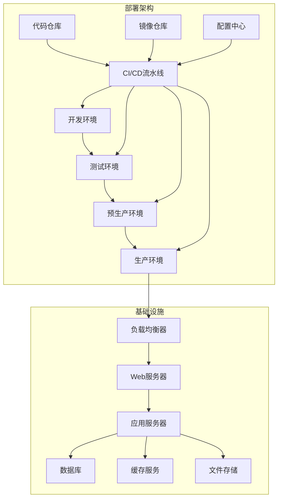

### 构建配置

#### 环境配置

系统支持多环境配置：

```typescript
// 环境变量配置
interface EnvConfig {
  VITE_API_URL: string
  VITE_APP_TITLE: string
  VITE_USE_MOCK: string
  VITE_MOCK_DELAY: string
  VITE_API_DEBUG: string
}

// 开发环境
// .env.development
VITE_API_URL=http://localhost:3000/api
VITE_APP_TITLE=Art Design Pro (开发)
VITE_USE_MOCK=true
VITE_MOCK_DELAY=1000
VITE_API_DEBUG=true

// 生产环境
// .env.production
VITE_API_URL=https://api.artdesign.pro
VITE_APP_TITLE=Art Design Pro
VITE_USE_MOCK=false
VITE_MOCK_DELAY=0
VITE_API_DEBUG=false
```

#### 构建脚本

```json
{
  "scripts": {
    "dev": "vite --open",
    "build": "vue-tsc --noEmit && vite build",
    "build:dev": "vite build --mode development",
    "build:test": "vite build --mode test",
    "build:prod": "vite build --mode production",
    "preview": "vite preview",
    "analyze": "vite build && npx vite-bundle-analyzer dist/stats.html"
  }
}
```

### Docker部署

#### Dockerfile

```dockerfile
# 多阶段构建
FROM node:18-alpine as builder

WORKDIR /app

# 复制依赖文件
COPY package*.json ./
RUN npm ci --only=production

# 复制源代码
COPY . .

# 构建应用
RUN npm run build

# 生产镜像
FROM nginx:alpine

# 复制构建产物
COPY --from=builder /app/dist /usr/share/nginx/html

# 复制nginx配置
COPY nginx.conf /etc/nginx/nginx.conf

# 暴露端口
EXPOSE 80

# 启动nginx
CMD ["nginx", "-g", "daemon off;"]
```

#### Docker Compose

```yaml
version: '3.8'

services:
  frontend:
    build: .
    ports:
      - '80:80'
    environment:
      - NODE_ENV=production
    volumes:
      - ./nginx.conf:/etc/nginx/nginx.conf:ro
    restart: unless-stopped

  backend:
    image: art-design-pro-backend:latest
    ports:
      - '3000:3000'
    environment:
      - NODE_ENV=production
      - DATABASE_URL=postgresql://user:password@db:5432/artdesign
    depends_on:
      - db
      - redis
    restart: unless-stopped

  db:
    image: postgres:14-alpine
    environment:
      - POSTGRES_DB=artdesign
      - POSTGRES_USER=user
      - POSTGRES_PASSWORD=password
    volumes:
      - postgres_data:/var/lib/postgresql/data
    restart: unless-stopped

  redis:
    image: redis:7-alpine
    volumes:
      - redis_data:/data
    restart: unless-stopped

volumes:
  postgres_data:
  redis_data:
```

### CI/CD流水线

#### GitHub Actions

```yaml
name: CI/CD Pipeline

on:
  push:
    branches: [main, develop]
  pull_request:
    branches: [main]

jobs:
  test:
    runs-on: ubuntu-latest
    steps:
      - uses: actions/checkout@v3

      - name: Setup Node.js
        uses: actions/setup-node@v3
        with:
          node-version: '18'
          cache: 'npm'

      - name: Install dependencies
        run: npm ci

      - name: Run tests
        run: npm run test

      - name: Run linting
        run: npm run lint

      - name: Type checking
        run: npm run type-check

  build:
    needs: test
    runs-on: ubuntu-latest
    steps:
      - uses: actions/checkout@v3

      - name: Setup Node.js
        uses: actions/setup-node@v3
        with:
          node-version: '18'
          cache: 'npm'

      - name: Install dependencies
        run: npm ci

      - name: Build application
        run: npm run build

      - name: Upload build artifacts
        uses: actions/upload-artifact@v3
        with:
          name: dist
          path: dist/

  deploy:
    needs: build
    runs-on: ubuntu-latest
    if: github.ref == 'refs/heads/main'
    steps:
      - name: Download build artifacts
        uses: actions/download-artifact@v3
        with:
          name: dist
          path: dist/

      - name: Deploy to production
        run: |
          # 部署脚本
          echo "Deploying to production..."
```

### 监控和日志

#### 错误监控

集成Sentry进行错误监控：

```typescript
// main.ts
import * as Sentry from '@sentry/vue'
import { BrowserTracing } from '@sentry/tracing'

if (import.meta.env.PROD) {
  Sentry.init({
    app: app,
    dsn: 'YOUR_SENTRY_DSN',
    integrations: [
      new BrowserTracing({
        routingInstrumentation: Sentry.vueRouterInstrumentation(router)
      })
    ],
    tracesSampleRate: 1.0
  })
}
```

#### 性能监控

使用Web Vitals监控性能：

```typescript
// utils/performance.ts
import { getCLS, getFID, getFCP, getLCP, getTTFB } from 'web-vitals'

function sendToAnalytics(metric: any) {
  // 发送性能数据到分析服务
  gtag('event', metric.name, {
    value: Math.round(metric.name === 'CLS' ? metric.value * 1000 : metric.value),
    event_category: 'Web Vitals',
    event_label: metric.id,
    non_interaction: true
  })
}

getCLS(sendToAnalytics)
getFID(sendToAnalytics)
getFCP(sendToAnalytics)
getLCP(sendToAnalytics)
getTTFB(sendToAnalytics)
```

#### 日志管理

实现结构化日志：

```typescript
// utils/logger.ts
enum LogLevel {
  DEBUG = 0,
  INFO = 1,
  WARN = 2,
  ERROR = 3
}

class Logger {
  private level: LogLevel

  constructor(level: LogLevel = LogLevel.INFO) {
    this.level = level
  }

  debug(message: string, data?: any) {
    if (this.level <= LogLevel.DEBUG) {
      console.debug(`[DEBUG] ${message}`, data)
    }
  }

  info(message: string, data?: any) {
    if (this.level <= LogLevel.INFO) {
      console.info(`[INFO] ${message}`, data)
    }
  }

  warn(message: string, data?: any) {
    if (this.level <= LogLevel.WARN) {
      console.warn(`[WARN] ${message}`, data)
    }
  }

  error(message: string, error?: Error) {
    if (this.level <= LogLevel.ERROR) {
      console.error(`[ERROR] ${message}`, error)

      // 发送错误到监控服务
      if (import.meta.env.PROD) {
        Sentry.captureException(error)
      }
    }
  }
}

export const logger = new Logger(import.meta.env.DEV ? LogLevel.DEBUG : LogLevel.INFO)
```

### 安全考虑

#### HTTPS配置

```nginx
server {
    listen 443 ssl http2;
    server_name artdesign.pro;

    ssl_certificate /path/to/certificate.crt;
    ssl_certificate_key /path/to/private.key;

    ssl_protocols TLSv1.2 TLSv1.3;
    ssl_ciphers ECDHE-RSA-AES256-GCM-SHA512:DHE-RSA-AES256-GCM-SHA512;
    ssl_prefer_server_ciphers off;

    add_header Strict-Transport-Security "max-age=63072000" always;
    add_header X-Frame-Options DENY;
    add_header X-Content-Type-Options nosniff;
    add_header X-XSS-Protection "1; mode=block";

    location / {
        root /usr/share/nginx/html;
        index index.html;
        try_files $uri $uri/ /index.html;
    }

    location /api {
        proxy_pass http://backend:3000;
        proxy_set_header Host $host;
        proxy_set_header X-Real-IP $remote_addr;
        proxy_set_header X-Forwarded-For $proxy_add_x_forwarded_for;
        proxy_set_header X-Forwarded-Proto $scheme;
    }
}
```

#### 内容安全策略

```html
<!-- CSP头部 -->
<meta
  http-equiv="Content-Security-Policy"
  content="default-src 'self'; 
              script-src 'self' 'unsafe-inline' https://cdn.trusted.com; 
              style-src 'self' 'unsafe-inline'; 
              img-src 'self' data: https:; 
              font-src 'self' https://fonts.gstatic.com;"
/>
```

---

## 总结

Art Design Pro 是一个基于 Vue 3 + TypeScript 的现代化后台管理系统，采用了分层架构设计，实现了清晰的职责分离和模块化开发。系统具有以下特点：

### 架构优势

1. **清晰的分层结构**：每层职责明确，便于维护和扩展
2. **高度模块化**：组件可复用，提高开发效率
3. **类型安全**：TypeScript提供编译时类型检查
4. **良好的开发体验**：Mock数据支持，热重载和调试工具

### 技术亮点

1. **现代化技术栈**：Vue 3 + TypeScript + Vite
2. **完整的权限系统**：多层次权限控制
3. **AI集成**：智能搜索和内容生成
4. **性能优化**：代码分割、懒加载、虚拟滚动
5. **开发规范**：严格的代码规范和测试覆盖

### 扩展性

系统设计具有良好的扩展性，支持：

- 新功能模块的快速集成
- 第三方服务的无缝接入
- 多种部署方式
- 灵活的配置管理

通过本文档的详细说明，开发人员可以快速理解系统架构，掌握开发方法，明确代码边界，从而高效地进行开发工作。
