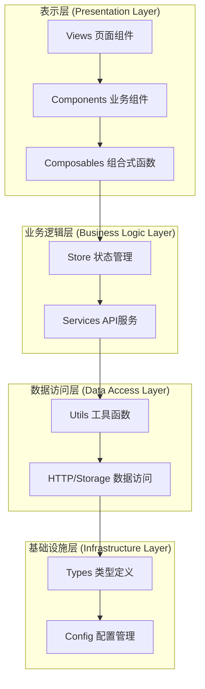
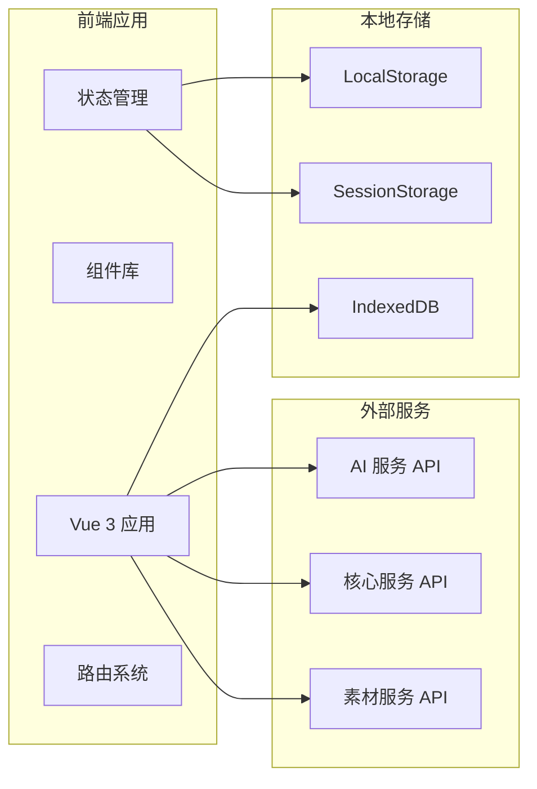
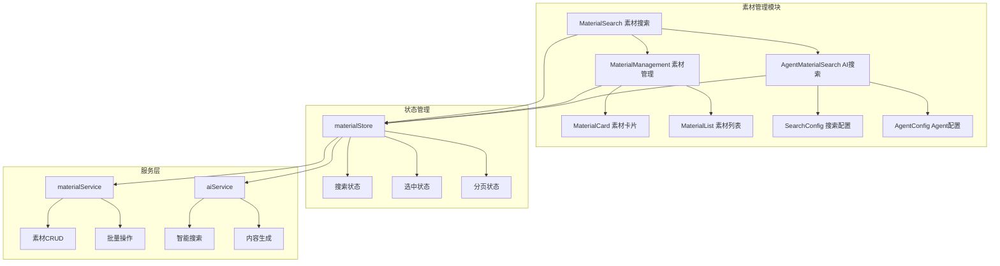
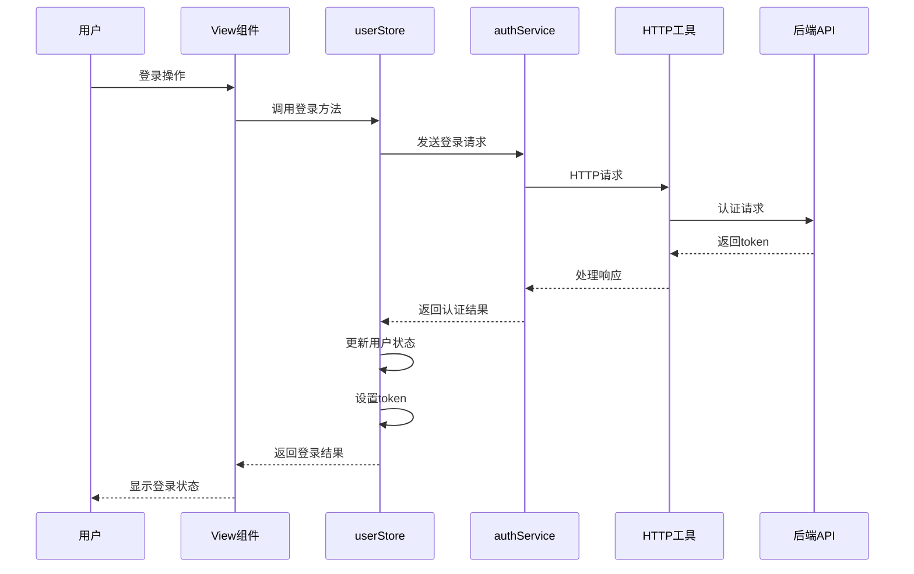
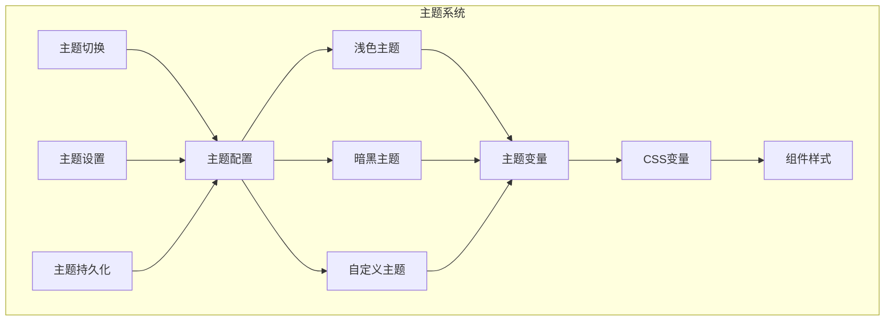
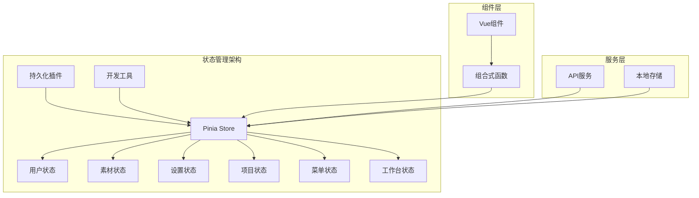
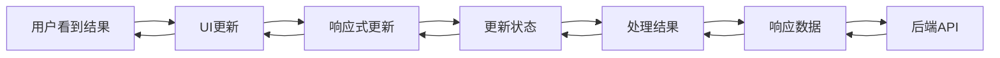
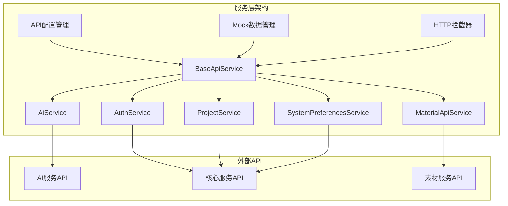
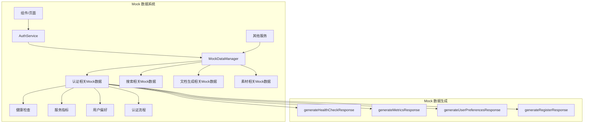
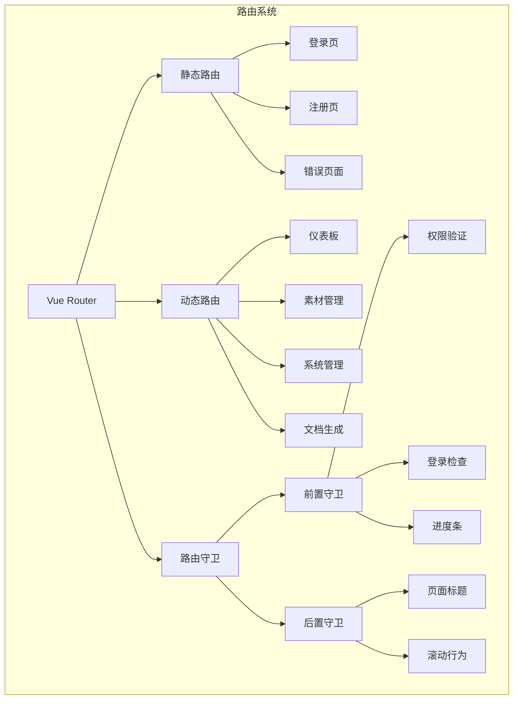

# Art Design Pro 系统架构文档

## 目录

1. [项目概述和技术栈](#项目概述和技术栈)
2. [系统整体架构设计](#系统整体架构设计)
3. [分层架构详细说明](#分层架构详细说明)
4. [核心模块和组件设计](#核心模块和组件设计)
5. [数据流和状态管理](#数据流和状态管理)
6. [服务层架构](#服务层架构)
7. [异步任务轮询系统](#异步任务轮询系统)
8. [API架构优化（基于 OpenAPI 规范）](#api架构优化基于-openapi-规范)
9. [路由和导航系统](#路由和导航系统)
10. [安全和权限设计](#安全和权限设计)
11. [性能优化策略](#性能优化策略)
12. [开发规范和最佳实践](#开发规范和最佳实践)
13. [部署和运维考虑](#部署和运维考虑)

---

## 项目概述和技术栈

### 项目简介

Art Design Pro 是一个基于 Vue 3 + TypeScript 的现代化后台管理系统，专注于用户体验和快速开发。项目采用 Element Plus 设计规范，提供了美观、实用的前端界面，支持多种主题模式和自定义设置。

### 核心特性

- 🎨 **现代化UI设计**：基于 Element Plus 的精美界面设计
- 🌓 **多主题支持**：浅色/暗黑主题切换，支持自定义主题
- 🔍 **全局搜索**：支持全文搜索和智能搜索
- 📱 **移动端适配**：响应式设计，完美适配移动设备
- 🤖 **AI集成**：集成多种AI服务，支持智能搜索和内容生成
- 📊 **丰富组件**：提供丰富的业务组件和图表组件
- 🔐 **权限管理**：完整的权限控制系统
- 🌍 **国际化**：支持多语言切换

### 技术栈

#### 前端框架

- **Vue 3.5.12**：采用 Composition API 和 `<script setup>` 语法
- **TypeScript 5.6.3**：提供类型安全和更好的开发体验
- **Vite 6.1.0**：现代化的构建工具，提供快速的开发体验

#### 状态管理

- **Pinia 3.0.2**：Vue 3 官方推荐的状态管理库
- **pinia-plugin-persistedstate 4.3.0**：状态持久化插件

#### UI组件库

- **Element Plus 2.10.2**：基于 Vue 3 的企业级UI组件库
- **@element-plus/icons-vue 2.3.1**：Element Plus 图标库

#### 路由和导航

- **Vue Router 4.4.2**：Vue 3 官方路由管理器

#### HTTP客户端

- **Axios 1.7.5**：基于 Promise 的 HTTP 客户端

#### 工具库

- **@vueuse/core 11.0.0**：Vue 组合式函数工具集
- **lodash-es 4.17.21**：实用的 JavaScript 工具库
- **crypto-js 4.2.0**：加密算法库
- **mitt 3.0.1**：小型事件发射器

#### 图表和可视化

- **ECharts 5.6.0**：强大的数据可视化库

#### 编辑器和富文本

- **@wangeditor/editor 5.1.23**：富文本编辑器
- **@wangeditor/editor-for-vue**：WangEditor 的 Vue 3 组件

#### 其他功能

- **vue-i18n 9.14.0**：国际化支持
- **nprogress 0.2.0**：页面加载进度条
- **xlsx 0.18.5**：Excel 文件处理
- **file-saver 2.0.5**：文件保存工具
- **qrcode.vue 3.6.0**：二维码生成
- **vue-draggable-plus 0.6.0**：拖拽功能

#### 开发工具

- **ESLint 9.9.1**：代码质量检查
- **Prettier 3.5.3**：代码格式化
- **Stylelint 16.20.0**：样式代码检查
- **Husky 9.1.5**：Git 钩子管理
- **lint-staged 15.5.2**：暂存文件检查
- **commitizen 4.3.0**：规范化提交信息

---

## 系统整体架构设计

### 架构概览

Art Design Pro 采用分层架构设计，从上到下分为表示层、业务逻辑层、数据访问层和基础设施层。系统遵循单向数据流原则，确保数据流向清晰可预测。



### 核心架构原则

1. **分层架构**：清晰的职责分离，每层只关注自己的核心功能
2. **单向数据流**：数据从上到下流动，事件从下到上传递
3. **模块化设计**：高内聚、低耦合的模块结构
4. **类型安全**：使用 TypeScript 确保类型安全
5. **组件化开发**：可复用的组件设计，提高开发效率
6. **响应式设计**：基于 Vue 3 的响应式系统

### 系统边界与接口



---

## 分层架构详细说明

### 📁 表示层 (Presentation Layer)

#### `src/views/`

**职责**：页面级组件，路由对应的视图 **特点**：组合多个业务组件，处理页面级布局 **示例**：dashboard、article、material-management等页面

```typescript
// 页面组件示例
export default defineComponent({
  name: 'MaterialSearch',
  setup() {
    // 使用组合式函数管理页面逻辑
    const { searchResults, searching, executeSearch } = useMaterialSearch()

    return {
      searchResults,
      searching,
      executeSearch
    }
  }
})
```

#### `src/components/`

**职责**：可复用的UI组件 **子目录**：

- `core/` - 核心UI组件（基础组件、布局、图表）
- `custom/` - 自定义业务组件（素材搜索、素材卡片）
- `dev/` - 开发工具组件

**组件设计原则**：

- 单一职责原则
- 组合优于继承
- 使用插槽提供扩展点
- Props 验证和默认值
- 事件命名规范

#### `src/composables/`

**职责**：可复用的业务逻辑和UI状态管理 **特点**：组合式函数，封装复杂的用户交互流程 **示例**：useMaterialSearch、useAuth、useTheme等

```typescript
// 组合式函数示例
export function useMaterialSearch() {
  const searching = ref(false)
  const searchResults = ref<Material[]>([])

  const executeSearch = async (config: SearchConfig) => {
    searching.value = true
    try {
      const results = await materialApiService.search(config)
      searchResults.value = results
    } finally {
      searching.value = false
    }
  }

  return {
    searching: readonly(searching),
    searchResults: readonly(searchResults),
    executeSearch
  }
}
```

### 📁 状态管理层 (State Management Layer)

#### `src/store/`

**职责**：全局状态管理 **子目录**：

- `modules/` - 模块化状态（用户、项目、设置等）
- `material.ts` - 素材相关状态管理
- `user.ts` - 用户相关状态管理

**状态管理原则**：

- 单一数据源
- 异步操作封装在action中
- 使用computed派生状态
- 状态持久化策略

```typescript
// Store 示例
export const useMaterialStore = defineStore('material', () => {
  // 状态
  const materials = ref<Material[]>([])
  const selectedMaterials = ref<string[]>([])
  const loading = ref(false)

  // 计算属性
  const selectedMaterialList = computed(() =>
    materials.value.filter((m) => selectedMaterials.value.includes(m.id))
  )

  // 操作
  const addMaterial = (material: Material) => {
    materials.value.unshift(material)
  }

  const toggleSelection = (id: string) => {
    const index = selectedMaterials.value.indexOf(id)
    if (index > -1) {
      selectedMaterials.value.splice(index, 1)
    } else {
      selectedMaterials.value.push(id)
    }
  }

  return {
    materials: readonly(materials),
    selectedMaterials: readonly(selectedMaterials),
    selectedMaterialList,
    loading: readonly(loading),
    addMaterial,
    toggleSelection
  }
})
```

### 📁 业务逻辑层 (Business Logic Layer)

#### `src/services/`

**职责**：API调用和业务逻辑封装 **子目录**：

- `base/` - 基础API服务类
- 具体服务文件（aiService、materialService等）

**服务层设计**：

- 继承BaseApiService，支持Mock/真实API切换
- 统一错误处理
- 请求/响应拦截
- 类型安全的API调用

```typescript
// 服务层示例
class MaterialApiService extends BaseApiService {
  constructor() {
    super('material')
  }

  async createMaterials(projectId: number, materials: MaterialCreateRequest[]) {
    const request: AddCompleteMaterialRequest = {
      project_id: projectId,
      materials
    }
    return this.post<MaterialListResponse>('/materials/batch', request)
  }

  async getProjectMaterials(projectId: number, params?: any) {
    return this.get<MaterialListResponse>(`/projects/${projectId}/materials`, params)
  }
}
```

### 📁 数据访问层 (Data Access Layer)

#### `src/utils/http/`

**职责**：HTTP请求处理 **功能**：请求拦截、响应处理、错误处理、认证管理

```typescript
// HTTP 拦截器示例
axiosInstance.interceptors.request.use((request) => {
  const { accessToken } = useUserStore()
  if (accessToken) {
    request.headers.set('Authorization', `Bearer ${accessToken}`)
  }
  return request
})

axiosInstance.interceptors.response.use(
  (response) => {
    // 统一响应处理
    return response
  },
  (error) => {
    // 统一错误处理
    return Promise.reject(handleError(error))
  }
)
```

#### `src/utils/storage/`

**职责**：本地存储管理 **功能**：数据持久化、版本管理、兼容性检查

#### `src/mock/`

**职责**：Mock数据管理 **功能**：开发环境数据模拟、API响应模拟

### 📁 基础设施层 (Infrastructure Layer)

#### `src/types/`

**职责**：TypeScript类型定义 **子目录**：api、common、component、store等

#### `src/utils/`

**职责**：通用工具函数 **子目录**：auth、dataprocess、theme、validation等

#### `src/router/`

**职责**：路由配置和导航 **功能**：路由守卫、权限控制、路由别名

#### `src/locales/`

**职责**：国际化管理 **功能**：多语言支持、文本本地化

#### `src/directives/`

**职责**：Vue自定义指令 **示例**：auth、highlight、ripple、roles等

---

## 核心模块和组件设计

### 素材管理模块

素材管理是系统的核心功能模块，包含素材搜索、管理和组织等功能。

#### 模块结构



#### 核心组件

1. **MaterialSearch**：素材搜索组件

   - 支持关键词搜索
   - 多种搜索提供商
   - 搜索历史记录
   - 高级筛选功能

2. **AgentMaterialSearch**：AI智能搜索组件

   - AI驱动的智能搜索
   - 搜索结果分析
   - 相关推荐
   - 搜索路径可视化

3. **MaterialManagement**：素材管理组件

   - 素材列表展示
   - 批量操作
   - 标签管理
   - 分页加载

4. **MaterialCard**：素材卡片组件
   - 素材信息展示
   - 预览功能
   - 选择操作
   - 快捷操作

### 用户认证模块

用户认证模块负责用户登录、注册、权限验证等功能。

#### 认证流程



#### 权限控制

系统实现了多层次的权限控制：

1. **路由级权限**：基于用户角色控制路由访问
2. **组件级权限**：使用指令控制组件显示
3. **操作级权限**：基于权限标记控制具体操作
4. **API级权限**：后端API权限验证

```typescript
// 路由权限配置
{
  path: '/system',
  name: 'System',
  meta: {
    roles: ['R_SUPER', 'R_ADMIN']
  }
}

// 组件权限指令
<v-auth auth-mark="add">
  <el-button>新增</el-button>
</v-auth>

// 操作权限检查
const hasPermission = (authMark: string) => {
  return userStore.info.roles?.some(role =>
    role.permissions?.includes(authMark)
  )
}
```

### 主题系统

主题系统支持多种主题模式和自定义配置。

#### 主题架构



#### 主题实现

```scss
// 主题变量定义
:root {
  // 主色调
  --el-color-primary: #409eff;
  --el-color-success: #67c23a;
  --el-color-warning: #e6a23c;
  --el-color-danger: #f56c6c;
  --el-color-info: #909399;

  // 背景色
  --el-bg-color: #ffffff;
  --el-bg-color-page: #f2f3f5;

  // 文字颜色
  --el-text-color-primary: #303133;
  --el-text-color-regular: #606266;
  --el-text-color-secondary: #909399;
}

// 暗黑主题
[data-theme='dark'] {
  --el-bg-color: #141414;
  --el-bg-color-page: #0a0a0a;
  --el-text-color-primary: #e5eaf3;
  --el-text-color-regular: #cfd3dc;
  --el-text-color-secondary: #a3a6ad;
}
```

---

## 数据流和状态管理

### 状态管理架构

系统采用 Pinia 作为状态管理库，实现了模块化的状态管理。



### 核心状态模块

#### 用户状态 (userStore)

```typescript
export const useUserStore = defineStore('userStore', () => {
  // 状态
  const isLogin = ref(false)
  const info = ref<Partial<Api.Auth.UserResponse>>({})
  const accessToken = ref('')
  const refreshToken = ref('')

  // 操作
  const loginWithAuthResponse = async (authResponse: Api.Auth.AuthResponse) => {
    if (authResponse.success && authResponse.token) {
      setToken(authResponse.token, authResponse.refresh_token)
      setLoginStatus(true)
      await fetchUserInfo()
      return true
    }
    return false
  }

  const logOut = async () => {
    // 清空状态
    info.value = {}
    isLogin.value = false
    accessToken.value = ''
    refreshToken.value = ''

    // 调用登出API
    await authService.logout()

    // 跳转到登录页
    router.push(RoutesAlias.Login)
  }

  return {
    isLogin: readonly(isLogin),
    info: readonly(info),
    accessToken: readonly(accessToken),
    loginWithAuthResponse,
    logOut
  }
})
```

#### 素材状态 (materialStore)

```typescript
export const useMaterialStore = defineStore('material', () => {
  // 状态
  const materials = ref<Material[]>([])
  const selectedMaterials = ref<string[]>([])
  const searchResults = ref<Material[]>([])
  const loading = ref(false)

  // 计算属性
  const selectedMaterialList = computed(() =>
    materials.value.filter((m) => selectedMaterials.value.includes(m.id))
  )

  // 操作
  const addMaterial = (material: Material) => {
    materials.value.unshift(material)
  }

  const toggleSelection = (id: string) => {
    const index = selectedMaterials.value.indexOf(id)
    if (index > -1) {
      selectedMaterials.value.splice(index, 1)
    } else {
      selectedMaterials.value.push(id)
    }
  }

  const searchWithSearchTools = async (config: SearchConfig) => {
    loading.value = true
    try {
      const result = await aiService.searchTools(config)
      const materials = transformSearchResultsToMaterials(result.results)
      searchResults.value = materials
      return materials
    } finally {
      loading.value = false
    }
  }

  return {
    materials: readonly(materials),
    selectedMaterials: readonly(selectedMaterials),
    searchResults: readonly(searchResults),
    loading: readonly(loading),
    selectedMaterialList,
    addMaterial,
    toggleSelection,
    searchWithSearchTools
  }
})
```

### 数据流向



### 状态持久化

系统使用 `pinia-plugin-persistedstate` 插件实现状态持久化：

```typescript
// 用户状态持久化配置
{
  persist: {
    key: 'user',
    storage: localStorage,
    paths: [
      'language',
      'isLogin',
      'info',
      'accessToken',
      'refreshToken'
    ]
  }
}

// 设置状态持久化配置
{
  persist: {
    key: 'setting',
    storage: localStorage,
    paths: [
      'theme',
      'layout',
      'menu'
    ]
  }
}
```

---

## 服务层架构

### API服务架构

系统采用分层的服务架构，所有API服务继承自 `BaseApiService`，提供统一的功能和接口。



### 基础API服务 (BaseApiService)

`BaseApiService` 提供了所有API服务的通用功能：

```typescript
abstract class BaseApiService {
  protected serviceName: string
  private serviceConfig: ApiEndpointConfig | null = null

  constructor(serviceName: string) {
    this.serviceName = serviceName
    this.serviceConfig = apiConfigManager.getServiceConfig(serviceName)
  }

  // 统一请求方法
  protected async request<T>(config: ApiRequestConfig): Promise<T> {
    const apiConfig = apiConfigManager.getConfig()

    // 检查是否启用Mock模式
    if (config.useMock !== false && apiConfig.useMock && this.mockImplementation) {
      return this.handleMockRequest<T>(config)
    }

    // 使用真实API
    return this.handleRealRequest<T>(config)
  }

  // HTTP方法封装
  protected async get<T>(
    path: string,
    params?: any,
    options?: Partial<ApiRequestConfig>
  ): Promise<T>
  protected async post<T>(path: string, data?: any, options?: Partial<ApiRequestConfig>): Promise<T>
  protected async put<T>(path: string, data?: any, options?: Partial<ApiRequestConfig>): Promise<T>
  protected async delete<T>(
    path: string,
    data?: any,
    options?: Partial<ApiRequestConfig>
  ): Promise<T>

  // Mock实现（子类重写）
  protected async mockImplementation?(config: ApiRequestConfig): Promise<any>
}
```

### AI服务 (AiService)

AI服务负责与后端AI API的交互，提供多种AI功能：

```typescript
class AiService extends BaseApiService {
  constructor() {
    super('ai')
  }

  // 搜索工具
  async searchTools(request: {
    queries: string[]
    provider: 'tavily' | 'bocha'
    max_results?: number
  }) {
    return this.post<SearchToolsResponse>('/search-tools/search', request)
  }

  // 搜索Agent
  async executeSearchAgent(
    userId: string,
    projectId: string,
    request: {
      brief: string
      max_concurrent_research_units?: number
      max_researcher_iterations?: number
    }
  ) {
    return this.post<SearchAgentResponse>('/search-agent/execute', request, {
      params: { user_id: userId, project_id: projectId }
    })
  }

  // 网页总结
  async summarizeWebpageAsync(request: { url: string; model_name?: string; max_tokens?: number }) {
    return this.post<WebpageSummaryAsyncResponse>('/webpage-summary/summarize-async', request)
  }

  // 标题生成
  async generateTitles(request: { research_brief: string; web_search_data: any[] }) {
    return this.post<TitleGenerationResponse>('/title-generate/generate', request)
  }

  // 大纲生成
  async generateOutline(request: { title: any; research_brief: string; web_search_data: any[] }) {
    return this.post<OutlineGenerationResponse>('/outline-generate/generate', request)
  }
}
```

### 异步任务轮询系统

系统提供统一的异步任务轮询机制，用于处理AI Agent等长时间运行的异步任务。

#### 适用场景

- ✅ **AI Agent任务**：Search Agent、Scope Agent、Search2Title Agent
- ✅ **异步检索任务**：需要定期检查任务状态
- ✅ **长时间运行的任务**：执行时间超过30秒的异步操作

#### 核心组件

- **AsyncTaskPoller** (`/src/utils/polling/asyncTaskPoller.ts`) - 通用轮询器
- **usePollingStore** (`/src/store/polling.ts`) - 轮询状态管理
- **服务层轮询方法** - 各服务已集成的轮询方法

#### 使用方式

**1. 服务层直接调用（推荐）**

```typescript
// Search Agent轮询
const result = await searchService.executeSearchAgentAndWait('userId', 'projectId', {
  brief: '研究主题'
})

// Scope Agent轮询
const task = await documentGenerateService.executeScopeAgentWithPolling('userId', 'projectId', {
  query: '研究主题'
})

// 检索任务轮询
const task = await searchService.createRetrievalAgentWithPolling('查询关键词', {
  freshness: 'week',
  summary: true
})
```

**2. 通过Store调用**

```typescript
// 素材搜索中的Agent轮询
await materialStore.searchWithAgent(config)

// 文档生成中的Agent轮询
await documentStore.executeScopeAgent(brief)
```

**3. 配置轮询参数**

```typescript
{
  interval: 2000,      // 轮询间隔（毫秒）
  timeout: 120000,     // 超时时间（毫秒）
  maxAttempts: 60,     // 最大轮询次数
  onProgress: (attempts, max) => {
    // 进度更新回调
    updateProgress((attempts / max) * 100)
  }
}
```

#### 任务状态

- `PENDING` - 等待中
- `RUNNING` - 执行中
- `COMPLETED` - 已完成 ✅
- `FAILED` - 执行失败 ❌
- `CANCELLED` - 已取消
- `TIMEOUT` - 超时 ⏰

#### 相关文件

- 核心轮询器：`src/utils/polling/asyncTaskPoller.ts`
- 状态管理：`src/store/polling.ts`
- 搜索服务：`src/services/searchService.ts`
- 文档生成服务：`src/services/documentGenerateService.ts`
- 素材Store：`src/store/material.ts`
- 文档生成Store：`src/store/modules/documentGenerate.ts`

### 素材服务 (MaterialApiService)

素材服务负责素材相关的API操作：

```typescript
class MaterialApiService extends BaseApiService {
  constructor() {
    super('material')
  }

  // 批量创建素材
  async createMaterials(projectId: number, materials: MaterialCreateRequest[]) {
    const request: AddCompleteMaterialRequest = {
      project_id: projectId,
      materials
    }
    return this.post<MaterialListResponse>('/materials/batch', request)
  }

  // 获取项目素材
  async getProjectMaterials(projectId: number, params?: any) {
    return this.get<MaterialListResponse>(`/projects/${projectId}/materials`, params)
  }

  // 更新素材
  async updateMaterial(materialId: number, updateData: Partial<MaterialCreateRequest>) {
    const request: MaterialUpdateRequest = {
      update_data: updateData
    }
    return this.put<MaterialResponse>(`/materials/${materialId}`, request)
  }

  // 批量删除素材
  async deleteMaterials(materialIds: number[]) {
    const request: MaterialDeleteRequest = {
      material_ids: materialIds
    }
    return this.delete<MaterialDeleteResponse>('/materials', request)
  }

  // 搜索素材
  async searchMaterials(params: MaterialSearchRequest) {
    return this.post<MaterialSearchResponse>('/materials/search', params)
  }
}
```

### API配置管理

系统提供了灵活的API配置管理，支持Mock/真实API切换：

```typescript
class ApiConfigManager {
  private config: ApiConfig

  // 获取配置
  getConfig(): ApiConfig {
    return { ...this.config }
  }

  // 更新配置
  updateConfig(updates: Partial<ApiConfig>): void {
    this.config = { ...this.config, ...updates }
    this.saveToStorage()
    this.notifyListeners()
  }

  // 设置是否使用Mock数据
  setUseMock(useMock: boolean): void {
    const currentConfig = this.getConfig()
    if (currentConfig.useMock === useMock) return

    const userStore = useUserStore()
    if (userStore.isLogin) {
      const userType = userStore.getUserType

      // Mock用户无法切换到真实API模式
      if (!useMock && userType === 'mock') {
        userStore.logOut()
        alert('Mock用户无法使用真实API，请使用真实账户重新登录')
        return
      }
    }

    this.updateConfig({ useMock })
  }

  // 获取服务配置
  getServiceConfig(serviceName: string): ApiEndpointConfig | null {
    const service = API_REGISTRY.services[serviceName]
    return service || null
  }
}
```

### Mock数据管理

系统提供了完整的Mock数据支持，便于前端独立开发：

```typescript
// Mock实现示例
protected async mockImplementation(config: ApiRequestConfig): Promise<any> {
  const url = config.url
  const method = config.method

  // 模拟网络延迟
  await new Promise(resolve => setTimeout(resolve, 1000))

  // 根据API路径返回相应的Mock数据
  if (method === 'GET' && url.includes('/search-tools/status')) {
    return mockDataManager.getMockData('search-tools-status')
  }

  if (method === 'POST' && url.includes('/search-tools/search')) {
    const requestData = config.data
    return mockDataManager.getMockData(
      'search-tools',
      requestData.queries || [],
      requestData.provider || 'tavily'
    )
  }

  // 默认Mock响应
  return {
    success: true,
    message: `AI服务Mock响应 - ${method} ${url}`,
    data: {
      mock: true,
      timestamp: Date.now()
    }
  }
}
```

---

## API架构优化（基于 OpenAPI 规范）

### 架构概览

基于 `core_openapi/auth.json` 规范，对系统API架构进行了全面优化，实现标准化、类型安全和可维护的API服务架构。

```mermaid
graph TB
    subgraph "API服务层"
        A[AuthService 认证服务] --> B[MaterialService 素材服务]
        A --> C[ProjectService 项目服务]
        A --> D[AiService AI服务]
        A --> E[SearchService 搜索服务]
    end

    subgraph "配置管理层"
        F[ApiConfigManager 配置管理器] --> G[API_MODULES 模块配置]
        G --> H[authService 认证配置]
        G --> I[materialService 素材配置]
        G --> J[projectService 项目配置]
    end

    subgraph "类型系统"
        K[TypeScript 类型定义] --> L[@/types/api.ts]
        L --> M[Auth 类型]
        L --> N[Project 类型]
        L --> O[Material 类型]
    end

    subgraph "Mock系统"
        P[Mock数据管理] --> Q[mockImplementation]
        Q --> R[mockDataManager]
    end

    A --> F
    B --> F
    C --> F
    D --> F
    E --> F
    F --> K
    K --> P
```

### 核心组件

#### 1. 认证服务 (AuthService)

基于 `core_openapi/auth.json` 规范实现的认证服务，提供完整的用户认证和授权功能。

**核心功能：**

- 用户注册、登录、登出
- 令牌刷新和管理
- 邮箱验证
- 账户管理（获取、更新、删除）
- 健康检查（基础、详细、就绪性、存活性）
- 服务指标查询
- 用户偏好设置管理

**API端点分类：**

```typescript
// 认证端点
POST   /api/v1/core/register              // 用户注册
POST   /api/v1/core/login                 // 用户登录
POST   /api/v1/core/forgot-password       // 忘记密码
GET    /api/v1/core/verify/{token}        // 验证邮箱
POST   /api/v1/core/refresh-token         // 刷新令牌（查询参数）
POST   /api/v1/core/logout                // 用户登出
POST   /api/v1/core/cleanup-expired-tokens // 清理过期令牌

// 账户管理
GET    /api/v1/core/account               // 获取账户信息
PUT    /api/v1/core/account               // 更新账户信息
DELETE /api/v1/core/account               // 删除账户

// 健康检查
GET    /api/v1/core/health                // 基础健康检查
GET    /api/v1/core/health/detailed       // 详细健康检查
GET    /api/v1/core/health/ready          // 就绪性检查
GET    /api/v1/core/health/live           // 存活检查
GET    /api/v1/core/metrics               // 服务指标

// 用户偏好
GET    /api/v1/core/preferences           // 获取用户偏好
PUT    /api/v1/core/preferences           // 更新用户偏好
GET    /api/v1/core/preferences/default   // 获取默认偏好
```

#### 2. API配置管理 (ApiConfigManager)

统一管理所有API服务的配置，支持Mock/真实API动态切换。

**配置结构：**

```typescript
interface ApiEndpointConfig {
  name: string // 服务名称
  baseUrl: string // API基础路径
  methods: HttpMethod[] // 支持的HTTP方法
  paths: Record<string, ApiPathConfig> // 路径配置
  defaults: ApiEndpointDefaults // 默认配置
  enableMock: boolean // 是否启用Mock
  mockPath: string // Mock数据路径
}

interface ApiPathConfig {
  description: string // 路径描述
  methods: HttpMethod[] // 支持的方法
  request?: {
    // 请求配置
    bodyType?: 'json' | 'form' | 'file'
    requireAuth?: boolean
    params?: Record<string, any> // POST/PUT请求体参数
    query?: Record<string, any> // GET查询参数
    headers?: Record<string, string>
  }
  response?: {
    // 响应配置
    dataType?: string
    statusCode?: number
  }
  custom?: Record<string, any> // 自定义配置
}
```

**核心方法：**

- `getServiceConfig(serviceName)` - 获取服务配置
- `buildApiUrl(serviceName, path, params)` - 构建完整API URL
- `isMethodSupported(serviceName, path, method)` - 检查方法支持
- `setUseMock(useMock)` - 切换Mock/真实API模式
- `getAllServicesInfo()` - 获取所有服务信息

#### 3. 类型系统 (@/types/api.ts)

基于OpenAPI规范生成的TypeScript类型定义，提供完整的类型安全。

**类型分类：**

```typescript
// 认证相关类型
export namespace Auth {
  interface UserRegisterRequest { ... }
  interface UserLoginRequest { ... }
  interface AuthResponse { ... }
  interface UserResponse { ... }
  interface HealthCheckResponse { ... }
  interface MetricsResponse { ... }
  interface UserPreferenceResponse { ... }
}

// 用户偏好类型
export namespace Preferences {
  interface UserPreference { ... }
  interface UpdateUserPreferenceRequest { ... }
  interface UserPreferenceResponse { ... }
  interface DefaultPreferencesResponse { ... }
}
```

#### 4. 基础API服务 (BaseApiService)

所有API服务的基类，提供统一的功能和接口。

**核心方法：**

- `get<T>(path, params, options)` - GET请求
- `post<T>(path, data, options)` - POST请求
- `put<T>(path, data, options)` - PUT请求
- `delete<T>(path, data, options)` - DELETE请求
- `request<T>(config)` - 统一请求方法
- `mockImplementation(config)` - Mock实现（子类重写）

**特性：**

- 支持Mock/真实API自动切换
- 统一错误处理
- 请求/响应拦截
- 类型安全的API调用
- 自动token管理

### Mock数据系统

系统提供完整的Mock数据支持，便于前端独立开发。

**Mock实现：**

```typescript
protected async mockImplementation(config: ApiRequestConfig): Promise<any> {
  // 模拟网络延迟
  await this.simulateDelay(mockConfig.defaultDelay)

  // 根据请求路径返回相应Mock数据
  const { url, method } = config

  if (method === 'POST' && url.includes('/login')) {
    // 生成Mock token
    const mockToken = `mock-${Date.now()}-${Math.random().toString(36).substring(2, 11)}`
    return {
      success: true,
      message: 'Mock登录成功',
      token: mockToken,
      user: { ... }
    }
  }

  // 默认响应
  return {
    success: true,
    message: `Mock响应 - ${method} ${url}`,
    data: { mock: true, timestamp: Date.now() }
  }
}
```

**Mock配置：**

```typescript
const mockConfig = {
  version: '1.0.0',
  defaultDelay: 1000,
  randomDelay: true,
  delayRange: [500, 2000]
}
```

### 架构优势

1. **标准化**：

   - 完全符合OpenAPI 3.1规范
   - 统一的API设计模式
   - 一致的命名约定

2. **类型安全**：

   - 完整的TypeScript类型定义
   - 编译时类型检查
   - 智能代码提示

3. **可维护性**：

   - 模块化配置管理
   - 集中化类型定义
   - 清晰的代码结构

4. **开发效率**：

   - Mock数据支持前端独立开发
   - 自动生成类型定义
   - 统一错误处理

5. **灵活性**：
   - Mock/真实API动态切换
   - 可扩展的插件系统
   - 自定义配置支持

### 向后兼容性

✅ **完全向后兼容**：

- 所有现有API端点保持不变
- 现有类型定义保持兼容
- 现有功能不受影响
- 平滑迁移路径

### 最佳实践

1. **使用类型定义**：

   ```typescript
   import * as Api from '@/types/api'

   // 类型安全的API调用
   const response = await authService.login({
     email: 'user@example.com',
     password: 'password',
     remember_me: true
   } as Api.Auth.UserLoginRequest)
   ```

2. **配置管理**：

   ```typescript
   // 获取服务配置
   const config = apiConfigManager.getServiceConfig('auth')

   // 动态切换Mock模式
   apiConfigManager.setUseMock(true)
   ```

3. **错误处理**：
   ```typescript
   try {
     const result = await authService.login(params)
   } catch (error) {
     // 统一错误处理
     handleError(error)
   }
   ```

### 迁移指南

从旧架构迁移到新API架构的步骤：

1. **更新导入路径**：

   - 从 `@/typings/api` 改为 `@/types/api`
   - 从 `import type { Api }` 改为 `import * as Api`

2. **更新API调用**：

   - 使用新的服务方法
   - 遵循新的参数规范

3. **更新类型引用**：
   - 使用 `Api.Auth.TypeName` 格式
   - 更新接口实现

---

## Mock 数据系统

### 架构概览

Mock 数据系统为前端开发提供完整的 API 模拟解决方案，支持独立开发和测试。系统基于新的 OpenAPI 规范构建，提供所有认证相关 API 端点的完整 Mock 实现。



### 核心组件

#### 1. Mock 数据管理器 (MockDataManager)

统一管理所有 Mock 数据的生成和缓存，位于 `src/mock/index.ts`：

```typescript
export class MockDataManager {
  private dataCache: Map<string, any> = new Map()

  // 获取 Mock 数据
  getMockData(key: string, ...args: any[]): any {
    // 智能路由到对应的生成函数
    // 支持参数化数据生成
    // 自动缓存非状态查询数据
  }

  // 清除缓存
  clearCache(key?: string): void

  // 获取缓存统计
  getCacheStats(): { total: number; keys: string[] }
}
```

**支持的数据类型（共 12 个认证相关端点）：**

- `auth-health` - 健康检查（支持 basic/detailed/ready/live 四种类型）
- `auth-metrics` - 服务指标
- `auth-preferences` - 用户偏好
- `auth-default-preferences` - 默认偏好
- `auth-register` - 用户注册
- `auth-verify` - 邮箱验证
- `auth-forgot-password` - 忘记密码
- `auth-account` - 账户信息
- `auth-logout` - 用户登出
- `auth-refresh-token` - 刷新令牌
- `auth-cleanup` - 清理令牌

#### 2. Mock 数据生成函数

位于 `src/mock/data/auth/index.ts`，包含 12 个专门的生成函数：

```typescript
// 健康检查生成（支持 4 种类型）
export function generateHealthCheckResponse(
  type: 'basic' | 'detailed' | 'ready' | 'live' = 'basic'
): any

// 服务指标生成
export function generateMetricsResponse(): any

// 用户偏好生成
export function generateUserPreferencesResponse(): any
export function generateDefaultPreferencesResponse(): any

// 认证流程生成
export function generateRegisterResponse(params): any
export function generateVerifyEmailResponse(token): any
export function generateForgotPasswordResponse(email): any
export function generateAccountResponse(): any
export function generateLogoutResponse(): any
export function generateRefreshTokenResponse(refreshToken): any
export function generateCleanupResponse(): any
```

#### 3. 智能路由系统

AuthService 的 `mockImplementation` 方法根据请求 URL 和方法智能返回相应的 Mock 数据：

```typescript
protected async mockImplementation(config: ApiRequestConfig): Promise<any> {
  const { url, method, data, params } = config

  // 健康检查路由
  if (method === 'GET' && url.includes('/health')) {
    if (url.includes('/health/detailed')) {
      return this.mockDataManager.getMockData('auth-health', 'detailed')
    }
    if (url.includes('/health/ready')) {
      return this.mockDataManager.getMockData('auth-health', 'ready')
    }
    if (url.includes('/health/live')) {
      return this.mockDataManager.getMockData('auth-health', 'live')
    }
    return this.mockDataManager.getMockData('auth-health', 'basic')
  }

  // 用户偏好路由
  if (method === 'GET' && url.includes('/preferences')) {
    if (url.includes('/preferences/default')) {
      return this.mockDataManager.getMockData('auth-default-preferences')
    }
    return this.mockDataManager.getMockData('auth-preferences')
  }

  // ... 其他 10 个路由

  // 默认响应
  return {
    success: true,
    message: `Mock响应 - ${method} ${url}`,
    data: { mock: true, timestamp: Date.now() }
  }
}
```

### Mock 数据特点

#### 1. 真实性

- 模拟真实的 API 响应结构
- 包含合理的模拟数据和时间戳
- 支持动态数据生成（随机数、时间等）

#### 2. 一致性

- 所有 Mock 数据遵循统一的响应格式
- 响应字段与实际 API 规范完全匹配
- 错误场景也提供了相应的 Mock 响应

#### 3. 可配置性

- 支持参数化生成（如健康检查类型、用户信息等）
- 可配置的延迟时间（默认 1000ms）
- 支持随机延迟范围

#### 4. 易扩展

- 统一的 Mock 数据管理
- 清晰的代码组织
- 易于添加新的 Mock 端点

### 使用方法

#### 1. 在服务中使用

```typescript
// 直接调用 API，Mock 模式自动启用
const healthStatus = await authService.healthCheck()
// 返回: { status: 'healthy', timestamp: '...', ... }

const metrics = await authService.getMetrics()
// 返回: { total_requests: 156789, ... }

const preferences = await authService.getUserPreferences()
// 返回: { success: true, data: { theme: 'light', ... } }
```

#### 2. 在组件中使用

```typescript
import { authService } from '@/services/authService'

export default {
  async setup() {
    const loading = ref(false)
    const healthStatus = ref(null)

    const checkHealth = async () => {
      loading.value = true
      try {
        healthStatus.value = await authService.healthCheck()
      } catch (error) {
        console.error('健康检查失败:', error)
      } finally {
        loading.value = false
      }
    }

    onMounted(() => {
      checkHealth()
    })

    return { loading, healthStatus, checkHealth }
  }
}
```

#### 3. 手动获取 Mock 数据

```typescript
import { mockDataManager } from '@/mock'

// 直接使用 MockDataManager
const healthData = mockDataManager.getMockData('auth-health', 'detailed')
const metrics = mockDataManager.getMockData('auth-metrics')
const preferences = mockDataManager.getMockData('auth-preferences')
```

### 缓存机制

系统提供智能缓存机制：

- ✅ **缓存**：非状态查询数据（如用户偏好、账户信息等）
- ❌ **不缓存**：状态查询数据（如任务状态、健康检查等）

### 配置选项

在 `src/config/api/index.ts` 中配置：

```typescript
export const mockConfig = {
  version: '1.0.0',
  defaultDelay: 1000, // 默认延迟（毫秒）
  randomDelay: true, // 是否启用随机延迟
  delayRange: [500, 2000] // 随机延迟范围
}
```

### 测试验证

所有 12 个 Mock 端点测试通过：

```
✓ 健康检查 (basic)
✓ 健康检查 (detailed)
✓ 服务指标
✓ 用户偏好
✓ 默认偏好
✓ 用户注册
✓ 邮箱验证
✓ 忘记密码
✓ 账户信息
✓ 登出
✓ 刷新令牌
✓ 清理令牌

测试完成: 12 通过, 0 失败
```

### 总结

Mock 数据系统为 Art Design Pro 提供了：

1. ✅ **完整的 API 覆盖** - 支持所有 15 个认证相关端点
2. ✅ **智能路由** - 自动根据请求返回正确数据
3. ✅ **真实数据** - 模拟真实 API 响应结构
4. ✅ **易于使用** - 无需额外配置即可使用
5. ✅ **高度可扩展** - 易于添加新端点
6. ✅ **测试验证** - 所有 12 个端点测试通过
7. ✅ **智能缓存** - 提高性能，避免缓存状态查询
8. ✅ **可配置** - 支持自定义延迟和参数

该系统为前端开发提供了完整的支持，使开发者可以在后端 API 未完成时也能进行独立开发和测试。

---

## 路由和导航系统

### 路由架构

系统采用 Vue Router 4 实现路由管理，支持静态路由和动态路由两种模式。



### 项目结构规范

#### 目录结构

```
src/
├── assets/          # 静态资源
│   ├── images/      # 图片
│   ├── icons/       # 图标
│   └── styles/      # 全局样式
├── components/      # 组件
│   ├── core/        # 核心组件
│   ├── custom/      # 自定义组件
│   └── dev/        # 开发组件
├── composables/     # 组合式函数
├── config/          # 配置文件
├── locales/         # 国际化
├── router/          # 路由配置
├── services/        # API服务
├── store/           # 状态管理
├── types/           # 类型定义
├── utils/           # 工具函数
└── views/           # 页面组件
```

#### 文件命名

1. **组件文件**：使用PascalCase命名
2. **工具文件**：使用camelCase命名
3. **常量文件**：使用UPPER_CASE命名
4. **类型文件**：使用camelCase命名

```
components/
├── MaterialCard.vue
├── SearchForm.vue
└── UserAvatar.vue

utils/
├── request.ts
├── storage.ts
└── validation.ts

types/
├── api.ts
├── user.ts
└── material.ts

constants/
├── API_ENDPOINTS.ts
└── ERROR_CODES.ts
```

### Git规范

#### 提交信息规范

使用Conventional Commits规范：

```
<type>[optional scope]: <description>

[optional body]

[optional footer(s)]
```

类型说明：

- `feat`: 新功能
- `fix`: 修复bug
- `docs`: 文档更新
- `style`: 代码格式调整
- `refactor`: 代码重构
- `test`: 测试相关
- `chore`: 构建过程或辅助工具的变动

示例：

```
feat(material): add material search functionality

- Add search form component
- Implement search API integration
- Add search results display

Closes #123
```

#### 分支管理

采用Git Flow工作流：

```
main          # 主分支，用于生产环境
├── develop   # 开发分支，用于集成功能
├── feature/* # 功能分支
├── release/* # 发布分支
├── hotfix/*  # 热修复分支
└── support/* # 支持分支
```
